# Jenkins与Kubernetes的CI与CD

**系统环境**

- 系统版本：CentOS 7.8

- Jenkins版本：2.249.1
- Kubernetes版本：1.19.2

**参考地址**

- [小豆丁个人博客](http://www.mydlq.club/article/47/#wow17)

- [Jenkins 官方网址](https://jenkins.io/zh/)
- [Jenkins Github 网址](https://github.com/jenkinsci)
- [Jenkins Kubernetes 插件 Github 网址](https://github.com/jenkinsci/kubernetes-plugin)

**CI/CD 流程图**


**整个流程**

1. 介绍了如何在 Kubernetes 部署 Jenkins。
2. 介绍 Jenkins 中需要安装什么相关插件。
3. 配置凭据，例如 Docker 仓库凭据、K8S 连接凭据、Git 认证凭据。
4. 在 Jenkins 中存储执行流水线过程中的脚本，例如 Docker 的 Dockerfile、Maven 的 Settings.xml。
5. 简介描述了如何写 “脚本式” 的流水线脚本，以及脚本中如何使用各种常用插件。
6. 创建一个用于当做模板的 Job，对其进行一些参数化构建变量配置，方便后续全部的 Job 通过复制该模板 Job 来新建。
7. 写流水线脚本，将分为 Git、Maven、Docker、Kubectl、Http 等几个阶段。写完脚本后放置到上面创建模板 Job 的脚本框框中。
8. 通过复制模板 Job 来新创建用于测试的项目 Job，并且修改其中从模板 Job 复制过来的变量的参数，将其改成适用于该测试项目的参数值。
9. 执行上面创建的测试项目的 Job，观察它是否能够正常执行完整个脚本，并且结果为成功。

## CentOS7搭建NFS服务器

### 服务端配置

1. 配置环境

   - 关闭防火墙服务

     ```shell
     # 停止并禁用防火墙
     $ systemctl stop firewalld
     $ systemctl disable firewalld
     ```

   - 关闭并禁用SELinux

     ```shell
     $ setenforce 0
     $ sed -i 's/^SELINUX=enforcing$/SELINUX=disabled/' /etc/selinux/config
     ```

2. 安装nfs-utils和rpcbind

   ```shell
   $ yum install -y nfs-utils rpcbind
   ```

3. 创建存储的文件夹

   ```shell
   # 创建文件夹
   $ mkdir /nfs
   
   # 更改归属组与用户
   $ chown -R nfsnobody:nfsnobody /nfs
   ```

4. 配置NFS

   ```shell
   # 编辑exports
   $ vi /etc/exports
   
   # 输入以下内容(格式：FS共享的目录 NFS客户端地址1(参数1,参数2,...) 客户端地址2(参数1,参数2,...))
   $ /nfs 192.168.2.0/24(rw,async,no_root_squash)
   ```

   > 如果设置为 /nfs *(rw,async,no_root_squash) 则对所以的IP都有效

   - 常用选项
     - `ro`:客户端挂载后，其权限为只读，默认选项；
     - `rw`:读写权限；
     - `sync`:同时将数据写入到内存与硬盘中；
     - `async`:异步，优先将数据保存到内存，然后再写入硬盘；
     - `Secure`:要求请求源的端口小于1024
   - 用户映射
     - `root_squash`:当NFS客户端使用root用户访问时，映射到NFS服务器的匿名用户；
     - `no_root_squash`:当NFS客户端使用root用户访问时，映射到NFS服务器的root用户；
     - `all_squash`:全部用户都映射为服务器端的匿名用户;
     - `anonuid=UID`：将客户端登录用户映射为此处指定的用户uid；
     - `anongid=GID`：将客户端登录用户映射为此处指定的用户gid;

5. 设置开机启动并启动

   - rpcbind

     ```shell
     $ systemctl restart rpcbind
     ```

   - nfs

     ```shell
     $ systemctl enable nfs && systemctl restart nfs
     ```

6. 查看是否有可用的NFS地址

   ```shell
   $ showmount -e 127.0.0.1
   ```

### 客户端配置

1. 安装nfs-utils和rpcbind

   ```shell
   $ yum install -y nfs-utils rpcbind
   ```

2. 创建挂载的文件夹

   ```shell
   $ mkdir -p /nfs
   ```

3. 挂载nfs

   ```shell
   $ mount -t nfs -o nolock,vers=4 192.168.2.31:/nfs /nfs
   ```

   - 参数解释

     - `mount`：挂载命令
     - `-o`：挂载选项
     - `nfs` :使用的协议
     - `nolock` :不阻塞
     - `vers` : 使用的NFS版本号
     - `IP` : NFS服务器的IP（NFS服务器运行在哪个系统上，就是哪个系统的IP）
     - `/nfs`: 要挂载的目录（centos7的目录）
     - `/nfs` : 要挂载到的目录（开发板上的目录，注意挂载成功后，/mnt下原有数据将会被隐藏，无法找到）

   - 查看挂载

     ```shell
     $ df -h
     ```

   - 卸载挂载

     ```shell
     $ umount /nfs
     ```

   - 查看nfs版本

     ```shell
     # 查看nfs服务端信息
     $ nfsstat -s
     
     # 查看nfs客户端信息
     $ nfsstat -c
     ```

## kubernetes 安装 Jenkins

### 设置存储目录

在`Kubenetes`环境下所起的应用都是一个个`Docker`镜像，为了保证应用重启的情况下数据安全，所以需要将`Jenkins`持久化到存储中。这里用的是`NFS`网路存储，方便在`Kubernetes`环境下应用启动节点转义数据一致。当然也可以选择存储到本地，但是为了保证应用数据一致，需要设置`Jenkins`固定到某一`Kubernetes`节点。

1. 安装 NFS 服务端

   > 详情请查看上一章内容
   
2. 挂载 NFS 并设置存储文件夹

   如果不能直接操作 NFS 服务端创建文件夹，需要知道 NFS 服务器地址，然后将其挂在到本地目录，进入其中创建 Jenkins 目录空间。

   - 挂载 NFS

     ```shell
     $ mount -o vers=4.1 192.168.2.11:/nfs/ /nfs
     ```

   - 在 NFS 共享存储文件夹下创建存储 Jenkins 数据的文件夹

     ```shell
     $ mkdir -p /nfs/data/jenkins
     ```

### Kubernetes 部署 Jenkins

下面是以 NFS 为存储卷的示例，将在 NFS 存储卷上创建 Jenkins 目录，然后创建 NFS 类型的 PV、PVC。

### NFS 存储卷创建 Jenkins 目录

进入 NFS Server 服务器，然后再其存储目录下创建 Jenkins 目录，并且确保目录对其它用户有读写权限。

```shell
$ mkdir /nfs/data/jenkins
```

### 创建 Jenkins 用于存储的 PV、PVC

创建 Kubernetes 的 PV、PVC 资源，其中 PV 用于与 NFS 关联，需要设置 NFS Server 服务器地址和挂载的路径，修改占用空间大小。而 PVC 则是与应用关联，方便应用与 NFS 绑定挂载，下面是 PV、PVC 的资源对象 yaml 文件。

准备 PV & PVC 部署文件

> 一定要确保 PV 的空间大于 PVC，否则无法关联

`jenkins-storage.yaml`

```yaml
apiVersion: v1
kind: PersistentVolume
metadata:
  name: jenkins
  labels:
    app: jenkins
spec:
  capacity:          
    storage: 10Gi
  accessModes:       
    - ReadWriteOnce
  persistentVolumeReclaimPolicy: Retain  
  mountOptions:                #NFS挂在选项
    - hard
    - nfsvers=4.1    
  nfs:                         #NFS设置
    path: /nfs/data/jenkins    #NFS挂在目录
    server: 192.168.2.11       #NFS服务器IP
---
kind: PersistentVolumeClaim
apiVersion: v1
metadata:
  name: jenkins
spec:
  accessModes:
    - ReadWriteOnce
  resources:
    requests:
      storage: 10Gi             #生产环境空间一定要设置比较大点
  selector:
    matchLabels:
      app: jenkins
```

将PV与PVC部署到 Kubernetes 中：

> 提前将 namespace 修改成你自己的 namespace

`-n`：指定 namespace

```shell
$ kubectl apply -f jenkins-storage.yaml -n hup-ns
```

### 创建 ServiceAccount & ClusterRoleBinding

Kubernetes 集群一般情况下都默认开启了 RBAC 权限，所以需要创建一个角色和服务账户，设置角色拥有一定权限，然后将角色与 ServiceAccount 绑定，最后将 ServiceAccount 与 Jenkins 绑定，这样来赋予 Jenkins 一定的权限，使其能够执行一些需要权限才能进行的操作。这里为了方便，将 cluster-admin 绑定到 ServiceAccount 来保证 Jenkins 拥有足够的权限。

> 注意：请修改下面的 Namespace 参数，改成部署的 Jenkins 所在的 Namespace。

1. jenkins-rbac.yaml

   ```yaml
   apiVersion: v1
   kind: ServiceAccount
   metadata:
     name: jenkins-admin       #ServiceAccount名
     namespace: default        #指定namespace，一定要修改成你自己的namespace
     labels:
       name: jenkins
   ---
   kind: ClusterRoleBinding
   apiVersion: rbac.authorization.k8s.io/v1
   metadata:
     name: jenkins-admin
     labels:
       name: jenkins
   subjects:
     - kind: ServiceAccount
       name: jenkins-admin
       namespace: default      #指定namespace，一定要修改成你自己的namespace
   roleRef:
     kind: ClusterRole
     name: cluster-admin
     apiGroup: rbac.authorization.k8s.io
   ```

2. 创建 RBAC 命令

   ````shell
   $ kubectl apply -f jenkins-rbac.yaml -n hup-ns
   ````

### 创建 Service & Deployment

在 Kubernetes 中部署服务需要部署文件，这里部署 Jenkins 需要创建 Service 与 Deployment 对象，其中两个对象需要做一些配置，如下：

- Service：Service 暴露两个接口 `8080` 与 `50000`，其中 8080 是 Jenkins API 和 UI 的端口，而 50000 则是供代理使用的端口。
- Deployment： Deployment 中，需要设置容器安全策略为 `runAsUser: 0` 赋予容器以 `Root` 权限运行，并且暴露 `8080` 与 `50000` 两个端口与 Service 对应，而且还要注意的是，还要设置上之前创建的服务账户 “jenkins-admin”。

创建 Service & Deployment 部署文件

`jenkins-deployment.yaml`

```yaml
apiVersion: v1
kind: Service
metadata:
  name: jenkins
  labels:
    app: jenkins
spec:
  type: NodePort
  ports:
  - name: http
    port: 8080                      #服务端口
    targetPort: 8080
    nodePort: 32001                 #NodePort方式暴露 Jenkins 端口
  - name: jnlp
    port: 50000                     #代理端口
    targetPort: 50000
    nodePort: 32002
  selector:
    app: jenkins
---
apiVersion: apps/v1
kind: Deployment
metadata:
  name: jenkins
  labels:
    app: jenkins
spec:
  selector:
    matchLabels:
      app: jenkins
  replicas: 1
  template:
    metadata:
      labels:
        app: jenkins
    spec:
      serviceAccountName: jenkins-admin
      containers:
      - name: jenkins
        image: jenkins/jenkins:lts-centos7
        securityContext:                     
          runAsUser: 0                      #设置以ROOT用户运行容器
          privileged: true                  #拥有特权
        ports:
        - name: http
          containerPort: 8080
        - name: jnlp
          containerPort: 50000
        #resources:
        #  limits:
        #    memory: 2Gi
        #    cpu: "2000m"
        #  requests:
        #    memory: 2Gi
        #    cpu: "2000m"
        env:
        - name: LIMITS_MEMORY
          valueFrom:
            resourceFieldRef:
              resource: limits.memory
              divisor: 1Mi
        - name: "JAVA_OPTS"                 #设置变量，指定时区和 jenkins slave 执行者设置
          value: " 
                   -Xmx$(LIMITS_MEMORY)m 
                   -XshowSettings:vm 
                   -Dhudson.slaves.NodeProvisioner.initialDelay=0
                   -Dhudson.slaves.NodeProvisioner.MARGIN=50
                   -Dhudson.slaves.NodeProvisioner.MARGIN0=0.85
                   -Duser.timezone=Asia/Shanghai
                 "    
        - name: "JENKINS_OPTS"
          value: "--prefix=/jenkins"         #设置路径前缀加上 Jenkins
        volumeMounts:                        #设置要挂在的目录
        - name: data
          mountPath: /var/jenkins_home
      volumes:
      - name: data
        persistentVolumeClaim:
          claimName: jenkins                 #设置PVC
```

参数说明：

- **JAVA_OPTS：** JVM 参数设置

- **JENKINS_OPTS：** Jenkins 参数设置

- **其它参数：** 默认情况下，Jenkins 生成代理是保守的。例如，如果队列中有两个构建，它不会立即生成两个执行器。它将生成一个执行器，并等待某个时间释放第一个执行器，然后再决定生成第二个执行器。Jenkins 确保它生成的每个执行器都得到了最大限度的利用。如果你想覆盖这个行为，并生成一个执行器为每个构建队列立即不等待，所以在 Jenkins 启动时候添加这些参数:

  ```shell
  -Dhudson.slaves.NodeProvisioner.initialDelay=0
  -Dhudson.slaves.NodeProvisioner.MARGIN=50
  -Dhudson.slaves.NodeProvisioner.MARGIN0=0.85
  ```

  有了上面的部署文件后，再将 Jenkins 部署到 Kuberntes 中：

  `-n`：指定应用启动的 namespace

  ```shell
  $ kubectl create -f jenkins-deployment.yaml -n hup-ns
  ```

### 获取 Jenkins 生成的 Token

在安装 Jenkins 时候，它默认生成一段随机字符串在控制台日志中，用于安装时验证。这里需要获取它输出在控制台中的日志信息，来获取 Token 字符串。

1. 查看 Jenkins Pod 启动日志

   > 注意：这里“-n”指的是要 namespace，后面跟的 namespace 请替换成你jenkins 启动的 namespace

   ```shell
   $ kubectl logs $(kubectl get pods -n default | awk '{print $1}' | grep jenkins) -n default
   ```

2. 在日志中可以看到，默认给的token为

   ```tex
   *************************************************************
   *************************************************************
   *************************************************************
   Jenkins initial setup is required. An admin user has been created and a password generated.
   Please use the following password to proceed to installation:
   
   6ff1332535564592b2c921f5cd3461f4
   
   This may also be found at: /var/jenkins_home/secrets/initialAdminPassword
   *************************************************************
   *************************************************************
   *************************************************************
   ```

### 启动 Jenkins 进行初始化

输入 Kubernetes 集群地址和 Jenkins Service 设置的 NodePort 端口号，访问 Jenkins UI 界面进行初始化，按以下步骤执行：

1.    进入Jenkins

   输入 Kubernetes 集群地址和上面设置的 `Nodeport` 方式的端口号 `32001`，然后输入上面获取的 `Token` 字符串。例如，本人 Kubernetes 集群 IP 为 `192.168.3.51` ，所以就可以访问地址 `http://192.168.3.51:32001/jenkins` 进入 Jenkins 初始化界面。

   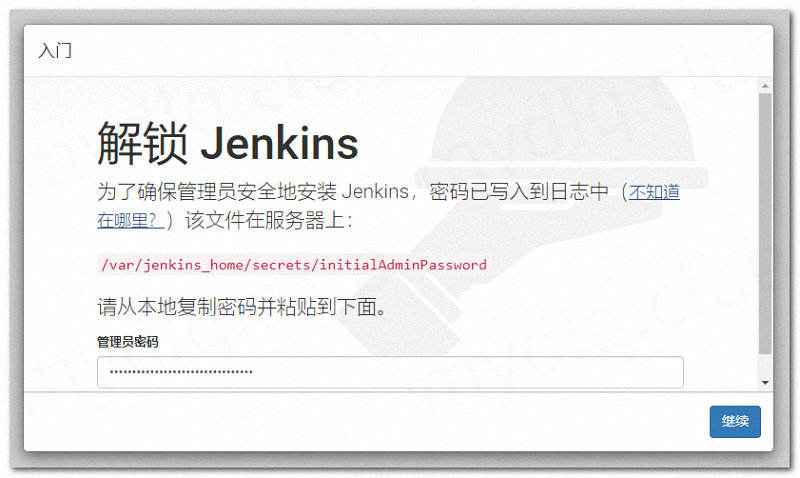
   
2.    安装插件

      安装插件，选择 `推荐安装` 方式进行安装即可，后续再安装需要的插件。

      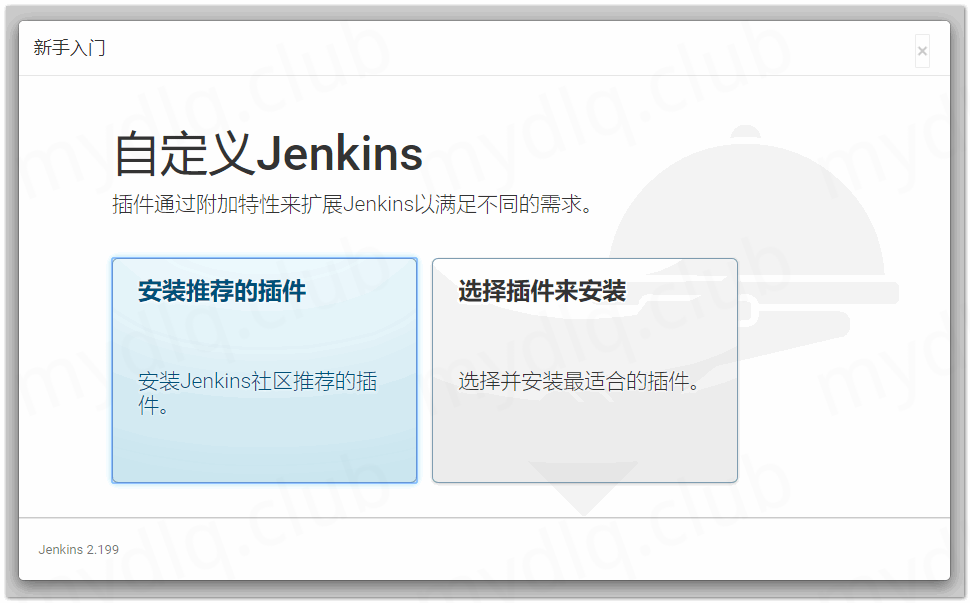

3.    设置用户名、密码

      在这里输入一个用户名、密码，方便后续登录，如果不设置可能下次登录需要使用之前日志中默认的 Token 串来登录。

      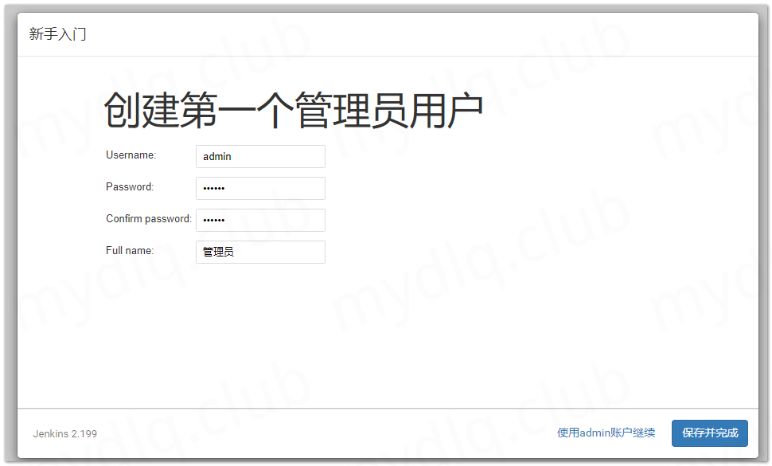

4.    配置 Jenkins 地址

      配置 Jenkins URL 地址，来告知 Jenkins 自己的 URL，在发送邮件、触发钩子等可能用到。

      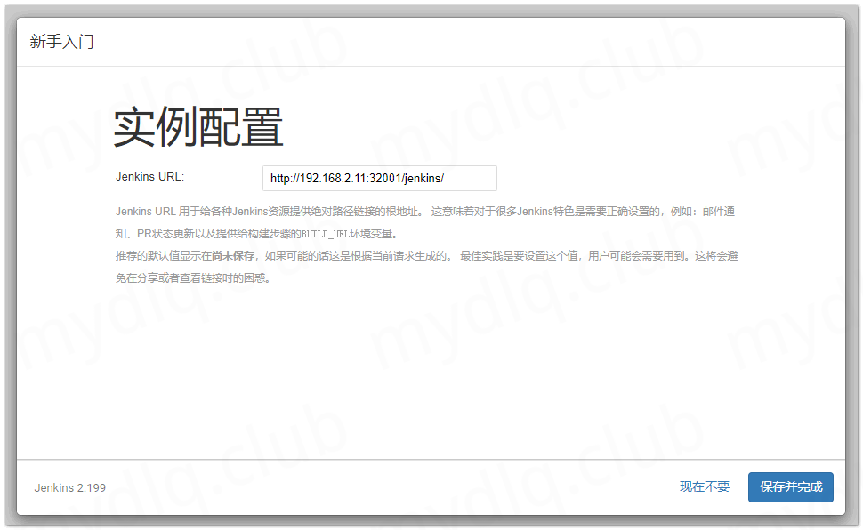

5.    进入 Jenkins 界面

      到此 Jenkins 初始化就配置完成，成功进入 Jenkins 界面。

      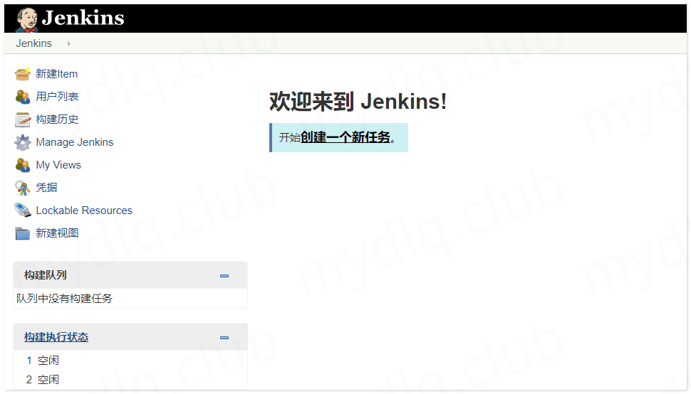

## Jenkins 安装相关插件

Jenkins 中可以打开`系统管理`->`插件管理`->`可选插件`来安装下面的一些插件：

- **Git：** Jenkins 安装中默认安装 Git 插件，所以不需要单独安装。利用 git 工具可以将 github、gitlab 等等的地址下载源码。
- **Docker：** Jenkins 安装中默认安装 Docker 插件，所以不需要单独安装。利用 Docker 插件可以设置 Docker 环境，运行 Docker 命令，配置远程 Docker 仓库凭据等。
- **Docker Pipeline：**Build and use Docker containers from pipelines.
- **Kubernetes：** Kubernetes 插件的目的是能够使用 Kubernetes 集群动态配置 Jenkins 代理（使用Kubernetes调度机制来优化负载），运行单个构建，等构建完成后删除该代理。这里我们需要用到这个插件来启动 Jenkins Slave 代理镜像，让代理执行 Jenkins 要执行的 Job。
- **Kubernetes Cli：** Kubernetes Cli 插件作用是在执行 Jenkins Job 时候提供 kubectl 与 Kubernetes 集群交互环境。可以在 Pipeline 或自由式项目中允许执行 kubectl 相关命令。它的主要作用是提供 kubectl 运行环境，当然也可以提供 helm 运行环境。
- **Config File Provider：** Config File Provider 插件作用就是提供在 Jenkins 中存储 properties、xml、json、settings.xml 等信息，可以在执行 Pipeline 过程中可以写入存储的配置。例如，存入一个 Maven 全局 Settings.xml 文件，在执行 Pipeline Job 时候引入该 Settings.xml ，这样 Maven 编译用的就是该全局的 Settings.xml。
- **Pipeline Utility Steps：** 这是一个操作文件的插件，例如读写 json、yaml、pom.xml、Properties 等等。在这里主要用这个插件读取 pom.xml 文件的参数设置，获取变量，方便构建 Docker 镜像。
- **Git Parameter：** 能够与 Git 插件结合使用，动态获取 Git 项目中分支信息，在 Jenkins Job 构建前提供分支选项，来让项目执行人员选择拉取对应分支的代码。
- **HTTP Request Plugin：**This plugin sends a http request to an url with some parameters

## 配置相关凭据

选择 `凭据`->`系统`->`全局凭据`->`添加凭据`来新增 `Git`、`Docker Hub`、`Kubernetes` 等认证凭据。

### 添加 Git 认证凭据

**配置的参数值：**

- 类型：Username with password
- 范围：全局
- 用户名（Git 用户名）： 请填写自己的git账号
- 密码（Git 密码）：请填写自己的git账号密码
- ID：global-git-credential
- 描述：全局 Git 凭据

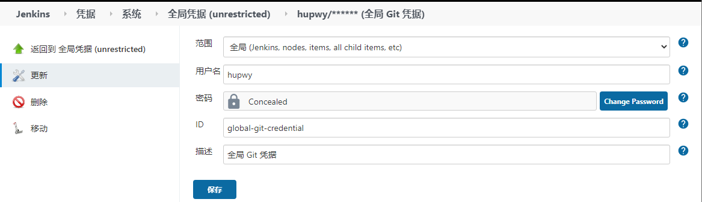

### 添加 Kubernetes Token 凭据

**配置的参数值：**

- 类型：Secret text
- 范围：全局
- Secret（K8S Token 串）：请填写自己的kubernetes集群的token
- ID：global-kubernetes-credential
- 描述：全局的 K8S Token

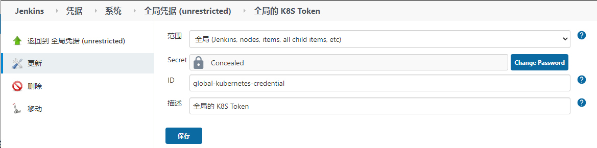


### 添加 Docker 仓库认证凭据

**配置的参数值：**

- 类型：Username with password
- 范围：全局
- 用户名（Docker 仓库用户名）：请填写自己的Docker仓库的账号
- 密码（Docker 仓库密码）：请填写自己的Docker仓库的账号密码
- ID：docker-hub-credential
- 描述：Docker 仓库认证凭据

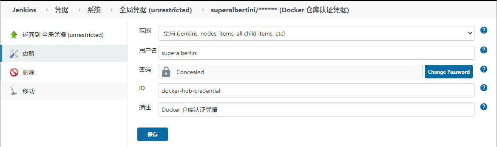

## Jenkins 配置 Kubernetes 插件 

进入 `系统管理`->`系统设置`->`云`中，点击 `新增一个云`选项，来新建一个与 Kubernetes 的连接，然后按照下面各个配置项进行配置。

### Kubernetes Plugin 基本配置

1. 配置连接 Kubernetes 参数

   配置 Kubernetes API 地址，然后再选择 Kubernetes Token 凭据。

   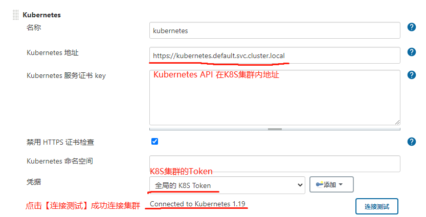

   **注意：** 如果你的 Jenkins 也是安装在 Kubernetes 环境中，那么可以直接使用 Kubernetes 集群内的 Kubernetes API 地址，如果 Jnekins 是在安装在正常物理机或者虚拟机环境中，那么使用集群外的 Kubernetes API 地址，两个地址如下：

   - 集群内地址：https://kubernetes.default.svc.cluster.local
   - 集群外地址：https://{Kubernetes 集群 IP}:6443

   然后点击【连接测试】按钮，查看是否能成功连通 Kubernetes，如果返回结果【Connected to Kubernetes 1.19】则代表连接成功，否则失败。

2. 配置 Jenkins 地址

   

   **注意：** 这里的 Jenkins 地址是供Slave节点连接 Jenkins Master节点用的，所以这里需要配置 Jenkins Master 的 URL 地址。这里和上面一样，也是考虑 Jenkins 是部署在 Kubernetes 集群内还是集群外，两个地址如下：

   - 集群内地址：https://{Jenkins Service 名称}.{Jenkins Service 所在 Namespace}/{Jenkins 前缀}
   - 集群外地址：https://{Kubernetes 集群 IP}:{Jenkins NodePort 端口}/{Jenkins 前缀}

   > 如果 Jnekins 中配置了 /jenkins 前缀，则 URL 后面加上 /jenkins，否则不加，这个地址根据自己的 Jnekins 实际情况来判断。

### Kubernetes 插件 Pod 模板配置

1. 配置Pod名称和标签列表

   配置Pod模板的名称和标签列表名，Pod模板名可用于子模板继承，标签列表可用于Jenkins Job中指定，使用此Pod模板来执行任务。

   

2. 配置 Pod 的原始 yaml

   在Pod 的原始yaml 配置中，加入一段配置，用于改变Kubernetes Plugin自带的 JNLP 镜像，并指定 `RunAsUser=0` 来使容器以`Root`身份执行任务，并设置`privileged=true` 来让Slave Pod在Kubernetes中拥有特权。

   > Jenkins Slave JNLP 镜像官方地址 https://hub.docker.com/r/jenkins/slave 可以从中下载相关 JNLP 代理镜像。

   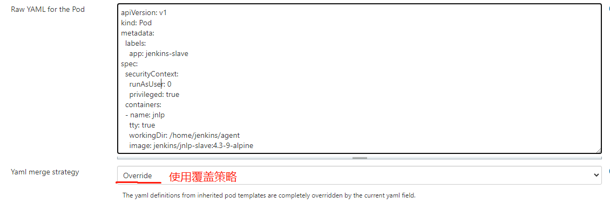

   yaml 内容如下：

   ```yaml
   apiVersion: v1
   kind: Pod
   metadata:
     labels:
       app: jenkins-slave   #要和伤命定义的Pod模板名称相同
   spec:
     securityContext:
       runAsUser: 0
       privileged: true
     containers:
     - name: jnlp
       tty: true
       workingDir: /home/jenkins/agent
       image: jenkins/jnlp-slave:4.3-9-alpine
   ```

### Kubernetes 插件 Container 配置

将配置 Jenkins Slave 在 Kubernetes 中的 Pod 中所包含容器信息，这里镜像都可以从官方 Docker Hub 下载，由于网速原因，本人已经将其下载到 Aliyun 镜像仓库。

1. 配置 Maven 镜像
   - 名称：maven
   
   - Docker 镜像：maven:3.6.3-adoptopenjdk-8
   
   - 其它参数：默认值即可
   
     > Maven 镜像可以从官方 Docker Hub 下载，地址：https://hub.docker.com/_/maven

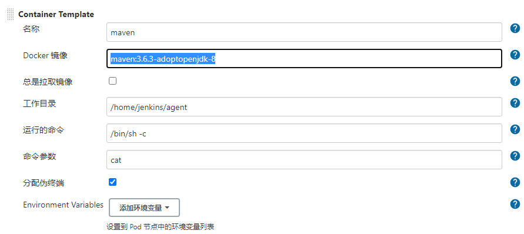
2. 配置 Docker In Docker 镜像

   - 名称：docker

   - Docker 镜像：docker:dind

   - 其它参数：默认值即可

     > Docker-IN-Docker 镜像可以从官方 Docker Hub 下载，地址：https://hub.docker.com/_/docker

     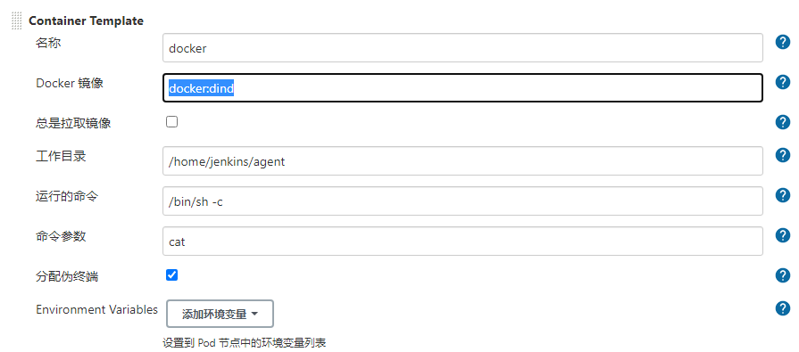

3. 配置 Kubectl 镜像

   - 名称：kubectl

   - Docker 镜像：bitnami/kubectl:1.19.2

   - 其它参数：默认值即可

     > Kubectl 镜像可以从官方 Docker Hub 下载，地址：https://hub.docker.com/r/bitnami/kubectl

     

     

### Container 存储挂载配置

由于上面配置的 Maven、Docker 等都需要挂载存储，Maven 中是将中央仓库下载的 Jar 存储到共享目录，而 Docker 则是需要将宿主机的 Docker 配置挂载到 Docker In Docker 容器内部，所以我们要对挂载进行配置。
    
1. 创建 Maven 存储使用的 PV、PVC
   
        提前在 NFS 卷中，创建用于存储 Maven 相关 Jar 的目录：
        
        > 创建的目录要确保其它用户有读写权限。
        
        ```shell
        $ mkdir /nfs/data/maven
        ```
        
        然后，Kubernetes 下再创建 Maven 的 PV、PVC 部署文件：
        
        **maven-storage.yaml**]
        
        ```yaml
        apiVersion: v1
        kind: PersistentVolume
        metadata:
          name: maven
          labels:
            app: maven
        spec:
          capacity:          
            storage: 100Gi         #根据自身情况填写存储空间大小
          accessModes:       
            - ReadWriteOnce
          persistentVolumeReclaimPolicy: Retain  
          mountOptions:            #NFS挂在选项
            - hard
            - nfsvers=4.1    
          nfs:                     #NFS设置
            path: /nfs/data/maven   
            server: 192.168.3.51   #NFS服务器IP
        ---
        kind: PersistentVolumeClaim
        apiVersion: v1
        metadata:
          name: maven
        spec:
          accessModes:
            - ReadWriteOnce
          resources:
            requests:
              storage: 100Gi        #根据自身情况填写存储空间大小
          selector:
            matchLabels:
              app: maven
        ```
        
        部署 PV、PVC 到 Kubernetes 中：
        
        `-n`：指定 namespace
        
        ````shell
        $ kubectl apply -f maven-storage.yaml -n default
        ````
    
     2. 配置 Maven 挂载
    
        在卷选项中，选择添加卷，选择 `Persistent Volume Claim` 按如下添加配置：
    
        - 申明值（PVC 名称）：maven
        - 挂在路径（容器内的目录）：/root/.m2
    
        
    
     3. 配置 Docker 挂载
    
        Kubernetes 中 Pod 的容器是启动在各个节点上，每个节点就是一台宿主机，里面进行了很多 Docker 配置，所以我们这里将宿主机的 Docker 配置挂载进入 Docker 镜像。选择添加卷，选择 `Host Path Volume` 按如下添加配置：
    
        **① 路径 /usr/bin/docker：**
    
        - 主机路径（宿主机目录）：/usr/bin/docker
        - 挂载路径（容器内的目录）：/usr/bin/docker
    
        **② 路径 /var/run/docker.sock：**
    
        - 主机路径（宿主机目录）：/var/run/docker.sock
        - 挂载路径（容器内的目录）：/var/run/docker.sock
    
        **③ 路径 /etc/docker：**
    
        - 主机路径（宿主机目录）：/etc/docker
        - 挂载路径（容器内的目录）：/etc/docker
    
        

## 创建相关文件

之前安装了`Config File Provider`插件，该插件功能就是可以在Jenkins上存储一些配置文件，例如，我们经常使用到的yaml、properties、Dockerfile、Maven 的 Settings.xml 等文件，都可以存储到Jenkins该插件中。

打开`系统管理`->`Managed files` ，在其中新增几个文件：

- **Maven 配置文件：** Maven 的 Settings.xml 配置文件。
- **Dockerfile 文件：** Dockerfile 脚本。
- **Kubernetes 部署文件：** 将应用部署到 kubernetes 的 Deployment 文件。

### 新增Maven配置文件

选择`Add a new Config`—> `Global Maven settings.xml`来新增一个`Maven`全局`Settings.xml`文件：

- **ID：** global-maven-settings

- **Name：** MavenGlobalSettings

- **Comment：** 全局 Maven Settings.xml 文件

- **Content：** 内容如下：

  > 为了加快 jar 包的下载速度，这里将仓库地址指向 aliyun Maven 仓库地址。

  ```xml
  <?xml version="1.0" encoding="UTF-8"?>
  
  <settings xmlns="http://maven.apache.org/SETTINGS/1.0.0" 
            xmlns:xsi="http://www.w3.org/2001/XMLSchema-instance" 
            xsi:schemaLocation="http://maven.apache.org/SETTINGS/1.0.0 http://maven.apache.org/xsd/settings-1.0.0.xsd">
  
    <pluginGroups></pluginGroups>
  
    <proxies></proxies>
  
    <servers></servers>
  
    <mirrors>
      <!--Aliyun Maven-->
      <mirror>
          <id>alimaven</id>
          <name>aliyun maven</name>
          <url>http://maven.aliyun.com/nexus/content/groups/public/</url>
          <mirrorOf>central</mirrorOf>
      </mirror>
    </mirrors>
      
    <profiles></profiles>
  
  </settings>
  ```

### 新增Dockerfile文件

选择`Add a new Config`—> `Custom file`来新增一个`Dockerfile`文件：

- **ID：** global-dockerfile-file                  **请根据自己的需要定义ID**

- **Name：** Dockerfile                             **请根据自己的需要定义名字**

- **Comment：** 全局 Dockerfile 文件

- **Content：** 内容如下：

  ````dockerfile
  ## 以jre8u265为基础镜像
  FROM openjdk:8u265-jre-slim
  ## 挂在路径
  VOLUME /tmp
  ## 将maven编译的项目jar拷贝到容器的根目录，并重新起名
  ADD k8s-srv-login/target/*.jar k8s-srv-login.jar
  ## 和上面命令用以相同，二选其一就可以
  # RUN sh -c 'touch /k8s-srv-login.jar'
  ## 定义可执行jar的jvm参数 
  ENV JAVA_OPTS="-Xmx512M -Xms256M -Xss256k -Duser.timezone=Asia/Shanghai"
  ## 定义app这身的jvm
  ENV APP_OPTS=""
  ## 执行拷贝到容器里的jar
  ENTRYPOINT [ "sh", "-c", "java $JAVA_OPTS -Djava.security.egd=file:/dev/./urandom -jar /k8s-srv-login.jar $APP_OPTS" ]
  ````

### 新增 Kubernetes 部署文件

选择`Add a new Config`—> `Custom file`来新增一个`Kubernetes` 部署文件：

- **ID：** global-kubernetes-deployment                      **请根据自己的需要定义ID**

- **Name：** deployment.yaml                                       **请根据自己的需要定义名字**

- **Comment：** 全局 Kubernetes 部署文件 

- **Content：** 内容如下：

  ````yaml
  apiVersion: v1
  kind: Service
  metadata:
    annotations:
      prometheus.io/port: "9779"
      prometheus.io/scrape: "true"
    labels:
      app: #APP_NAME
      version: #APP_VERSION
      group: #APP_GROUP
    name: #APP_NAME
    namespace: #KUBERNETES_NAMESPACE
  spec:
    ports:
    - name: http
      port: #HTTP_REQUEST_PORT
      protocol: TCP
      targetPort: #HTTP_REQUEST_PORT
    selector:
      app: #APP_NAME
      group: #APP_GROUP
    type: NodePort
  ---
  apiVersion: apps/v1
  kind: Deployment
  metadata:
    labels:
      app: #APP_NAME
      version: #APP_VERSION
      group: #APP_GROUP
    name: #APP_NAME
    namespace: #KUBERNETES_NAMESPACE
  spec:
    replicas: #APP_REPLICAS
    revisionHistoryLimit: 2
    selector:
      matchLabels:
        app: #APP_NAME
        group: #APP_GROUP
    template:
      metadata:
        labels:
          app: #APP_NAME
          version: #APP_VERSION
          group: #APP_GROUP
        namespace: #KUBERNETES_NAMESPACE
      spec:
        containers:
        - env:
          - name: KUBERNETES_NAMESPACE
            valueFrom:
              fieldRef:
                fieldPath: metadata.namespace
          - name: "update_uuid"
            value: "#APP_UUID"    #生成的随机值，放置执行kubectl apply时能够执行
          image: #APP_IMAGE_NAME
          imagePullPolicy: IfNotPresent
          livenessProbe:
            failureThreshold: 3
            httpGet:
              path: #HTTP_REQUEST_URL
              port: #HTTP_REQUEST_PORT
              scheme: HTTP
            initialDelaySeconds: 180
            successThreshold: 1
          name: spring-boot
          ports:
          - containerPort: #HTTP_REQUEST_PORT
            name: http
            protocol: TCP
          - containerPort: 9779
            name: prometheus
            protocol: TCP
          - containerPort: 8778
            name: jolokia
            protocol: TCP
          readinessProbe:
            failureThreshold: 3
            httpGet:
              path: #HTTP_REQUEST_URL
              port: #HTTP_REQUEST_PORT
              scheme: HTTP
            initialDelaySeconds: 10
            successThreshold: 1
          securityContext:
            runAsUser: 0
            privileged: true
  ````

  为了模板能够动态替换某些值，上面模板中设置了几个可替换的参数，用 **#变量名称** 来标记，后面我们在执行 Pipeline 时候将里面的 **#xxx变量** 标记替换掉，上面配置的变量有：

  - **#APP_NAME：** 应用名称。
  - **#APP_REPLICAS：** 应用副本数。
  - **#APP_IMAGE_NAME：** 镜像名称。
  - **#HTTP_REQUEST_URL：**应用请求的url
  - **#HTTP_REQUEST_PORT：**应用请求的端口
  - **#APP_VERSION：**应用的版本
  - **#APP_GROUP：**应用的groupId
  - **#KUBERNETES_NAMESPACE：**应用所在的namespace
  - **#APP_UUID：** 生成的随机值，因为后续 Kubectl 在执行命令时候，如果部署对象中的值没有一点变化的话，将不会执行 kubectl apply 命令，所以这里设置了一个随机值，以确保每次部署文件都不一致。

  并且还有一点就是要注意，设置更新策略为 Recreate（删除再创建） 策略，否则后面的健康检查阶段将不能正常检查更新后的项目。

  > Kubernetes默认为RollingUpdate策略，该策略为应用启动时，先将新实例启动，再删除旧的实例，就是因为这样，在后面健康检查阶段，健康检查URL 地址还是未更新前的旧实例的URL地址，会导致健康检查不准确，所以必须改为Recreate策略，先删除旧实例，再创建新实例。

## 如何写流水线脚本和使用插件

### 脚本中设置全局超时时间

设置任务超时时间，如果在规定时间内任务没有完成，则进行失败操作，格式如下：

```groovy
timeout(time: 60, unit: 'SECONDS') {
    // 脚本
}
```

### 脚本中使用 Git 插件

Git 插件方法使用格式，及其部分参数：

- **changelog：** 是否检测变化日志
- **url：** Git 项目地址
- **branch：** Git 分支
- **credentialsId：** Jenkins 存的 Git 凭据 ID 值

```groovy
git changelog: true,
    url: "http://gitlab.xxxx/xxx.git"
    branch: "master",
    credentialsId: "xxxx-xxxx-xxxx-xxxx",
```

### 脚本中使用 Kubernetes 插件

Kubernetes 插件中存在 PodTemplate 方法，在执行脚本时候，会自动在 Kubernetes 中创建 Pod Template 配置的 Slave Pod，在其中执行 podTemplate 代码块中的脚本。

```groovy
def label = "jnlp-agent"
podTemplate(label: label,cloud: 'kubernetes' ){
    node (label) {
        print "在 Slave Pod 中执行任务"  
    }
}
```

**podTemplate 方法参数简介：**

- **cloud：** 之前 Kuberntes 插件配置的 Cloud 名称
- **label：** 之前 Kuberntes 插件配置的 Cloud 中 Pod Template 里面的 Label 标签名称。

### 脚本中使用 Docker 镜像

在之前配置了Kubernetes插件的Pod Template配置中，配置了几个容器，每个容器中都有特定的功能的环境，例如：

- Maven 容器中能够执行`mvn`命令。
- Kuberctl 容器能够执行`kubectl`命令。
- Docker In Docker 容器中能够执行`Docker`命令。

既然每个容器都能提供特定的环境，那么再执行执行 Pipleline 脚本时候，就可以在不同的镜像中使用不同的环境的命令：

- Maven 镜像

  ```groovy
  container('maven') {  
      sh "mvn install
  }
  ```

- Docker In Docker 镜像

  ```groovy
  container('docker') {  
      sh "docker build -t xxxxx:1.0.0 .
  }
  ```

- Kubectl 镜像

  ```groovy
  container('kubectl') {  
      sh "kubectl apply -f xxxx.yaml"
  }
  ```

### 脚本中引入Jenkins中预先存储的文件

在之前的`系统设置`->`File Manager`中，存储了很多文件，例如：

- Docker 的镜像构建脚本文件 Dockerfile。
- Maven 的全局设置文件 Settings.xml
- Kubernetes 的部署文件 deployment.yaml

在使用 Pipleline 脚本时候，我们需要将这些文件文本提取出来，创建在执行任务的流程中，创建这些文件可以使用 Config File Provider 插件提供的 configFileProvider 方法，如下所示：

- 创建 settings.xml 文件

  ```groovy
  configFileProvider([configFile(fileId: "global-maven-settings", targetLocation: "settings.xml")]){
      sh "cat settings.xml"
  }
  ```

- 创建 Dockerfile 文件

  ```groovy
  configFileProvider([configFile(fileId: "global-dockerfile-file", targetLocation: "Dockerfile")]){
      sh "cat Dockerfile"
  }
  ```

- 创建 Dockerfile 文件

  ```groovy
  configFileProvider([configFile(fileId: "global-kubernetes-deployment", targetLocation: "deployment.yaml")]){
      sh "cat deployment.yaml"
  }
  ```

### 脚本创建文件

在使用 Groovy 写 Pipleline 脚本时候，经常要将变量的文本生成文件，方便在执行流水线过程中操作文本文件使用，如何将文件转换为文件，可以使用 Pipeline Utility Steps 插件的 writeFile 方法，如下：

```groovy
writeFile encoding: 'UTF-8', file: './test.txt', text: "写入文件的文本内容"
```

### 脚本中使用Http Rrequest插件

脚本中可以使用`HttpRequest`来对某一地址进行请求，这里简单使用`Get`请求地址，复杂的可以查看Jenkins插件的官网查看使用示例。

下面是使用`Http Request`的`Get`请求示例：

```groovy
result = httpRequest "http:www.baidu.com"

if ("${result.status}" == "200") {
    print "Http 请求成功"
} 
```

### 脚本中使用 Kubernetes Cli 插件

在之前说过，在`kubectl`镜像中能够使用`kubectl`命令，不过由于执行`Kubectl`命令一般需要在镜像的`$HOME/.kube/`目录中存在连接`Kubernetes API`的 `config`文件，使其`kubectl`命令有明确请求`kubernetes API`的地址和用户权限，不过将`config`文件挂入镜像内部是一件比较繁琐的事情。

好在`Jenkins`提供的`Kubectl Cli`插件，只要在其中配置连接`Kubernetes`的`Token`凭据，就能够在`Kubectl Cli`提供的`withKubeConfig`方法，拥有类似存在 `config`一样的功能，在`kubectl`镜像中的`withKubeConfig`方法块内执行`kubectl`就可以操作配置的`Kubectl Cli`的凭据的`K8S`集群。

```groovy
container('kubectl') {
    withKubeConfig([credentialsId: "Kubernetes Token 凭据 ID",serverUrl: "https://kubernetes.default.svc.cluster.local"]) {
        sh "kubectl get nodes"
    }
}
```

### 脚本中操作字符串替换值

在使用 Groovy 语法写 Pipleline 脚本时候，我们经常要替换先前设置好的一些文本的值，这里我们简单示例一下，如何替换字符串。

```groovy
// 测试的字符串
sourceStr = "这是要替换的值：#value1，这是要替换的值：#value2"

// 替换#value1与#value2连个值
afterStr = deploy.replaceAll("#value1","AAA").replaceAll("#value2","BBB")

// 输出替换后的字符串
print "${afterStr}"
```

### 脚本中读取 pom.xml 参数

在执行Java项目的流水线时，我们经常要动态获取项目中的属性，很多属性都配置在项目的`pom.xml`中，还好`Pipeline Utility Steps`插件提供能够读取 `pom.xml`的方法，示例如下：

```groovy
stage('读取pom.xml参数阶段'){
    // 读取 Pom.xml 参数
    pom = readMavenPom file: './pom.xml'
    // 输出读取的参数
    print "${pom.artifactId}"
    print = "${pom.version}"
}
```

### 脚本中使用 Docker 插件构建与推送镜像

在流水线脚本中，我们一般不直接使用`Docker`命令，而是使用`Docker`插件提供的`docker.withRegistry("")`方法来构建与推送镜像，并且还能在方法中配置登录凭据信息，来让仓库验证权限，这点是非常方便的。使用示例如下：

```groovy
docker.withRegistry("http://xxxx Docker仓库地址", "Docker仓库凭据ID") {
        // 构建 Docker 镜像
        def customImage = docker.build("${dockerImageName}")
        // 推送 Docker 镜像
        customImage.push()
    }
```

## 在 Jenkins 创建模板任务

创建一个`Pipeline Job`来充当各个`Jenkins Job`的模板，方便后续创建`Job`时，直接复制模板项目，然后修改配置就能使用。所以这里我们创建一个模板 `Pipeline Job`，在`Job`配置中需要添加一些参数和环境变量，方便我们动态替换一些值。

### 创建 Pipeline 任务

- **任务名称：** my-template

- **任务类型：** 流水线项目

  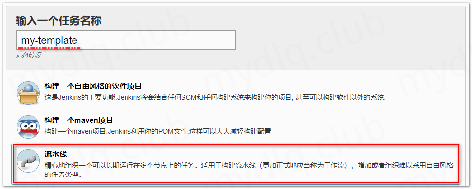

### 配置项目构建基本参数

配置同一时间一个Job只能构建一个，不允许多个并发构建。另外需要设置项目构建后，包的保留时间，以防止包过多且大占用大量空间（一个包很肯能占 10MB~200MB 大小）导致储不足。


### 配置 Git 变量

在`Job`配置的`参数化构建过程`中，添加下面参数：

**Git 项目地址变量**

- 变量名称：GIT_PROJECT_URL
- 类型：String
- 描述：项目Git地址
- 默认值：https://github.com/hupwy/k8s-cloud-parent.git


### Git 分支变量

- 变量名称：GIT_BRANCH

- 类型：Git Parameter

- 描述：选择 Git 分支

- 默认值：mian

  

### Git 凭据变量

- 变量名称：GIT_CREADENTIAL
- 类型：Credentials
- 描述：Git 凭据
- 默认值：global-git-credential


### 配置 Maven 变量

**Maven 构建命令变量**

- 变量名称：MAVEN_BUILD_OPTION

- 类型：Choices

- 描述：要执行的执行 Maven 命令选择

- 可选值：[‘install’, ‘package’, ‘deploy’]

- 默认值：install

  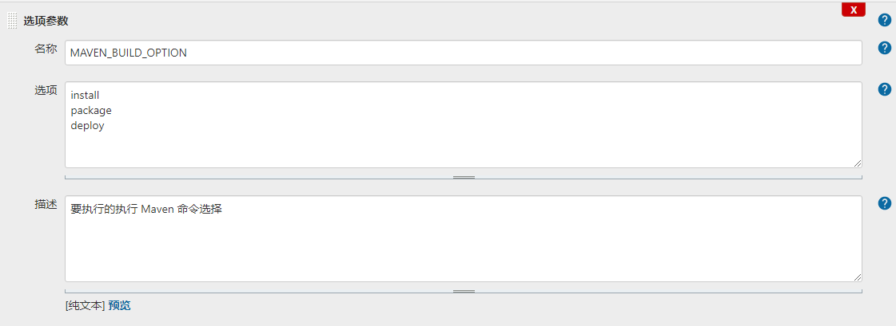

### 配置 Docker 变量

#### Docker项目地址变量

- 变量名称：DOCKER_HUB_URL

- 类型：String

- 描述：Docker 仓库地址

- 默认值（默认 Docker 仓库地址）：”registry.cn-hangzhou.aliyuncs.com”

  

#### Docker 仓库项目组变量

- 变量名称：DOCKER_HUB_GROUP

- 类型：String

- 描述：Docker 仓库项目组名

- 默认值：”docker-hub-demo-cicd”

  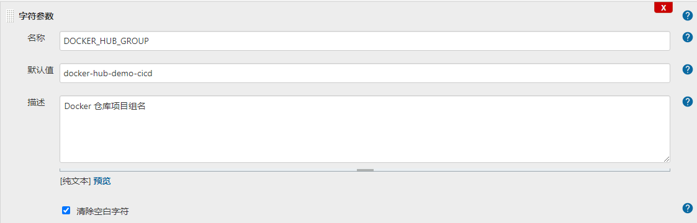

#### Docker 仓库认证凭据变量

- 变量名称：DOCKER_HUB_CREADENTIAL

- 类型：Credentials

- 描述：Docker 仓库认证凭据

- 默认值：docker-hub-credential

  

#### Docker Dockerfile文件ID变量

- 变量名称：DOCKER_DOCKERFILE_ID

- 类型：String

- 描述：存于 Jenkins “Managed files” 的 Dockerfile 文件的 ID

- 默认值：”global-dockerfile-file”

  

### 配置 Kubernetes 变量

#### Kubernetes 认证凭据变量

- 变量名称：KUBERNETES_CREADENTIAL

- 类型：Credentials

- 描述：Kubernetes 认证 Token

- 默认值：global-kubernetes-credential

  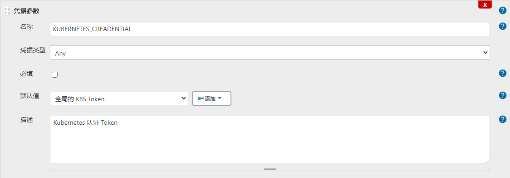

#### Kubernetes Namespace变量

- 变量名称：KUBERNETES_NAMESPACE

- 类型：String

- 描述：Kubernetes 命名空间 Namespace

- 默认值：”hup-ns”                                               `根据自己的Namespace填写`

  

#### Kubernetes 应用实例副本数

- 变量名称：KUBERNETES_APP_REPLICAS

- 类型：String

- 描述：应用实例副本数

- 默认值：1

  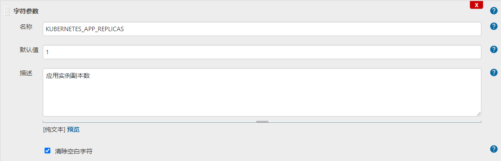

#### Kubernetes应用部署yaml文件ID

- 变量名称：KUBERNETES_DEPLOYMENT_ID

- 类型：String

- 描述：存于 Jenkins “Managed files” 的 K8S 部署文件的 ID

- 默认值：”global-kubernetes-deployment”

  

### 配置 HTTP 变量

#### HTTP 健康检查端口

- 变量名称：HTTP_REQUEST_PORT

- 类型：String

- 描述：Http Request 端口（健康检测端口）

- 默认值：8080

  

#### HTTP 健康检查地址

- 变量名称：HTTP_REQUEST_URL

- 类型：String

- 描述：Http Request 项目中的相对路径（健康检测路径）

- 默认值：/actuator/health

  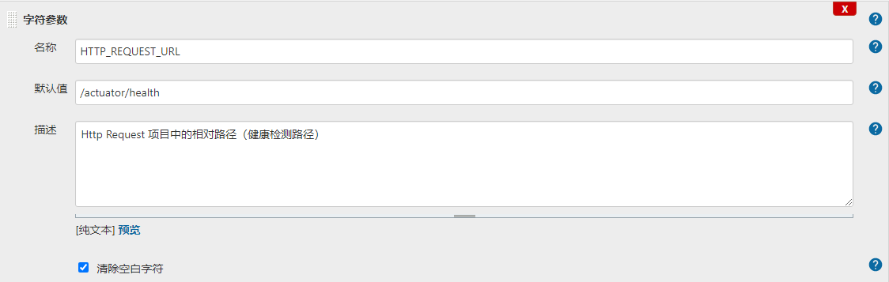

#### HTTP 健康检查次数

- 变量名称：HTTP_REQUEST_NUMBER

- 类型：Choices

- 描述：Http Request 请求次数

- 可选值：[‘10’, ‘5’, ‘10’, ‘15’, ‘20’, ‘25’, ‘30’]

- 默认值：10

  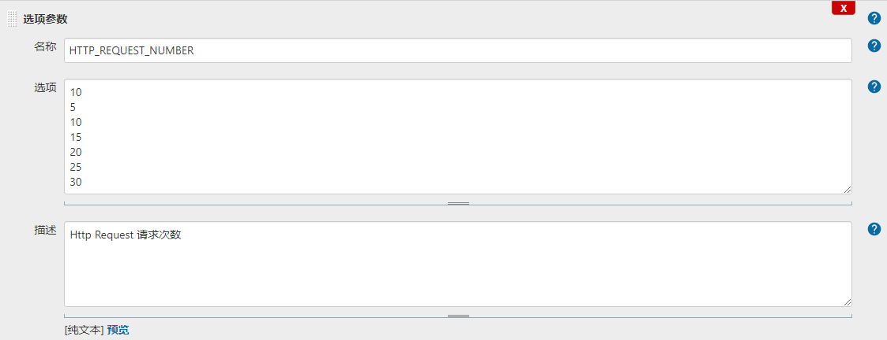

#### HTTP 健康检查时间间隔

- 变量名称：HTTP_REQUEST_INTERVAL

- 类型：Choices

- 描述：Http Request 时间间隔

- 可选值：[‘10’, ‘5’, ‘15’, ‘20’, ‘25’, ‘30’]

- 默认值：10

  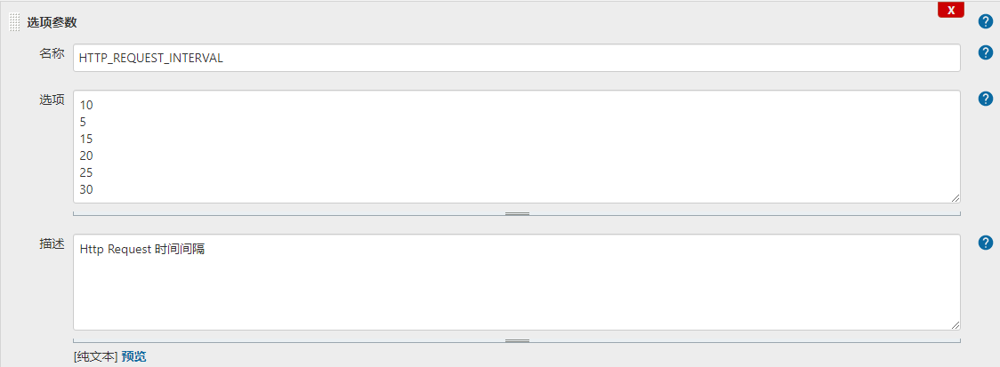

## 创建 Pipeline 脚本

接下将使用Groovy语法创建一个为SpringBoot项目准备的CI/CD的脚本式的流水线脚本。其中，脚本中包含多个阶段，分别为Git拉取代码，Maven编译Java项目，Docker构建与推送镜像，Kubectl部署应用到Kubernetes 中，最后使用Http请求进行健康检查，下面是各个阶段脚本及其介绍。

### 脚本中使用Kubernetes插件及设置超时时间

使用 Kubernetes 插件执行任务，并设置超时时间为 10 分钟，脚本如下：

```groovy
// 设置超时时间900SECONDS,方法块内的方法执行超时,任务就标记为失败
timeout(time: 900, unit: 'SECONDS') {
    def label = "jenkins-slave"
    
    podTemplate(label: label,cloud: 'kubernetes' ){
        node (label) {
            print "在 Slave Pod 中执行任务"  
        }
    }
}
```

### 脚本中 Git 拉取项目阶段

接下来接着往整体的脚本中添加 Git 模块，其中需要引用上面配置的变量，将变量填入脚本中的方法，如下：

```groovy
timeout(time: 900, unit: 'SECONDS') {
    def label = "jenkins-slave"
    podTemplate(label: label,cloud: 'kubernetes' ){
        node (label) {
            stage('Git阶段'){
                git changelog: true,
                    url: "${params.GIT_PROJECT_URL}"，
                    branch: "${params.GIT_BRANCH}",
                    credentialsId: "${params.GIT_CREADENTIAL}"
            }
        }
    }
}
```

**变量介绍：**

- **GIT_BRANCH：** Git 项目分支变量。
- **GIT_PROJECT_URL：** Git 项目 URL 变量。
- **GIT_CREADENTIAL：** Git 凭据 ID 变量。

### 脚本中 Maven 编译项目阶段

```groovy
timeout(time: 900, unit: 'SECONDS') {
    def label = "jenkins-slave"
    podTemplate(label: label,cloud: 'kubernetes' ){
        node (label) {
            stage('Git阶段'){
                git changelog: true,
                    url: "${params.GIT_PROJECT_URL}"，
                    branch: "${params.GIT_BRANCH}",
                    credentialsId: "${params.GIT_CREADENTIAL}"
            }
            stage('Maven阶段'){
                container('maven') {  
                    // 创建 Maven 需要的 Settings.xml 文件
                    configFileProvider([configFile(fileId: "global-maven-settings", targetLocation: "settings.xml")]){
                        // 执行 Maven 命令构建项目，并且设置 Maven 配置为刚刚创建的 Settings.xml 文件
                        sh "mvn -T 1C clean ${MAVEN_BUILD_OPTION} -Dmaven.test.skip=true --settings settings.xml"
                    }
                }
            }
        }
    }
}
```

**变量介绍：**

- **MAVEN_BUILD_OPTION：** Maven 执行的构建命令，package、install 或 deploy。
- **global-maven-settings：** 全局 Maven 的 Settings.xml 文件的 ID 值，这里是使用 configFileProvider 插件来创建该文件。

### 脚本中读取 pom.xml 参数阶段

这里使用 `Pipeline Utility Steps` 的 `readMavenPom` 方法读取项目的 `pom.xml` 文件，并设置 `appName` 与 `appVersion` 两个全局参数。

```groovy
timeout(time: 900, unit: 'SECONDS') {
    def label = "jenkins-slave"
    podTemplate(label: label,cloud: 'kubernetes' ){
        node (label) {
            stage('Git阶段'){
                git changelog: true,
                    url: "${params.GIT_PROJECT_URL}"，
                    branch: "${params.GIT_BRANCH}",
                    credentialsId: "${params.GIT_CREADENTIAL}"
            }
            stage('Maven阶段'){
                container('maven') {  
                    // 创建Maven需要的Settings.xml文件
                    configFileProvider([configFile(fileId: "global-maven-settings", targetLocation: "settings.xml")]){
                        // 执行Maven命令构建项目
                        sh "mvn -T 1C clean ${MAVEN_BUILD_OPTION} -Dmaven.test.skip=true --settings settings.xml"
                    }
                }
            }
            stage('读取pom.xml参数阶段'){
                // 读取 Pom.xml 参数
                pom = readMavenPom file: './k8s-srv-login/pom.xml'
                // 设置 appName 和 appVersion 两个全局参数
                appName = "${pom.artifactId}"
                appVersion = "${pom.version}"
                appGroup = "${pom.groupId}"
            }
        }
    }
}
```

**变量介绍：**

- **pom.artifactId：** 从 pom.xml 文件中读取的artifactId参数值。
- **pom.groupId：** 从 pom.xml 文件中读取的groupId参数值。
- **pom.version：** 从 pom.xml 文件中读取的version参数值。

### 脚本中 Docker 镜像构建与推送模块

```groovy
timeout(time: 900, unit: 'SECONDS') {
    def label = "jenkins-slave"
    podTemplate(label: label,cloud: 'kubernetes' ){
        node (label) {
            stage('Git阶段'){
                git changelog: true,
                    url: "${params.GIT_PROJECT_URL}"，
                    branch: "${params.GIT_BRANCH}",
                    credentialsId: "${params.GIT_CREADENTIAL}"
            }
            stage('Maven阶段'){
                container('maven') {  
                    // 创建 Maven 需要的 Settings.xml 文件
                    configFileProvider([configFile(fileId: "global-maven-settings", targetLocation: "settings.xml")]){
                        // 执行 Maven 命令构建项目
                        sh "mvn -T 1C clean ${MAVEN_BUILD_OPTION} -Dmaven.test.skip=true --settings settings.xml"
                    }
                }
            }
            stage('读取pom.xml参数阶段'){
                // 读取 Pom.xml 参数
                pom = readMavenPom file: './k8s-srv-login/pom.xml'
                // 设置 appName 和 appVersion 两个全局参数
                appName = "${pom.artifactId}"
                appVersion = "${pom.version}"
                appGroup = "${pom.groupId}"
            }
            stage('Docker阶段'){
                container('docker') {
                    // 创建 Dockerfile 文件，但只能在方法块内使用
                    configFileProvider([configFile(fileId: "${params.DOCKER_DOCKERFILE_ID}", targetLocation: "Dockerfile")]){
                        // 设置 Docker 镜像名称
                        dockerImageName = "${params.DOCKER_HUB_URL}/${params.DOCKER_HUB_GROUP}/${appName}:${appVersion}"
                        if ("${params.DOCKER_HUB_GROUP}" == '') {
                            dockerImageName = "${params.DOCKER_HUB_URL}/${appName}:${appVersion}"
                        }
                        // 提供 Docker 环境，使用 Docker 工具来进行 Docker 镜像构建与推送
                        docker.withRegistry("http://${params.DOCKER_HUB_URL}", "${params.DOCKER_HUB_CREADENTIAL}") {
                            def customImage = docker.build("${dockerImageName}")
                            customImage.push()
                        }
                    }
                }
            }
        }
    }
}
```

**变量介绍：**

- **DOCKER_DOCKERFILE_ID：** Dockerfile 文件的 ID。
- **DOCKER_HUB_URL：** Docker 仓库 URL 地址。
- **DOCKER_HUB_GROUP：** Docker 仓库项目组名。
- **DOCKER_HUB_CREADENTIAL：** Docker 仓库认证凭据。
- **appName：** 从 pom.xml 中读取的应用名称。
- **appVersion：** 从 pom.xml 中读取的应用版本号。

### Kubernetes 模块

````groovy
timeout(time: 900, unit: 'SECONDS') {
    def label = "jenkins-slave"
    podTemplate(label: label,cloud: 'kubernetes' ){
        node (label) {
            stage('Git阶段'){
                git changelog: true,
                    url: "${params.GIT_PROJECT_URL}"，
                    branch: "${params.GIT_BRANCH}",
                    credentialsId: "${params.GIT_CREADENTIAL}"
            }
            stage('Maven阶段'){
                container('maven') {  
                    // 创建 Maven 需要的 Settings.xml 文件
                    configFileProvider([configFile(fileId: "global-maven-settings", targetLocation: "settings.xml")]){
                        // 执行 Maven 命令构建项目
                        sh "mvn -T 1C clean ${MAVEN_BUILD_OPTION} -Dmaven.test.skip=true --settings settings.xml"
                    }
                }
            }
            stage('读取pom.xml参数阶段'){
                // 读取 Pom.xml 参数
                pom = readMavenPom file: './k8s-srv-login/pom.xml'
                // 设置 appName 和 appVersion 两个全局参数
                appName = "${pom.artifactId}"
                appVersion = "${pom.version}"
                appGroup = "${pom.groupId}"
            }
            stage('Docker阶段'){
                container('docker') {
                    // 创建 Dockerfile 文件，但只能在方法块内使用
                    configFileProvider([configFile(fileId: "${params.DOCKER_DOCKERFILE_ID}", targetLocation: "Dockerfile")]){
                        // 设置 Docker 镜像名称
                        dockerImageName = "${params.DOCKER_HUB_URL}/${params.DOCKER_HUB_GROUP}/${appName}:${appVersion}"
                        // 判断 DOCKER_HUB_GROUP 是否为空，有些仓库是不设置仓库组的
                        if ("${params.DOCKER_HUB_GROUP}" == '') {
                            dockerImageName = "${params.DOCKER_HUB_URL}/${appName}:${appVersion}"
                        }
                        // 提供 Docker 环境，使用 Docker 工具来进行 Docker 镜像构建与推送
                        docker.withRegistry("http://${params.DOCKER_HUB_URL}", "${params.DOCKER_HUB_CREADENTIAL}") {
                            def customImage = docker.build("${dockerImageName}")
                            customImage.push()
                        }
                    }
                }
            }
            stage('Kubernetes 阶段'){
                // kubectl 镜像
                container('kubectl') {
                    // 使用 Kubectl Cli 插件的方法，提供 Kubernetes 环境，在其方法块内部能够执行 kubectl 命令
                    withKubeConfig([credentialsId: "${params.KUBERNETES_CREADENTIAL}",serverUrl: "https://kubernetes.default.svc.cluster.local"]) {
                        // 使用 configFile 插件，创建 Kubernetes 部署文件 deployment.yaml
                        configFileProvider([configFile(fileId: "${params.KUBERNETES_DEPLOYMENT_ID}", targetLocation: "deployment.yaml")]){
                            // 读取 Kubernetes 部署文件
                            deploy = readFile encoding: "UTF-8", file: "deployment.yaml"
                            // 替换部署文件中的变量，并将替换后的文本赋予 deployfile 变量
                            deployfile = deploy.replaceAll("#APP_NAME","${appName}")
                                           .replaceAll("#APP_REPLICAS","${params.KUBERNETES_APP_REPLICAS}")
                                           .replaceAll("#KUBERNETES_NAMESPACE","${params.KUBERNETES_NAMESPACE}")
                                           .replaceAll("#HTTP_REQUEST_PORT","${params.HTTP_REQUEST_PORT}")
                                           .replaceAll("#HTTP_REQUEST_URL","${params.HTTP_REQUEST_URL}")
                                           .replaceAll("#APP_IMAGE_NAME","${dockerImageName}")
                                           .replaceAll("#APP_VERSION","${appVersion}")
                                           .replaceAll("#APP_GROUP","${appGroup}")
                                           .replaceAll("#APP_UUID",(new Random().nextInt(100000)).toString())
                                           
                            // 生成新的 Kubernetes 部署文件，内容为 deployfile 变量中的文本，文件名称为 "deploy.yaml"
                            writeFile encoding: 'UTF-8', file: './deploy.yaml', text: "${deployfile}"
                            // 输出新创建的部署 yaml 文件内容
                            sh "cat deploy.yaml"
                            // 执行 Kuberctl 命令进行部署操作
                            sh "kubectl apply -n ${params.KUBERNETES_NAMESPACE} -f deploy.yaml"
                        }
                    }
                }
            }
        }
    }
}
````

**变量介绍：**

- **KUBERNETES_DEPLOYMENT_ID：** Kubernetes 部署文件的 ID。
- **KUBERNETES_CREADENTIAL：** Kubernetes API 认证凭据。
- **KUBERNETES_NAMESPACE：** Kubernetes 部署应用的 Namespace。
- **KUBERNETES_APP_REPLICAS：** Kubernetes 部署应用的副本数。
- **appName：** 从 pom.xml 中读取的应用名称。
- **dockerImageName：** Docker 镜像名称。

### HTTP 健康检查模块

```groovy
timeout(time: 900, unit: 'SECONDS') {
    def label = "jenkins-slave"
    podTemplate(label: label,cloud:'kubernetes'){
        node (label) {
            stage('Git阶段'){
                git changelog: true,
                    url: "${params.GIT_PROJECT_URL}"，
                    branch: "${params.GIT_BRANCH}",
                    credentialsId: "${params.GIT_CREADENTIAL}"
            }
            stage('Maven阶段'){
                container('maven') {  
                    // 创建 Maven 需要的 Settings.xml 文件
                    configFileProvider([configFile(fileId: "global-maven-settings", targetLocation: "settings.xml")]){
                        // 执行 Maven 命令构建项目
                        sh "mvn -T 1C clean ${MAVEN_BUILD_OPTION} -Dmaven.test.skip=true --settings settings.xml"
                    }
                }
            }
            stage('读取pom.xml参数阶段'){
                // 读取 Pom.xml 参数
                pom = readMavenPom file: './k8s-srv-login/pom.xml'
                // 设置 appName 和 appVersion 两个全局参数
                appName = "${pom.artifactId}"
                appVersion = "${pom.version}"
                appGroup = "${pom.groupId}"
            }
            stage('Docker阶段'){
                container('docker') {
                    // 创建 Dockerfile 文件，但只能在方法块内使用
                    configFileProvider([configFile(fileId: "${params.DOCKER_DOCKERFILE_ID}", targetLocation: "Dockerfile")]){
                        // 设置 Docker 镜像名称
                        dockerImageName = "${params.DOCKER_HUB_URL}/${params.DOCKER_HUB_GROUP}/${appName}:${appVersion}"
                        // 判断 DOCKER_HUB_GROUP 是否为空，有些仓库是不设置仓库组的
                        if ("${params.DOCKER_HUB_GROUP}" == '') {
                            dockerImageName = "${params.DOCKER_HUB_URL}/${appName}:${appVersion}"
                        }
                        // 提供 Docker 环境，使用 Docker 工具来进行 Docker 镜像构建与推送
                        docker.withRegistry("http://${params.DOCKER_HUB_URL}", "${params.DOCKER_HUB_CREADENTIAL}") {
                            def customImage = docker.build("${dockerImageName}")
                            customImage.push()
                        }
                    }
                }
            }
            stage('Kubernetes 阶段'){
                container('kubectl') {
                    // 使用 Kubectl Cli 插件的方法，提供 Kubernetes 环境，在其方法块内部能够执行 kubectl 命令
                    withKubeConfig([credentialsId: "${params.KUBERNETES_CREADENTIAL}",serverUrl: "https://kubernetes.default.svc.cluster.local"]) {
                        // 使用 configFile 插件，创建 Kubernetes 部署文件 deployment.yaml
                        configFileProvider([configFile(fileId: "${params.KUBERNETES_DEPLOYMENT_ID}", targetLocation: "deployment.yaml")]){
                            // 读取 Kubernetes 部署文件
                            deploy = readFile encoding: "UTF-8", file: "deployment.yaml"
                            // 替换部署文件中的变量，并将替换后的文本赋予 deployfile 变量
                            deployfile = deploy.replaceAll("#APP_NAME","${appName}")
                                           .replaceAll("#APP_REPLICAS","${params.KUBERNETES_APP_REPLICAS}")
                                           .replaceAll("#APP_IMAGE_NAME","${dockerImageName}")
                                           .replaceAll("#APP_UUID",(new Random().nextInt(100000)).toString())
                            // 生成新的 Kubernetes 部署文件，内容为 deployfile 变量中的文本，文件名称为 "deploy.yaml"
                            writeFile encoding: 'UTF-8', file: './deploy.yaml', text: "${deployfile}"
                            // 输出新创建的部署 yaml 文件内容
                            sh "cat deploy.yaml"
                            // 执行 Kuberctl 命令进行部署操作
                            sh "kubectl apply -n ${params.KUBERNETES_NAMESPACE} -f deploy.yaml"
                        }
                    }
                }
            }
            stage('健康检查阶段'){
                // 设置检测延迟时间 10s,10s 后再开始检测
                sleep 10
                // 健康检查地址
                httpRequestUrl = "http://${appName}.${params.KUBERNETES_NAMESPACE}:${params.HTTP_REQUEST_PORT}${params.HTTP_REQUEST_URL}"
                // 循环使用 httpRequest 请求，检测服务是否启动
                for(n = 1; n <= "${params.HTTP_REQUEST_NUMBER}".toInteger(); n++){
                    try{
                        // 输出请求信息和请求次数
                        print "访问服务：${appName} \n" +
                              "访问地址：${httpRequestUrl} \n" +
                              "访问次数：${n}"
                        // 如果非第一次检测，就睡眠一段时间，等待再次执行 httpRequest 请求
                        if(n > 1){
                            sleep "${params.HTTP_REQUEST_INTERVAL}".toInteger()
                        }
                        // 使用 HttpRequest 插件的 httpRequest 方法检测对应地址
                        result = httpRequest "${httpRequestUrl}"
                        // 判断是否返回 200
                        if ("${result.status}" == "200") {
                            print "Http 请求成功，流水线结束"
                            break
                        } 
                    }catch(Exception e){
                        print "监控检测失败，将在 ${params.HTTP_REQUEST_INTERVAL} 秒后将再次检测。"
                        // 判断检测次数是否为最后一次检测，如果是最后一次检测，并且还失败了，就对整个 Jenkins 任务标记为失败
                        if (n == "${params.HTTP_REQUEST_NUMBER}".toInteger()) {
                            currentBuild.result = "FAILURE"
                        }
                    }
                }
            }
        }
    }
}
```

**变量介绍：**

- **HTTP_REQUEST_PORT：** HTTP 健康检查端口。
- **HTTP_REQUEST_URL：** HTTP 健康检查 URL 地址。
- **HTTP_REQUEST_NUMBER：** HTTP 健康检查次数。
- **HTTP_REQUEST_INTERVAL：** HTTP 健康检查间隔。
- **KUBERNETES_NAMESPACE：** Kubernetes 的 Namespace。
- **appName：** 从 pom.xml 中读取的应用名称。

### 完整脚本

```groovy
def label = "jenkins-slave"
timeout(time: 900, unit: 'SECONDS') {
    podTemplate(label: label,cloud: 'kubernetes' ){
        node (label) {
            stage('Git阶段'){
                // 执行 Git 命令进行 Clone 项目
                git changelog: true,
                    branch: "${params.GIT_BRANCH}",
                    credentialsId: "${params.GIT_CREADENTIAL}",
                    url: "${GIT_PROJECT_URL}"
            }
            stage('Maven阶段'){
                container('maven') {  
                    // 创建 Maven 需要的 Settings.xml 文件
                    configFileProvider([configFile(fileId: "global-maven-settings", targetLocation: "settings.xml")]){
                        // 执行 Maven 命令构建项目，并且设置 Maven 配置为刚刚创建的 Settings.xml 文件
                        sh "mvn -T 1C clean ${MAVEN_BUILD_OPTION} -pl k8s-srv-login -am -Dmaven.test.skip=true --settings settings.xml"
                    }
                }
            }
            stage('读取pom.xml参数阶段'){
                // 读取 Pom.xml 参数
                pom = readMavenPom file: './k8s-srv-login/pom.xml'
                // 设置 appName 和 appVersion 两个全局参数
                appName = "${pom.artifactId}"
                appVersion = "${pom.version}"
                appGroup = "${pom.groupId}"
            }
            stage('Docker阶段'){
                container('docker') {
                    // 创建 Dockerfile 文件，但只能在方法块内使用
                    configFileProvider([configFile(fileId: "${params.DOCKER_DOCKERFILE_ID}", targetLocation: "Dockerfile")]){
                        // 设置 Docker 镜像名称
                        dockerImageName = "${params.DOCKER_HUB_URL}/${params.DOCKER_HUB_GROUP}/${appName}:${appVersion}"
                        if ("${params.DOCKER_HUB_GROUP}" == '') {
                            dockerImageName = "${params.DOCKER_HUB_URL}/${appName}:${appVersion}"
                        }
                        // 提供 Docker 环境，使用 Docker 工具来进行 Docker 镜像构建与推送
                        docker.withRegistry("http://${params.DOCKER_HUB_URL}", "${params.DOCKER_HUB_CREADENTIAL}") {
                            def customImage = docker.build("${dockerImageName}")
                            customImage.push()
                        }
                    }
                }
            }
            stage('Kubernetes 阶段'){
                // kubectl 镜像
                container('kubectl') {
                    // 使用 Kubectl Cli 插件的方法，提供 Kubernetes 环境，在其方法块内部能够执行 kubectl 命令
                    withKubeConfig([credentialsId: "${params.KUBERNETES_CREADENTIAL}",serverUrl: "https://kubernetes.default.svc.cluster.local"]) {
                        // 使用 configFile 插件，创建 Kubernetes 部署文件 deployment.yaml
                        configFileProvider([configFile(fileId: "${params.KUBERNETES_DEPLOYMENT_ID}", targetLocation: "deployment.yaml")]){
                            // 读取 Kubernetes 部署文件
                            deploy = readFile encoding: "UTF-8", file: "deployment.yaml"
                            // 替换部署文件中的变量，并将替换后的文本赋予 deployfile 变量
                            deployfile = deploy.replaceAll("#APP_NAME","${appName}")
                                           .replaceAll("#APP_REPLICAS","${params.KUBERNETES_APP_REPLICAS}")
                                           .replaceAll("#KUBERNETES_NAMESPACE","${params.KUBERNETES_NAMESPACE}")
                                           .replaceAll("#HTTP_REQUEST_PORT","${params.HTTP_REQUEST_PORT}")
                                           .replaceAll("#HTTP_REQUEST_URL","${params.HTTP_REQUEST_URL}")
                                           .replaceAll("#APP_IMAGE_NAME","${dockerImageName}")
                                           .replaceAll("#APP_VERSION","${appVersion}")
                                           .replaceAll("#APP_GROUP","${appGroup}")
                                           .replaceAll("#APP_UUID",(new Random().nextInt(100000)).toString())
                                           
                            // 生成新的 Kubernetes 部署文件，内容为 deployfile 变量中的文本，文件名称为 "deploy.yaml"
                            writeFile encoding: 'UTF-8', file: './deploy.yaml', text: "${deployfile}"
                            // 输出新创建的部署 yaml 文件内容
                            sh "cat deploy.yaml"
                            // 执行 Kuberctl 命令进行部署操作
                            sh "kubectl apply -n ${params.KUBERNETES_NAMESPACE} -f deploy.yaml"
                        }
                    }
                }
            }
            stage('应用启动检查'){
                // 设置检测延迟时间 10s,10s 后再开始检测
                sleep 10
                // 健康检查地址
                httpRequestUrl = "http://${appName}.${params.KUBERNETES_NAMESPACE}:${params.HTTP_REQUEST_PORT}${params.HTTP_REQUEST_URL}"
                // 循环使用 httpRequest 请求，检测服务是否启动
                for(n = 1; n <= "${params.HTTP_REQUEST_NUMBER}".toInteger(); n++){
                    try{
                        // 输出请求信息和请求次数
                        print "访问服务：${appName} \n" +
                              "访问地址：${httpRequestUrl} \n" +
                              "访问次数：${n}"
                        // 如果非第一次检测，就睡眠一段时间，等待再次执行 httpRequest 请求
                        if(n > 1){
                            sleep "${params.HTTP_REQUEST_INTERVAL}".toInteger()
                        }
                        // 使用 HttpRequest 插件的 httpRequest 方法检测对应地址
                        result = httpRequest "${httpRequestUrl}"
                        // 判断是否返回 200
                        if ("${result.status}" == "200") {
                            print "Http 请求成功，流水线结束"
                            break
                        } 
                    }catch(Exception e){
                        print "监控检测失败，将在 ${params.HTTP_REQUEST_INTERVAL} 秒后将再次检测。"
                        // 判断检测次数是否为最后一次检测，如果是最后一次检测，并且还失败了，就对整个 Jenkins 任务标记为失败
                        if (n == "${params.HTTP_REQUEST_NUMBER}".toInteger()) {
                            currentBuild.result = "FAILURE"
                        }
                    }
                }
            }
        }
    }
}
```

将该流水线代码，配置到之前的模板Job的流水线脚本中，方便后续项目以此项目为模板。

## 创建任务从模板任务复制配置

这里我们新创建一个测试的示例项目Job，命名为**k8s-srv-login-pipeline**，除了新建命名外，其它配置直接复制上面的模板 Job，然后修改配置中的默认的 Git 地址、Git 凭据、Kubernetes Namespace 等变量参数值。

### 创建新的 Job 并复制模板项目配置


### 修改新建 Job 的部分配置项

**修改下列配置项目**

1. 修改 Git 项目地址

   将项目模板中的git地址改成项目的实际地址

2. 修改 Git 凭据

   选择实际项目的Git凭证

3. 修改 Kubernetes Namespace

   修改应用部署的实际Namespace

一般情况下就需要修改上面这些参数，其它默认即可，不过特殊项目特殊处理，例如，健康检查端口非 8080 就需要单独改端口变量配置，检查地址非 /actuator/health 就需要检查健康检查地址，Docker hub凭据非默认设置就需要配置新的凭据等等，这些都需要根据项目的不同单独修改的。

## 执行 pipeline 任务进行测试

执行上面创建的 Pipeline Job，点击 Build with Parameters 查看配置的参数是否有误，没有错误就开始执行任务。

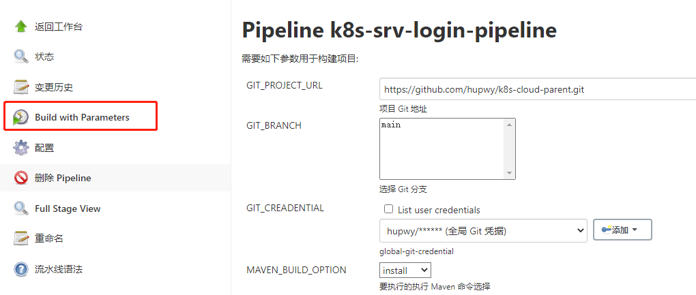


查看整个执行的各个节点，是否哪部都能够成功构建，如果出现错误，需要查看控制台输出的日志查找错误点，然后对脚本进行修改。


  