# 多级缓存解决方案


## 1.OpenResty高性能Web站点架构

http://openresty.org/en/

http://openresty.org/cn/

OpenResty® 是一款基于 NGINX 和 LuaJIT 的 Web 平台。

### 1.1 OpenResty简介

OpenResty 是一个基于 [Nginx](http://openresty.org/cn/nginx.html) 与 Lua 的高性能 Web 平台，其内部集成了大量精良的 Lua 库、第三方模块以及大多数的依赖项。用于方便地搭建能够处理超高并发、扩展性极高的动态 Web 应用、Web 服务和动态网关。

OpenResty® 通过汇聚各种设计精良的 [Nginx](http://openresty.org/cn/nginx.html) 模块（主要由 OpenResty 团队自主开发），从而将 [Nginx](http://openresty.org/cn/nginx.html) 有效地变成一个强大的通用 Web 应用平台。这样，Web 开发人员和系统工程师可以使用 Lua 脚本语言调动 [Nginx](http://openresty.org/cn/nginx.html) 支持的各种 C 以及 Lua 模块，快速构造出足以胜任 10K 乃至 1000K 以上单机并发连接的高性能 Web 应用系统。

OpenResty® 的目标是让你的Web服务直接跑在 [Nginx](http://openresty.org/cn/nginx.html) 服务内部，充分利用 [Nginx](http://openresty.org/cn/nginx.html) 的非阻塞 I/O 模型，不仅仅对 HTTP 客户端请求,甚至于对远程后端诸如 MySQL、PostgreSQL、Memcached 以及 Redis 等都进行一致的高性能响应。

### 1.2 OpenResty搭建

关于OpenResty的搭建，可以参考官方提供的网址进行搭建。http://openresty.org/cn/installation.html，我们采用源码安装的方式进行安装。

官方提供了源码安装的方式：http://openresty.org/cn/linux-packages.html

**安装步骤**

1)安装依赖库：

```properties
yum install libtermcap-devel ncurses-devel libevent-devel readline-devel pcre-devel gcc openssl openssl-devel per perl wget
```

2)下载安装包：

```properties
wget https://openresty.org/download/openresty-1.11.2.5.tar.gz
```

3)解压安装包

```properties
tar -xf openresty-1.11.2.5.tar.gz
```

4)进入安装包，并安装

```properties
#进入安装包
cd openresty-1.11.2.5

#安装
./configure --prefix=/usr/local/openresty --with-luajit --without-http_redis2_module --with-http_stub_status_module --with-http_v2_module --with-http_gzip_static_module --with-http_sub_module --add-module=/usr/local/gupao/ngx_cache_purge-2.3/

#编译并安装
make && make install
```

说明：

```properties
--prefix=/usr/local/openresty：安装路径

--with-luajit：安装luajit相关库，luajit是lua的一个高效版，LuaJIT的运行速度比标准Lua快数十倍。

--without-http_redis2_module：现在使用的Redis都是3.x以上版本，这里不推荐使用Redis2，表示不安装redis2支持的lua库

--with-http_stub_status_module：Http对应状态的库

--with-http_v2_module：对Http2的支持

--with-http_gzip_static_module：gzip服务端压缩支持

--with-http_sub_module：过滤器，可以通过将一个指定的字符串替换为另一个字符串来修改响应

--add-module=/usr/local/gupao/ngx_cache_purge-2.3/：Nginx代理缓存清理工具
```

关于每个模块的具体作用，可以参考腾讯云的开发者手册：https://cloud.tencent.com/developer/doc/1158

如下图安装完成后，在`/usr/local/openrestry/nginx`目录下是安装好的nginx，以后我们将在该目录的nginx下实现网站发布。

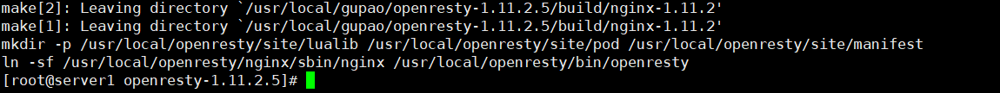

5)配置环境变量：

```properties
vi /etc/profile

export PATH=/usr/local/openresty/nginx/sbin:$PATH

source /etc/profile
```

6)开机启动：

linux系统结构`/lib/systemd/system/`目录,该目录自动存放启动文件的配置位置，里面一般包含有`xxx.service`,例如`systemctl enable nginx.service`,就是调用 `/lib/systemd/system/nginx.service`文件，使nginx开机启动。
我们可以创建`/usr/lib/systemd/system/nginx.service`，在该文件中编写启动nginx脚本：

```nginx
[Service]
Type=forking
PIDFile=/usr/local/openresty/nginx/logs/nginx.pid
ExecStartPre=/usr/local/openresty/nginx/sbin/nginx -t
ExecStart=/usr/local/openresty/nginx/sbin/nginx
ExecReload=/bin/kill -s HUP $MAINPID
ExecStop=/bin/kill -s QUIT $MAINPID
PrivateTmp=true

[Install]
WantedBy=multi-user.target
```

执行`systemctl daemon-reload`:重新加载某个服务的配置文件

执行`systemctl enable nginx.service`:开机启动

执行`systemctl start nginx.service`:启动nginx


访问`http://192.168.100.130/`,效果如下：


## 2.Lua语法学习

Lua 是一个小巧的脚本语言。它是巴西里约热内卢天主教大学（Pontifical Catholic University of Rio de Janeiro）里的一个由Roberto Ierusalimschy、Waldemar Celes 和 Luiz Henrique de Figueiredo三人所组成的研究小组于1993年开发的。 其设计目的是为了通过灵活嵌入应用程序中从而为应用程序提供灵活的扩展和定制功能。Lua由标准C编写而成，几乎在所有操作系统和平台上都可以编译，运行。Lua并没有提供强大的库，这是由它的定位决定的。所以Lua不适合作为开发独立应用程序的语言。Lua 有一个同时进行的JIT项目，提供在特定平台上的即时编译功能。

Lua脚本可以很容易的被C/C++ 代码调用，也可以反过来调用C/C++的函数，这使得Lua在应用程序中可以被广泛应用。不仅仅作为扩展脚本，也可以作为普通的配置文件，代替XML,ini等文件格式，并且更容易理解和维护。 Lua由标准C编写而成，代码简洁优美，几乎在所有操作系统和平台上都可以编译，运行。 一个完整的Lua解释器不过200k，在所有脚本引擎中，Lua的速度是最快的。这一切都决定了Lua是作为嵌入式脚本的最佳选择。

**Lua特性：**

```properties
1、一个小巧的脚本语言
2、设计目的是为了通过灵活嵌入应用程序中从而为应用程序提供灵活的扩展和定制功能
3、所有操作系统和平台上都可以编译、运行Lua脚本
4、所有脚本引擎中，Lua的速度是最快的
```


**应用场景：**

```properties
1、游戏开发
2、独立应用脚本
3、高性能Web应用（天猫、京东都有应用）
4、扩展和数据库插件如：MySQL Proxy 和 MySQL WorkBench
```

### 2.1 Lua常用语法

#### 2.1.1 Lua安装

首先我们准备一个linux虚拟机来安装Lua，在linux系统中按照如下步骤进行安装：

```properties
curl -R -O http://www.lua.org/ftp/lua-5.3.5.tar.gz
tar xf lua-5.3.5.tar.gz
cd lua-5.3.5
make linux test
```

出现如下界面，表示安装成功：

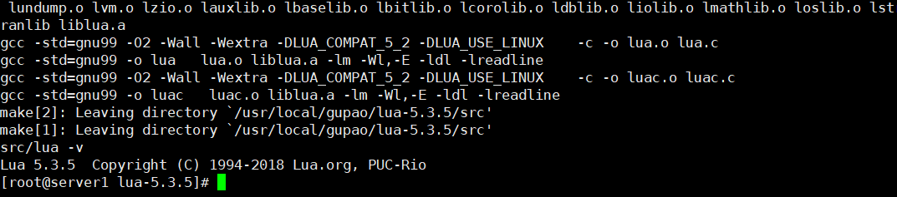

版本查看：`lua -v`


我们可以发现，Lua版本还是原来系统自带的版本，我们需要替换原来系统自带的lua,执行如下命令：

```properties
rm -rf /usr/bin/lua
ln -s /usr/local/gupao/lua-5.3.5/src/lua /usr/bin/lua
```

此时版本信息如下：

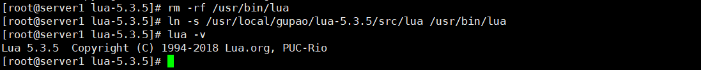

#### **2.1.4 Lua常用操作**

Lua 提供了交互式编程模式。我们可以在命令行中输入程序并立即查看效果，这种编程模式类似我们控制台操作，Lua 交互式编程模式可以通过命令 lua -i 或 lua 来启用：

```properties
[root@server1 lua-5.3.5]# lua -i
Lua 5.3.5  Copyright (C) 1994-2018 Lua.org, PUC-Rio
> 
```

**1)打印**

```properties
print("springcloud alibaba")
```

**2)数据类型**

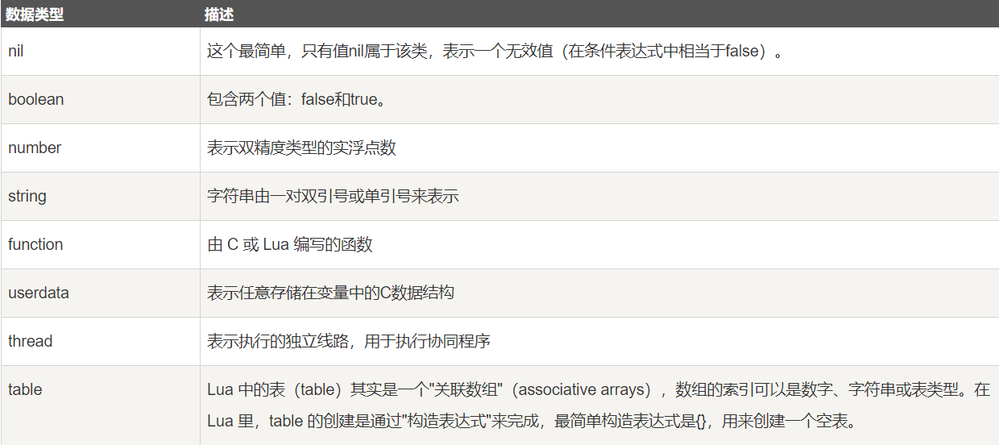

类型测试：

```lua
print(type("Hello world"))      --> string
print(type(10.4*3))             --> number
print(type(print))              --> function
print(type(type))               --> function
print(type(true))               --> boolean
print(type(nil))                --> nil
print(type(type(X)))            --> string
```

**3)变量**

变量在使用前，需要在代码中进行声明，即创建该变量。Lua 变量有三种类型：全局变量、局部变量、表中的域。

全局变量定义：

```lua
> age=19
> print(age)
19
```

局部变量定义：

```lua
> local username=wangwu
> print(username)
nil
```

此时username不是全局变量，一般在某个方法中使用，不能全局使用，所以输出nil。

**4)对象(table)**

```lua
> --定义对象resp
> resp = {}
> --往对象resp中添加属性name，赋值为zhangsan
> resp["name"]="zhangsan"
> --往对象resp中添加属性address，赋值为hunanchangsha
> resp["address"]="hunanchangsha"
> --输出对象resp中的name属性值
> print(resp["name"])
zhangsan
```

**5)函数**

创建一个函数，其实就是创建一个方法，函数以function开始，end结束，可以在end之前有返回值，也可以有入参，定义一个方法如下：

```lua
> --定义userinfo方法，入参为age
> function userinfo(age)
>> --age在原有基础上+1
>> age=age+1
>> --返回变化后的age
>> return age
>> --结束
>> end
> print(userinfo(19))
20
```

**6)拼接**

在上面方法调用上拼接一段字符串,可以使用亮点来做..，如下：

```properties
> print(userinfo(19).."岁了")
20岁了
```

**7)逻辑判断**

我们经常会做一些条件判断，在lua中也可以实现,lua中有`if xx then else end`的流程判断语法。

```lua
> function userinfo(age)
>> if age>=18 then
>> return "成年人"
>> else
>> return "未成年"
>> end
>> end
> print(userinfo(17))
未成年
```

**8)脚本编程**

我们可以像写java一样，将lua脚本写到一个文件中，并且可以在一个脚本文件引入另外一个脚本文件，类似java中的导包。

创建`course.lua`，代码如下：

```lua
--定义一个对象
local course = {}

--定义一个方法
function course.courseName(id)
        if id==1 then
                return "java"
        else
                return "UI"
        end
end
return course
```

创建`student.lua`，代码如下：

```lua
--导入course.lua
local cr = require("course")

--调用courseName方法
local result = cr.courseName(1)

print(result)
```

执行`student.lua`：

```lua
[root@server1 lua]# lua student.lua
java
```

## 3.多级缓存方案

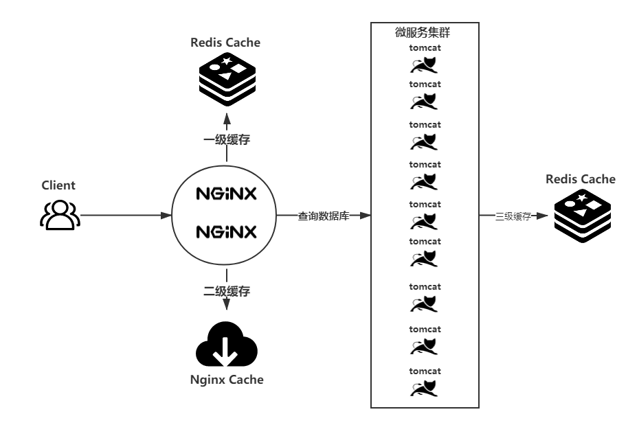

用户请求到达后端服务，先经过代理层nginx,nginx将请求路由到后端微服务服务，微服务去数据库中取数据，这是一个非常普通的流程，但在大并发场景下，需要做优化，而缓存是最有效的手段之一。缓存优化有，执行过程如下：

```properties
1:请求到达Nginx，Nginx抗压能力极强。
2:Tomcat抗压能力很弱，如果直接将所有请求路由给Tomcat，Tomcat压力会非常大，很有可能宕机。我们可以在Nginx这里设置2道缓存，第1道是Redis缓存，第2道是Nginx缓存。
3:先加载Redis缓存，如果Redis没有缓存，则加载Nginx缓存，Nginx如果没有缓存，则将请求路由到Tomcat。
4:Tomcat发布的程序会加载数据，加载完成后需要做缓存的，及时将数据存入Redis缓存，再响应数据给用户。
5:用户下次查询的时候，查询Redis缓存或Nginx缓存。
6:后面用户请求的时候，就可以直接从Nginx缓存拿数据了，这样就可以实现后端Tomcat发布的服务被调用的次数大幅减少，负载大幅下降。
```

上面这套缓存架构除了可以有效提高加载速度、降低后端服务负载之外，还可以防止缓存雪崩，为服务稳定健康打下了坚实的基础，这就是多级缓存架构体系。

### 3.1 SpringBoot 常用的缓存注解

`@EnableCaching`:

```properties
开关性注解，在项目启动类或某个配置类上使用此注解后，则表示允许使用注解的方式进行缓存操作。
```

`@Cacheable`:

```properties
可用于类或方法上；在目标方法执行前，会根据key先去缓存中查询看是否有数据，有就直接返回缓存中的key对应的value值。不再执行目标方法；无则执行目标方法，并将方法的返回值作为value，并以键值对的形式存入缓存。
```

`@CacheEvict`:

```properties
可用于类或方法上；在执行完目标方法后，清除缓存中对应key的数据(如果缓存中有对应key的数据缓存的话)。
```

`@CachePut`:

```properties
可用于类或方法上；在执行完目标方法后，并将方法的返回值作为value，并以键值对的形式存入缓存中。
```

`@Caching`:

```properties
此注解即可作为@Cacheable、@CacheEvict、@CachePut三种注解中的的任何一种或几种来使用。
```

`@CacheConfig`:

```properties
可以用于配置@Cacheable、@CacheEvict、@CachePut这三个注解的一些公共属性，例如cacheNames、keyGenerator。
```


**1)配置缓存链接**

修改`bootstrap.yml`，增加配置Redis缓存链接，如下：

```yaml
  #Redis配置
  redis:
    host: 192.168.100.130
    port: 6379
```

**2)开启缓存**

在`com.gupaoedu.vip.mall.MallGoodsServiceApplication`上添加缓存开启注解：

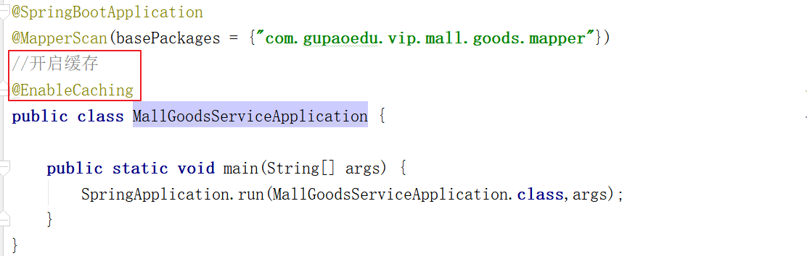

完整代码如下：

```java
/***
 * 根据推广产品分类ID查询Sku列表
 * cacheNames = "ad-items-skus":命名空间
 * key ="#id":入参id作为缓存的key，使用的是SpEL表达式
 */
@Cacheable(cacheNames = "ad-items-skus",key ="#id")
@Override
public List<Sku> typeSkuItems(Integer id) {
    //查询所有分类下的推广
    QueryWrapper<AdItems> adItemsQueryWrapper=new QueryWrapper<AdItems>();
    adItemsQueryWrapper.eq("type",id);
    List<AdItems> adItems = adItemsMapper.selectList(adItemsQueryWrapper);

    //获取所有SkuId
    List<String> skuIds = adItems.stream().map(adItem -> adItem.getSkuId()).collect(Collectors.toList());
    //批量查询Sku
    List<Sku> skus = skuMapper.selectBatchIds(skuIds);
    return skus;
}
```

我们可以发现上面存储的数据是二进制数据，我们很难阅读，而且占空间极大，我们可以使用FastJSON将每次存入到Redis中的数据转成JSON字符串，此时我们需要把下面的代码拷贝到`mall-service-dependency`工程的`com.itartisan.mall.config`包下, 此时清理再执行加载缓存后，效果就是JSON格式。

### 3.2 缓存清理

1)Service

接口：添加清理缓存方法`com.itartisan.mall.goods.service.SkuService#delTypeSkuItems`

```java
/***
 * 清理分类ID下的推广产品
 * @param id
 */
void delTypeSkuItems(Integer id);
```

实现类：添加实现方法`com.itartisan.mall.goods.service.impl.SkuServiceImpl#delTypeSkuItems`

```java
/****
 * 清理缓存
 * @param id
 */
@CacheEvict(cacheNames = "ad-items-skus",key ="#id")
@Override
public void delTypeSkuItems(Integer id) {
}
```


2)Controller

添加删除缓存方法`com.itartisan.mall.goods.controller.SkuController#deleteTypeItems`

```java
/****
 * 删除指定分类下的推广产品列表
 */
@DeleteMapping(value = "/aditems/type")
public RespResult deleteTypeItems(@RequestParam(value = "id") Integer id){
    //清理缓存
    skuService.delTypeSkuItems(id);
    return RespResult.ok();
}
```

### 3.3 注解缓存操作优化

使用`@CacheConfig`优化注解，可以将`cacheNames`挪到类上，每个方法上就不用重复写`cacheNames`了。

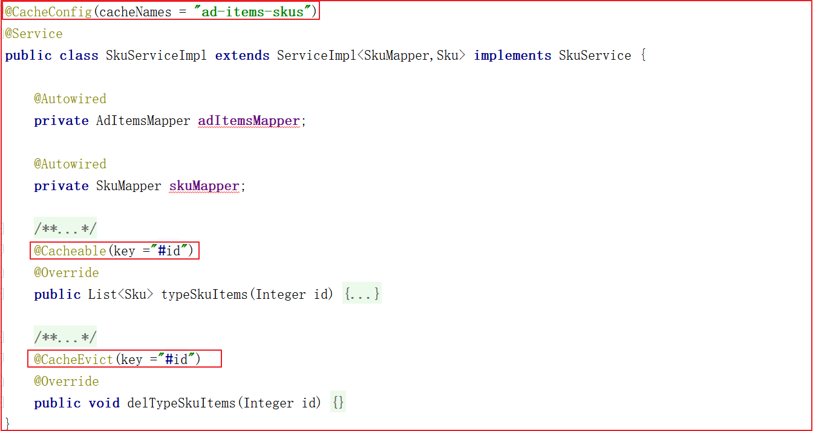

其他地方肯定会调用这几个方法用于实现缓存更新，我们可以在`goods-api`中添加feigin接口。

在`mall-api`中引入common工具包和feign依赖包：

```xml
<!--工具包-->
<dependency>
    <groupId>com.itartisan.mall</groupId>
    <artifactId>mall-common</artifactId>
    <version>0.0.1-SNAPSHOT</version>
</dependency>

<!--openfeign-->
<dependency>
    <groupId>org.springframework.cloud</groupId>
    <artifactId>spring-cloud-starter-openfeign</artifactId>
    <version>2.2.5.RELEASE</version>
</dependency>
```


在`goods-api`中创建`com.itartisan.mall.goods.feign.SkuFeign`，代码如下：

```java
@FeignClient(value = "mall-goods")
public interface SkuFeign {

    /****
     * 指定分类下的推广产品列表
     */
    @GetMapping(value = "/sku/aditems/type")
    public List<Sku> typeItems(@RequestParam(value = "id") Integer id);

    /****
     * 删除指定分类下的推广产品列表
     */
    @DeleteMapping(value = "/sku/aditems/type/{id}")
    public RespResult deleteTypeItems(@PathVariable(value = "id")Integer id);

    /****
     * 修改指定分类下的推广产品列表
     */
    @PutMapping(value = "/sku/aditems/type/{id}")
    public RespResult updateTypeItems(@PathVariable(value = "id")Integer id);
}
```

### 3.4 多级缓存-Lua+Redis


按照上面分析的架构，可以每次在Nginx的时候使用Lua脚本查询Redis，如果Redis有数据，则将数据存入到Nginx缓存，再将数据响应给用户，此时我们需要实现使用Lua将数据从Redis中加载出来。

我们在`/usr/local/openresty/nginx/lua`中创建文件`aditem.lua`，脚本如下：

```lua
--数据响应类型JSON
ngx.header.content_type="application/json;charset=utf8"
--Redis库依赖
local redis = require("resty.redis");
local cjson = require("cjson");

--获取id参数（type）
local id = ngx.req.get_uri_args()["id"];
--key组装
local key = "ad-items-skus::"..id
--创建链接对象
local red = redis:new()
--设置超时时间
red:set_timeout(2000)
--设置服务器链接信息
red:connect("192.168.100.130", 6379)
--查询指定key的数据
local result=red:get(key);

--关闭Redis链接
red:close()

if result==nil or result==null or result==ngx.null then
	return true
else
	--输出数据
	ngx.say(result)
end
```


修改`nginx.conf`添加如下配置：（最后记得将content_by_lua_file改成rewrite_by_lua_file）

```nginx
#推广产品查询
location /sku/aditems/type {
    content_by_lua_file /usr/local/openresty/nginx/lua/aditem.lua;
}
```

访问`http://www.itartisan.com/sku/aditems/type?id=1`效果如下：


## 4 Nginx代理缓存


proxy_cache 是用于 proxy 模式的缓存功能，proxy_cache 在 Nginx 配置的 http 段、server 段中分别写入不同的配置。http 段中的配置用于定义 proxy_cache 空间，server 段中的配置用于调用 http 段中的定义，启用对server 的缓存功能。

使用：

```properties
1、定义缓存空间
2、在指定地方使用定义的缓存
```

### 4.1 Nginx代理缓存学习

1)开启Proxy_Cache缓存：

我们需要在nginx.conf中配置才能开启缓存：

```properties
proxy_cache_path /usr/local/openresty/nginx/cache levels=1:2 keys_zone=proxy_cache:10m max_size=1g inactive=60m use_temp_path=off;
```

参数说明：

```properties
【proxy_cache_path】指定缓存存储的路径，缓存存储在/usr/local/openresty/nginx/cache目录

【levels=1:2】设置一个两级目录层次结构存储缓存，在单个目录中包含大量文件会降低文件访问速度，因此我们建议对大多数部署使用两级目录层次结构。如果 levels 未包含该参数，Nginx 会将所有文件放在同一目录中。

【keys_zone=proxy_cache:10m】设置共享内存区域，用于存储缓存键和元数据，例如使用计时器。拥有内存中的密钥副本，Nginx 可以快速确定请求是否是一个 HIT 或 MISS 不必转到磁盘，从而大大加快了检查速度。1 MB 区域可以存储大约 8,000 个密钥的数据，因此示例中配置的 10 MB 区域可以存储大约 80,000 个密钥的数据。

【max_size=1g】设置缓存大小的上限。它是可选的; 不指定值允许缓存增长以使用所有可用磁盘空间。当缓存大小达到限制时，一个称为缓存管理器的进程将删除最近最少使用的缓存，将大小恢复到限制之下的文件。

【inactive=60m】指定项目在未被访问的情况下可以保留在缓存中的时间长度。在此示例中，缓存管理器进程会自动从缓存中删除 60 分钟未请求的文件，无论其是否已过期。默认值为 10 分钟（10m）。非活动内容与过期内容不同。Nginx 不会自动删除缓存 header 定义为已过期内容（例如 Cache-Control:max-age=120）。过期（陈旧）内容仅在指定时间内未被访问时被删除。访问过期内容时，Nginx 会从原始服务器刷新它并重置 inactive 计时器。

【use_temp_path=off】表示NGINX会将临时文件保存在缓存数据的同一目录中。这是为了避免在更新缓存时，磁盘之间互相复制响应数据，我们一般关闭该功能。
```


2)Proxy_Cache属性：

```properties
proxy_cache:设置是否开启对后端响应的缓存，如果开启的话，参数值就是zone的名称，比如:proxy_cache。

proxy_cache_valid:针对不同的response code设定不同的缓存时间，如果不设置code，默认为200,301,302,也可以用any指定所有code。

proxy_cache_min_uses:指定在多少次请求之后才缓存响应内容,这里表示将缓存内容写入到磁盘。

proxy_cache_lock:默认不开启，开启的话则每次只能有一个请求更新相同的缓存，其他请求要么等待缓存有数据要么限时等待锁释放;nginx 1.1.12才开始有。
配套着proxy_cache_lock_timeout一起使用。

proxy_cache_key:缓存文件的唯一key，可以根据它实现对缓存文件的清理操作。
```

### 4.2 Nginx代理缓存热点数据应用

1)开启代理缓存

修改`nginx.conf`，添加如下配置：

```nginx
proxy_cache_path /usr/local/openresty/nginx/cache levels=1:2 keys_zone=proxy_cache:10m max_size=1g inactive=60m use_temp_path=off;
```

修改`nginx.conf`，添加如下配置：

```nginx
#门户发布
server {
    listen       80;
    server_name  www.gpshopvip.com;

    #推广产品查询
    location /sku/aditems/type {
        #先找Nginx缓存
        rewrite_by_lua_file /usr/local/openresty/nginx/lua/aditem.lua;
        #启用缓存openresty_cache
        proxy_cache proxy_cache;
        #针对指定请求缓存
        #proxy_cache_methods GET;
        #设置指定请求会缓存
        proxy_cache_valid 200 304 60s;
        #最少请求1次才会缓存
        proxy_cache_min_uses 1;
        #如果并发请求，只有第1个请求会去服务器获取数据
        #proxy_cache_lock on;
        #唯一的key
        proxy_cache_key $host$uri$is_args$args;
        #动态代理
        proxy_pass http://192.168.100.1:8081;
    }

    #其他所有请求
    location / {
        root   /usr/local/gupao/web/static/frant;
    }
}
```

重启nginx或者重新加载配置文件`nginx -s reload`，再次测试，可以发现下面个规律：

```properties
1:先查找Redis缓存
2:Redis缓存没数据，直接找Nginx缓存
3:Nginx缓存没数据，则找真实服务器
```

我们还可以发现cache目录下多了目录和一个文件，这就是Nginx缓存：

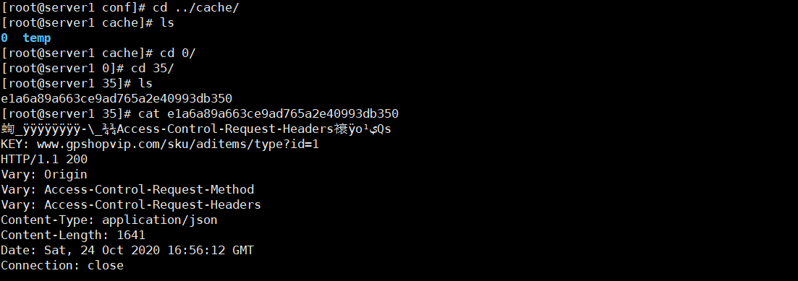

### 4.3 Cache_Purge代理缓存清理

很多时候我们如果不想等待缓存的过期，想要主动清除缓存，可以采用第三方的缓存清除模块清除缓存 `nginx_ngx_cache_purge`。安装nginx的时候，需要添加`purge`模块，`purge`模块我们已经下载了，在`/usr/local/gupao`目录下,添加该模块`--add-module=/usr/local/gupao/ngx_cache_purge-2.3/`,这一个步骤我们在安装`OpenRestry`的时候已经实现了。

安装好了后，我们配置一个清理缓存的地址：http://192.168.100.130/purge/sku/aditems/type?id=1

```nginx
#清理缓存
location ~ /purge(/.*) {
    #清理缓存
    proxy_cache_purge proxy_cache $host$1$is_args$args;
}
```

此时访问http://www.gpshopvip.com/purge/sku/aditems/type?id=1，表示清除缓存，如果出现如下效果表示清理成功：

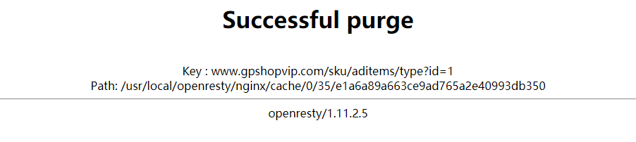

## 5 缓存一致性

上面我们虽然实现了多级缓存架构，但是问题也出现了，如果数据库中数据发生变更，如何更新Redis缓存呢？如何更新Nginx缓存呢？

我们可以使用阿里巴巴的技术解决方案Canal来实现，通过Canal监听数据库变更，并实时消费变更数据，并更新缓存。

**canal [kə'næl]**，译意为水道/管道/沟渠，主要用途是基于 MySQL 数据库增量日志解析，提供增量数据订阅和消费

学习地址：https://github.com/alibaba/canal

早期阿里巴巴因为杭州和美国双机房部署，存在跨机房同步的业务需求，实现方式主要是基于业务 trigger 获取增量变更。从 2010 年开始，业务逐步尝试数据库日志解析获取增量变更进行同步，由此衍生出了大量的数据库增量订阅和消费业务。

基于日志增量订阅和消费的业务包括

- 数据库镜像
- 数据库实时备份
- 索引构建和实时维护(拆分异构索引、倒排索引等)
- 业务 cache 刷新
- 带业务逻辑的增量数据处理

当前的 canal 支持源端 MySQL 版本包括 5.1.x , 5.5.x , 5.6.x , 5.7.x , 8.0.x。


### 5.1 Canal原理讲解

MySQL主备复制原理

- MySQL master 将数据变更写入二进制日志( binary log, 其中记录叫做二进制日志事件binary log events，可以通过 show binlog events 进行查看)
- MySQL slave 将 master 的 binary log events 拷贝到它的中继日志(relay log)
- MySQL slave 重放 relay log 中事件，将数据变更反映它自己的数据

- Canal 工作原理

  - canal 模拟 MySQL slave 的交互协议，伪装自己为 MySQL slave ，向 MySQL master 发送dump 协议
  - MySQL master 收到 dump 请求，开始推送 binary log 给 slave (即 canal )
  - canal 解析 binary log 对象(原始为 byte 流)

  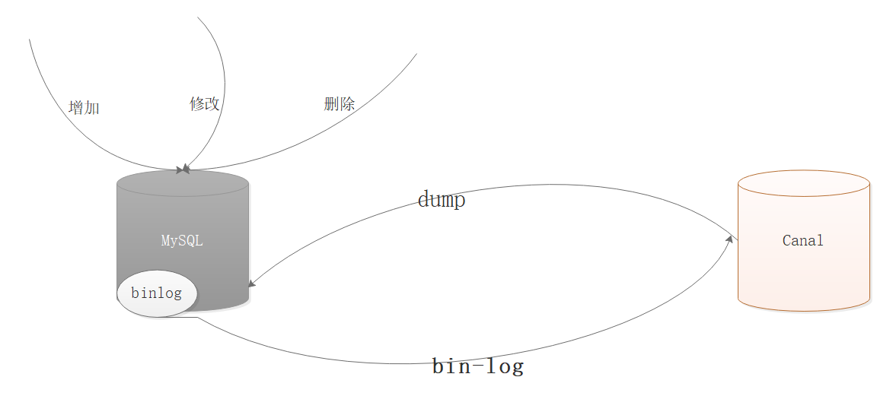

  

### 5.2 Canal安装

#### 5.2.1 MySQL开启binlog

对于MySQL , 需要先开启 Binlog 写入功能，配置 binlog-format 为 ROW 模式，my.cnf 中配置如下

```properties
docker exec -it mysql /bin/bash
cd /etc/mysql/mysql.conf.d
vi mysqld.cnf
```

在最文件尾部添加如下配置：

```properties
log-bin=mysql-bin # 开启 binlog
binlog-format=ROW # 选择 ROW 模式
server_id=1 # 配置 MySQL replaction 需要定义，不要和 canal 的 slaveId 重复
```

**注意：**针对阿里云 RDS for MySQL , 默认打开了 binlog , 并且账号默认具有 binlog dump 权限 , 不需要任何权限或者 binlog 设置,可以直接跳过这一步。


授权 canal 链接 MySQL 账号具有作为 MySQL slave 的权限, 如果已有账户可直接 grant：

```sql
CREATE USER canal IDENTIFIED BY 'canal';

GRANT SELECT, REPLICATION SLAVE, REPLICATION CLIENT ON *.* TO 'canal'@'%';

-- GRANT ALL PRIVILEGES ON *.* TO 'canal'@'%' ;
FLUSH PRIVILEGES;
```


重启mysql容器

```
docker restart canal
```


查看是否开启binlog:

```sql
show variables like 'log_bin';
```


#### 5.2.2 Canal安装

我们采用docker安装方式：

```
docker run -p 11111:11111 --name canal -d docker.io/canal/canal-server
```

进入容器,修改核心配置canal.properties 和instance.properties，canal.properties 是canal自身的配置，instance.properties是需要同步数据的数据库连接配置。

修改配置如下:

```properties
# position info
canal.instance.master.address=192.168.100.130:3306
```

另一处配置：

```properties
# table regex
#canal.instance.filter.regex=.*\\..*
#监听配置
canal.instance.filter.regex=shop_goods.ad_items
```


配置完成后，重启`canal`容器

```properties
docker restart canal
```


### 5.3 多级缓存架构缓存一致性实战

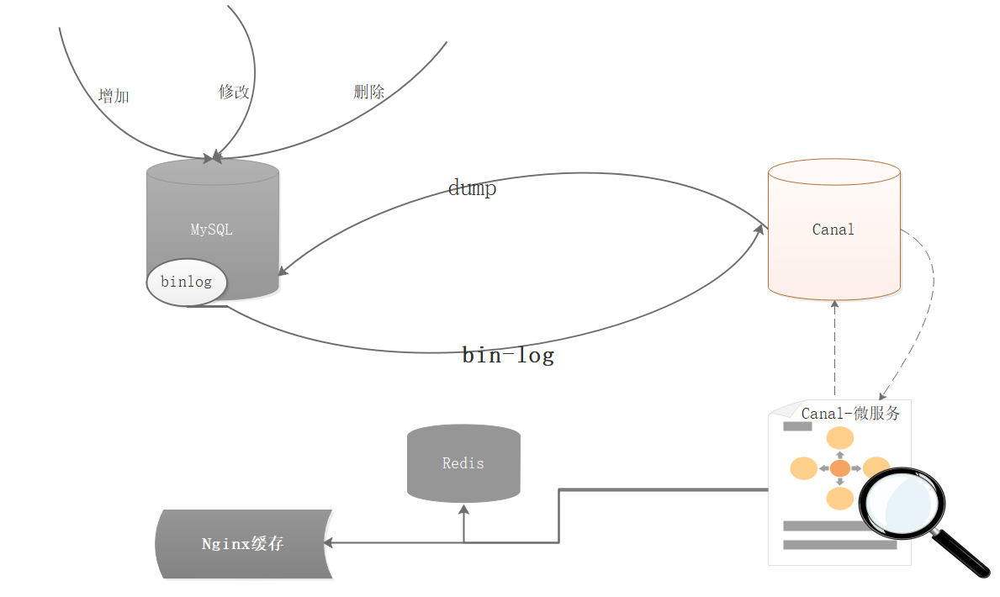


#### 5.3.1 Canal微服务搭建

工程坐标：

```xml
<groupId>com.itartisan.mall</groupId>
<version>0.0.1-SNAPSHOT</version>
<artifactId>mall-canal-service</artifactId>
```


pom.xml:

```xml
<?xml version="1.0" encoding="UTF-8"?>
<project xmlns="http://maven.apache.org/POM/4.0.0"
         xmlns:xsi="http://www.w3.org/2001/XMLSchema-instance"
         xsi:schemaLocation="http://maven.apache.org/POM/4.0.0 http://maven.apache.org/xsd/maven-4.0.0.xsd">
    <parent>
        <artifactId>mall-service</artifactId>
        <groupId>com.itartisan.mall</groupId>
        <version>0.0.1-SNAPSHOT</version>
    </parent>
    <modelVersion>4.0.0</modelVersion>
    <artifactId>mall-canal-service</artifactId>
    <description>
        Canal微服务
    </description>

    <dependencies>
        <!--springboot-canal快速构建依赖包-->
        <dependency>
            <groupId>top.javatool</groupId>
            <artifactId>canal-spring-boot-starter</artifactId>
            <version>1.2.1-RELEASE</version>
        </dependency>

        <!--依赖mall-goods-api-->
        <dependency>
            <groupId>com.itartisan.mall</groupId>
            <artifactId>goods-api</artifactId>
            <version>0.0.1-SNAPSHOT</version>
        </dependency>
    </dependencies>
</project>
```


bootstrap.yml:

```yaml
server:
  port: 8083
spring:
  application:
    name: mall-canal
  cloud:
    nacos:
      config:
        file-extension: yaml
        server-addr: 192.168.100.130:8848
      discovery:
        #Nacos的注册地址
        server-addr: 192.168.100.130:8848
#Canal配置
canal:
  server: 192.168.100.130:11111
  destination: example
#日志配置
logging:
  pattern:
    console: "%msg%n"
  level:
    root: error
```


创建监听类：`com.itartisan.canal.listener.AdItemsHandler`

```java
@CanalTable(value = "ad_items")
@Component
public class AdItemsHandler implements EntryHandler<AdItems> {

    @Autowired
    private SkuFeign skuFeign;

    @Override
    public void insert(AdItems adItems) {
        //加载缓存
        skuFeign.updateTypeItems(adItems.getType());
    }

    /***
     * 修改
     * @param before
     * @param after
     */
    @Override
    public void update(AdItems before, AdItems after) {
        //分类不同，则重新加载之前的缓存
        if(before.getType().intValue()!=after.getType().intValue()){
            //修改缓存
            skuFeign.updateTypeItems(before.getType());
        }
        //加载缓存
        skuFeign.updateTypeItems(after.getType());
    }

    @Override
    public void delete(AdItems adItems) {
        //删除缓存
        skuFeign.deleteTypeItems(adItems.getType());
    }
}
```


创建启动类：`com.itartisan.canal.MallCanalApplication`

```java
@SpringBootApplication(exclude = DataSourceAutoConfiguration.class)
@EnableFeignClients(basePackages = {"com.itartisan.mall.goods.feign"})
public class MallCanalApplication {

    public static void main(String[] args) {
        SpringApplication.run(MallCanalApplication.class,args);
    }
}
```

