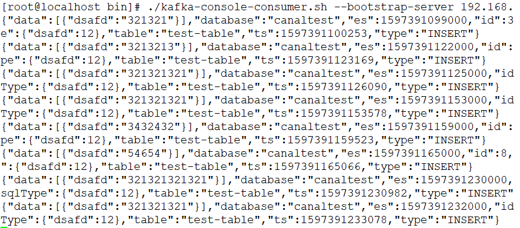

Canal的作用：把自己“伪装”成一个MySQL的slave，不停同步master的binlog数据，再把binlog数据以TCP或者MQ的方式（支持kafka、RabbitMQ、RocketMQ）发送给需要同步数据的项目。

canal项目地址：
https://github.com/alibaba/canal

## 在目标数据库上创建用户和数据库

注意数据库首先要开启binlog，binlog-format必须是ROW

```shell
log-bin=/var/lib/mysql/mysql-bin
binlog-format=ROW
```

用户和数据库创建

```mysql
-- 创建canal专用的用户，用于访问master获取binlog
CREATE USER canal IDENTIFIED BY '123456';

-- 给canal用户分配查询和复制的权限
GRANT SELECT, REPLICATION SLAVE, REPLICATION CLIENT ON *.* TO canal@'%';

-- 刷新权限
FLUSH PRIVILEGES;

ALTER USER 'canal'@'%' IDENTIFIED WITH mysql_native_password BY '123456';

-- 创建测试数据库
CREATE DATABASE `canaltest` CHARSET `utf8mb4` COLLATE `utf8mb4_unicode_ci`;
```

OK啦。

## 安装ZK和kafka

这里我们安装伪集群版本，按照这篇文章做
[CentOS Kafka 2.5.0 单机集群安装（伪集群）](https://github.com/hupwy/k8s-cloud-parent/blob/main/doc/%E6%B6%88%E6%81%AF%E9%98%9F%E5%88%97/Kafka/Kafka%E5%8D%95%E8%8A%82%E7%82%B9%E9%9B%86%E7%BE%A4(%E4%BC%AA%E9%9B%86%E7%BE%A4).md)

## 下载安装canal

以安装目录：/usr/local/soft/canal为例。
用目前稳定版本1.1.4

```
cd /usr/local/soft/
mkdir canal
cd canal
wget https://github.com/alibaba/canal/releases/download/canal-1.1.4/canal.deployer-1.1.4.tar.gz
tar -zxvf canal.deployer-1.1.4.tar.gz
```

如果下载慢的话，一个最简单的办法就是用迅雷下载到本地，再上传到服务器

需要修改的配置项：
conf/canal.properties

```
canal.serverMode=kafka
canal.mq.servers = 192.168.44.160:9092
```

example/instance.properties

```
canal.instance.master.address=192.168.44.121:3306
canal.instance.dbUsername=canal
canal.instance.dbPassword=123456
# 新增
canal.instance.defaultDatabaseName=canaltest
# 这个topic会自动创建
canal.mq.topic=canal-topic
```

在bin目录下启动canal

```
sh startup.sh 
# 查看实例日志
tail -100f /usr/local/soft/canal/logs/canal/canal.log
```

## 建表测试

在canaltest数据库随便建一张表，做增删改的操作。

在kafka服务器上消费这个topic

```
./kafka-console-consumer.sh --bootstrap-server 192.168.44.160:9092 --topic canal-topic
```

成功消费到canal发送的消息：
