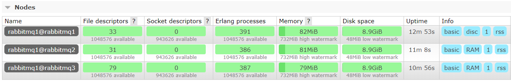

# Docker安装RabbitMQ集群

- 环境CentOS 7
- 主机IP：192.168.8.146
- 1个磁盘节点+2个内存节点

## 一、安装docker

参考：
[centos7 docker升级到最新稳定版本](https://blog.csdn.net/qq_36850813/article/details/91043125)

1）更新yum源（如果你的网速慢这一步就别做了）

```shell
sudo yum update
```

2）添加仓库

```shell
sudo yum-config-manager \
    --add-repo \
    https://mirrors.aliyun.com/docker-ce/linux/centos/docker-ce.repo
```

3）查看最新版本
如果之前安装了docker，需要卸载旧版本

```shell
yum list docker-ce --showduplicates | sort -r
```

4)安装Docker CE版本

```shell
yum install docker-ce -y
```

## 二、安装RabbitMQ

1）拉取RabbitMQ镜像（带managment）

```shell
docker pull rabbitmq:3.7.17-management
```

2）创建docker网络（让容器可以和主机通信）

```shell
docker network create rabbitmqnet
```

3）创建三个容器，端口分别是 5673 5674 5675 ，管理端口是 15673 15674 15675

```shell
docker run -d \
 --name=rabbitmq1 \
 -p 5673:5672 \
 -p 15673:15672 \
 -e RABBITMQ_NODENAME=rabbitmq1 \
 -e RABBITMQ_ERLANG_COOKIE='GUPAOEDUFORBETTERYOU' \
 -h rabbitmq1 \
 --net=rabbitmqnet \
 rabbitmq:management
docker run -d \
 --name=rabbitmq2 \
 -p 5674:5672 \
 -p 15674:15672 \
 -e RABBITMQ_NODENAME=rabbitmq1 \
 -e RABBITMQ_ERLANG_COOKIE='GUPAOEDUFORBETTERYOU' \
 -h rabbitmq2 \
 --net=rabbitmqnet \
 rabbitmq:management
docker run -d \
 --name=rabbitmq3 \
 -p 5675:5672 \
 -p 15675:15672 \
 -e RABBITMQ_NODENAME=rabbitmq1 \
 -e RABBITMQ_ERLANG_COOKIE='GUPAOEDUFORBETTERYOU' \
 -h rabbitmq3 \
 --net=rabbitmqnet \
 rabbitmq:management
```

4）后两个节点作为内存节点加入集群

```shell
docker exec -it rabbitmq2 /bin/bash
rabbitmqctl stop_app
rabbitmqctl reset
rabbitmqctl join_cluster --ram rabbitmq1@rabbitmq1
rabbitmqctl start_app
docker exec -it rabbitmq3 /bin/bash
rabbitmqctl stop_app
rabbitmqctl reset
rabbitmqctl join_cluster --ram rabbitmq1@rabbitmq1
rabbitmqctl start_app
```

访问：
http://192.168.8.146:15673/
guest/guest登录

