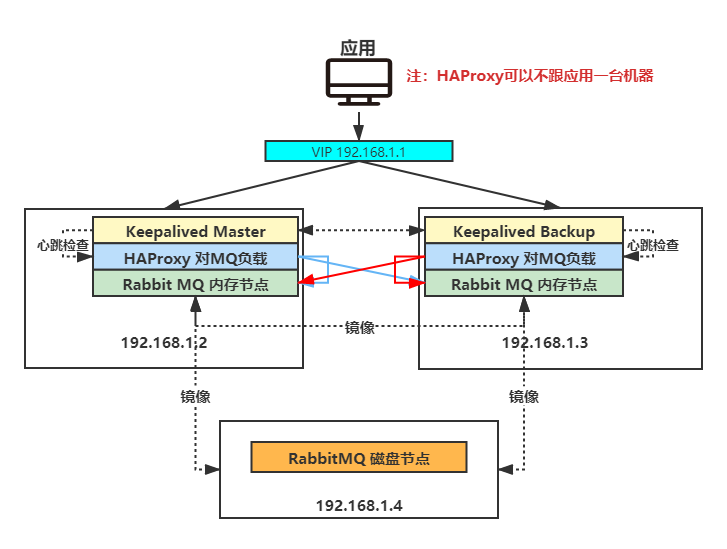
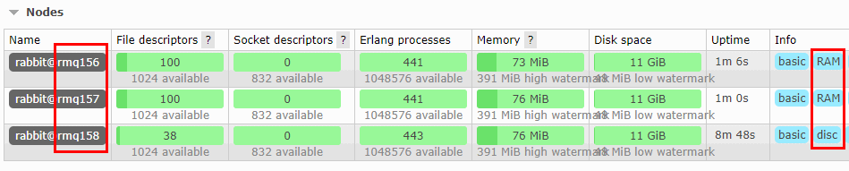
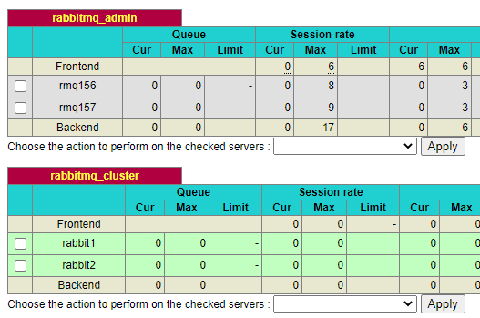
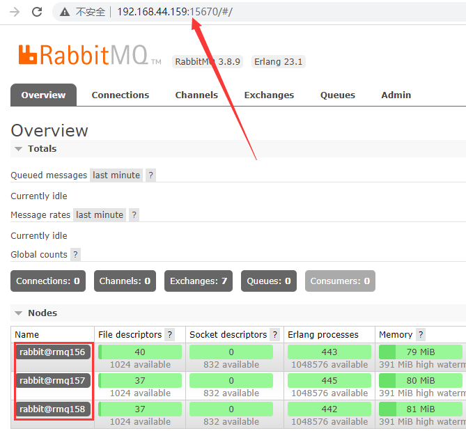
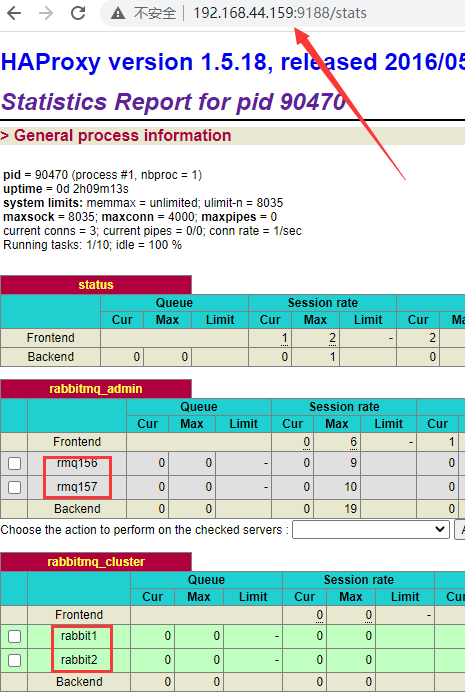

# HAProxy+Keepalived搭建RabbitMQ高可用集群

## 软件版本

- Erlang是当前最新版本23.1
- RabbitMQ是当前最新版本3.8.9

## 机器规划

准备三台虚拟机，可以用克隆功能。

- 192.168.1.2 RabbitMQ内存节点 HAPRoxy Keepalived（master）
- 192.168.1.3 RabbitMQ内存节点 HAPRoxy Keepalived（backup）
- 192.168.1.4 RabbitMQ磁盘节点
- VIP 192.168.1.1

## 网络结构图



## 安装Erlang和RabbitMQ

先按这个步骤在三台机器上分别安装好Erlang和RabbitMQ。
软件下载到
cd /usr/local/soft
[CentOS7安装RabbitMQ单机版](https://gper.club/articles/7e7e7f7ff4g56gceg6e)

可以用XShell的批量操作功能，同时发送命令到所有窗口，同时安装三台。
用户也要添加，管理插件也要启用。


## 配置.erlang.cookie

.erlang.cookie 默认在当前用户根目录下，是隐藏文件，只读文件。
权限要先改成777，改完以后还原成400
将三台机器内容改为一致，或者把第一台机器.erlang.cookie上传到其他两台机器。

```shell
cd ~
chmod 777 .erlang.cookie
vim .erlang.cookie 
chmod 400 .erlang.cookie
```

## 配置三台机器host

```shell
vim /etc/hosts
```

添加内容：

```shell
192.168.1.2 rmq2
192.168.1.3 rmq3
192.168.1.4 rmq4
```

重启网络

```shell
service network restart
```

相互验证一下，看看能不能ping通：

```
ping rmq3
```

## 加入集群

在4（磁盘节点）上执行：

```shell
cd /usr/local/soft/rabbitmq_server-3.8.9/sbin
./rabbitmq-server -detached >nohup.out&
./rabbitmqctl start_app
```

在2、3（内存节点）上执行：

```shell
cd /usr/local/soft/rabbitmq_server-3.8.9/sbin
./rabbitmq-server -detached >nohup.out&
./rabbitmqctl start_app
./rabbitmqctl stop_app
./rabbitmqctl join_cluster --ram rabbit@rmq158
./rabbitmqctl start_app
```

查看集群状态

```
./rabbitmqctl cluster_status
```

也可以在任何一台机器的管理界面查看：


设置镜像队列，在三台机器上执行：

```shell
./rabbitmqctl set_policy ha-all "^" '{"ha-mode":"all"}'
```

## 安装HAPRoxy

```shell
yum install -y haproxy
```

### 配置HAPRoxy

```shell
cd /etc/haproxy/
cp haproxy.cfg haproxy.cfg.bak
```

配置文件内容全部覆盖

```properties
#---------------------------------------------------------------------
# Global settings
#---------------------------------------------------------------------
global
log 127.0.0.1 local2
chroot /var/lib/haproxy # 改变当前工作目录
pidfile /var/run/haproxy.pid # haproxy的pid存放路径,启动进程的用户必须有权限访问此文件
maxconn 4000 # 最大连接数，默认4000
user root # 默认用户
group root # 默认组
daemon # 创建1个进程进入deamon模式运行。此参数要求将运行模式设置为daemon
stats socket /var/lib/haproxy/stats # 创建监控所用的套接字目录
#---------------------------------------------------------------------
# defaults settings
#---------------------------------------------------------------------
# 注意：因为要使用tcp的负载，屏蔽掉与http相关的默认配置
defaults
mode http # 默认的模式mode { tcp|http|health }，tcp是4层，http是7层，health只会返回OK
log global
# option httplog # 采用http日志格式
option dontlognull # 启用该项，日志中将不会记录空连接。所谓空连接就是在上游的负载均衡器
# option http-server-close # 每次请求完毕后主动关闭http通道
# option forwardfor except 127.0.0.0/8 # 如果后端服务器需要获得客户端真实ip需要配置的参数，可以从Http Header中获得客户端ip
option redispatch # serverId对应的服务器挂掉后,强制定向到其他健康的服务器
retries 3 # 3次连接失败就认为服务不可用，也可以通过后面设置
# timeout http-request 10s 
timeout queue 1m
timeout connect 10s # 连接超时时间
timeout client 1m # 客户端连接超时时间
timeout server 1m # 服务器端连接超时时间
# timeout http-keep-alive 10s
timeout check 10s
maxconn 3000 # 最大连接数
###################### 打开haproxy的监测界面###############################
listen status
bind 0.0.0.0:9188
mode http
stats enable
stats refresh 30s
stats uri /stats #设置haproxy监控地址为http://localhost:9188/stats
stats auth admin:123456 #添加用户名密码认证
stats realm (Haproxy\ statistic)
stats admin if TRUE
######################监听rabbitmq的web操作页面############################
listen rabbitmq_admin
bind 0.0.0.0:15670
server rmq2 192.168.1.2:15672
server rmq2 192.168.1.3:15672
#######################监听rabbimq_cluster #################################
listen rabbitmq_cluster
bind 0.0.0.0:5670
mode tcp
#负载均衡算法（#banlance roundrobin 轮询，balance source 保存session值，支持static-rr，leastconn，first，uri等参数）
balance roundrobin

#check inter 2000 是检测心跳频率
#rise 2是2次正确认为服务器可用
#fall 2是2次失败认为服务器不可用
server rabbit1 192.168.1.2:5672 check inter 5000 rise 2 fall 2
server rabbit2 192.168.1.3:5672 check inter 5000 rise 2 fall 2
```

### 启动156和157的haproxy

```shell
haproxy -f /etc/haproxy/haproxy.cfg
```

其他命令：

```shell
service haproxy restart
service haproxy stop
```

### 浏览器访问：

192.168.1.2:15670
192.168.1.3:15670
这两个都能正常访问RabbitMQ管理界面，用admin/admin登录

192.168.1.2:9188/stats
192.168.1.3:9188/stats
这两个能正常访问HaProxy监控界面，用amdin/123456登录



## 安装Keepalived

```shell
yum install -y keepalived
```

### 配置Keepalived

```shell
cd /etc/keepalived
cp keepalived.conf keepalived.conf.bak
```

156为master，配置内容

```json
global_defs {
     router_id NodeA      # 起一个唯一的名字，不能与备机相同
}

vrrp_script chk_haproxy {
    script "/etc/keepalived/check_haproxy.sh"
    interval 5
    weight 2
}

vrrp_instance VI_1 {
    state MASTER         # 这里标记为主
    interface ens33      # 这里的必须和你的网卡一致，ipconfig获得
    virtual_router_id 1  # 这里表示路由的唯一标识与备机一致
    priority 100         # 配置优先级
    advert_int 1
    authentication {
        auth_type PASS
        auth_pass root   # 配置认证密码
    }
    virtual_ipaddress {  # 配置虚拟ip地址，就是开放的地址，与本机ip不同
        192.168.1.1
    }

    track_script {
        chk_haproxy
    }
}
```

157为backup，配置内容
router_id、vrrp_instance state、priority要修改

```json
global_defs {
   router_id NodeB
}

vrrp_script chk_haproxy {
script "/etc/keepalived/check_haproxy.sh"
interval 5
weight 2
}

vrrp_instance VI_1 {
    state BACKUP   # 通过BACKUP表示该机器为备机
    interface ens33       # 与网卡一致，ipconfig获得
    virtual_router_id 1 # 与主机一致
    priority 50
    advert_int 1
    authentication {
        auth_type PASS
        auth_pass root
    }  
    virtual_ipaddress { # 开放的虚拟地址
        192.168.1.1
    }

    track_script {
      chk_haproxy
    }
}
```

### 编写脚本内容，自动重启HAProxy的服务，如果不成功则关闭Keepalived服务

```shell
vim /etc/keepalived/check_haproxy.sh
#!/bin/bash
if [ $(ps -C haproxy --no-header | wc -l) -eq 0 ];then
haproxy -f /etc/haproxy/haproxy.cfg
fi
sleep 2
if [ $(ps -C haproxy --no-header | wc -l) -eq 0 ];then
service keepalived stop
fi
```

作用：
如果HAProxy服务挂了，先重启。
如果重启不成功，关闭Keepalived服务，切换倒backup

### 启动keepalived

先启动2 master，再启动3 slave

```shell
service keepalived start
```

查看状态

```shell
service keepalived status
```

查看启动日志：

```shell
journalctl -xe
```

查看keepalived日志

```shell
tail -f  /var/log/messages
```

访问：
192.168.1.1:15670
admin/admin登录



192.168.1.1:9188/stats
amdin/123456登录



应用连接到
192.168.1.1:5670 收发消息