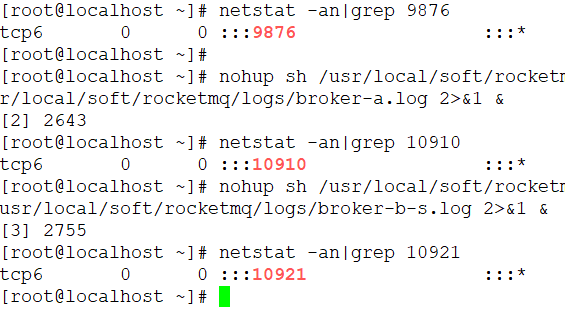
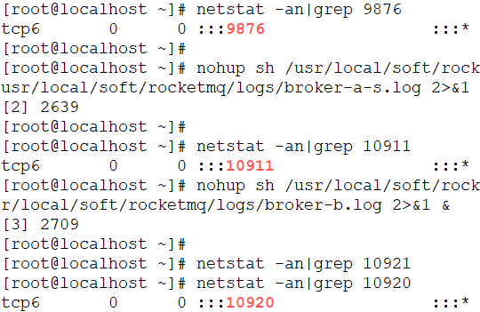

# RocketMQ 二主二从异步集群部署

## 节点规划

|     虚拟机     | 端口  | 名称           |
| :------------: | :---: | :------------- |
| 192.168.44.163 | 9876  | NameServer1    |
| 192.168.44.163 | 10910 | BrokerA-master |
| 192.168.44.163 | 10921 | BrokerB-slave  |
| 192.168.44.164 | 9876  | NameServer2    |
| 192.168.44.164 | 10920 | BrokerB-master |
| 192.168.44.164 | 10911 | BrokerA-slave  |


## 下载

从官网首页最新发布版本进入下载地址
http://rocketmq.apache.org/

比如：

```shell
cd /usr/local/soft
wget https://mirror.bit.edu.cn/apache/rocketmq/4.7.1/rocketmq-all-4.7.1-bin-release.zip
```

## 解压

解压后，把文件夹改个名字

```shell
unzip rocketmq-all-4.7.1-bin-release.zip
mv rocketmq-all-4.7.1-bin-release rocketmq
```

在两台机器上都下载、解压好。
在rocketmq/conf目录下，有三种建议配置模式：

- 2m-2s-async(2主2从异步) —— 本文采用这种
- 2m-2s-sync (2主2从同步)
- 2m-noslave (2主)

> 现在需要修改两台机器上2m-2s-async这个目录中的文件。
> 配置文件修改之前先备份。

## 配置第一台机器

192.168.44.163的两个配置文件
（1）broker-a.properties

```shell
cd /usr/local/soft/rocketmq/conf/2m-2s-async
vim  broker-a.properties
```

修改的内容（名字自定义，保持一致，否则不能组成集群）

```shell
brokerClusterName=qingshan-cluster
```

增加的内容

```properties
#Broker 对外服务的监听端口
listenPort=10910
#是否允许 Broker 自动创建Topic，建议线下开启，线上关闭
autoCreateTopicEnable=true
#是否允许 Broker 自动创建订阅组，建议线下开启，线上关闭
autoCreateSubscriptionGroup=true
#nameServer地址，分号分割
namesrvAddr=192.168.44.163:9876;192.168.44.164:9876
#存储路径
storePathRootDir=/usr/local/soft/rocketmq/store/broker-a
#commitLog 存储路径
storePathCommitLog=/usr/local/soft/rocketmq/store/broker-a/commitlog
#消费队列存储路径存储路径
storePathConsumeQueue=/usr/local/soft/rocketmq/store/broker-a/consumequeue
#消息索引存储路径
storePathIndex=/usr/local/soft/rocketmq/store/broker-a/index
#checkpoint 文件存储路径
storeCheckpoint=/usr/local/soft/rocketmq/store/checkpoint
#abort 文件存储路径
abortFile=/usr/local/soft/rocketmq/store/abort
```

（2）broker-b-s.properties

```shell
vim  broker-b-s.properties
```

修改的内容（名字自定义，保持一致，否则不能组成集群）

```shell
brokerClusterName=qingshan-cluster
```

增加的内容：

```properties
#Broker 对外服务的监听端口
listenPort=10921
#是否允许 Broker 自动创建Topic，建议线下开启，线上关闭
autoCreateTopicEnable=true
#是否允许 Broker 自动创建订阅组，建议线下开启，线上关闭
autoCreateSubscriptionGroup=true
#nameServer地址，分号分割
namesrvAddr=192.168.44.163:9876;192.168.44.164:9876
#存储路径
storePathRootDir=/usr/local/soft/rocketmq/store/broker-b-s
#commitLog 存储路径
storePathCommitLog=/usr/local/soft/rocketmq/store/broker-b-s/commitlog
#消费队列存储路径存储路径
storePathConsumeQueue=/usr/local/soft/rocketmq/store/broker-b-s/consumequeue
#消息索引存储路径
storePathIndex=/usr/local/soft/rocketmq/store/broker-b-s/index
#checkpoint 文件存储路径
storeCheckpoint=/usr/local/soft/rocketmq/store/checkpoint
#abort 文件存储路径
abortFile=/usr/local/soft/rocketmq/store/abort
```

## 配置第二台机器

192.168.44.164的两个配置文件
修改的内容基本一致，主要是注意一下端口号、路径名。

（1）broker-b.properties

```shell
cd /usr/local/soft/rocketmq/conf/2m-2s-async
vim  broker-b.properties
```

修改的内容（名字自定义，保持一致，否则不能组成集群）

```shell
brokerClusterName=qingshan-cluster
```

增加的内容

```properties
#Broker 对外服务的监听端口
listenPort=10920
#是否允许 Broker 自动创建Topic，建议线下开启，线上关闭
autoCreateTopicEnable=true
#是否允许 Broker 自动创建订阅组，建议线下开启，线上关闭
autoCreateSubscriptionGroup=true
#nameServer地址，分号分割
namesrvAddr=192.168.44.163:9876;192.168.44.164:9876
#存储路径
storePathRootDir=/usr/local/soft/rocketmq/store/broker-b
#commitLog 存储路径
storePathCommitLog=/usr/local/soft/rocketmq/store/broker-b/commitlog
#消费队列存储路径存储路径
storePathConsumeQueue=/usr/local/soft/rocketmq/store/broker-b/consumequeue
#消息索引存储路径
storePathIndex=/usr/local/soft/rocketmq/store/broker-b/index
#checkpoint 文件存储路径
storeCheckpoint=/usr/local/soft/rocketmq/store/checkpoint
#abort 文件存储路径
abortFile=/usr/local/soft/rocketmq/store/abort
```

（2）broker-a-s.properties

```shell
cd /usr/local/soft/rocketmq/conf/2m-2s-async
vim  broker-a-s.properties
```

修改的内容（名字自定义，保持一致，否则不能组成集群）

```shell
brokerClusterName=qingshan-cluster
```

增加的内容：

```properties
#Broker 对外服务的监听端口
listenPort=10911
#是否允许 Broker 自动创建Topic，建议线下开启，线上关闭
autoCreateTopicEnable=true
#是否允许 Broker 自动创建订阅组，建议线下开启，线上关闭
autoCreateSubscriptionGroup=true
#nameServer地址，分号分割
namesrvAddr=192.168.44.163:9876;192.168.44.164:9876
#存储路径
storePathRootDir=/usr/local/soft/rocketmq/store/broker-a-s
#commitLog 存储路径
storePathCommitLog=/usr/local/soft/rocketmq/store/broker-a-s/commitlog
#消费队列存储路径存储路径
storePathConsumeQueue=/usr/local/soft/rocketmq/store/broker-a-s/consumequeue
#消息索引存储路径
storePathIndex=/usr/local/soft/rocketmq/store/broker-a-s/index
#checkpoint 文件存储路径
storeCheckpoint=/usr/local/soft/rocketmq/store/checkpoint
#abort 文件存储路径
abortFile=/usr/local/soft/rocketmq/store/abort
```

## 创建数据目录

第一台机器163执行（只需要执行一次）

```shell
mkdir -p /usr/local/soft/rocketmq/store/broker-a /usr/local/soft/rocketmq/store/broker-a/consumequeue /usr/local/soft/rocketmq/store/broker-a/commitlog /usr/local/soft/rocketmq/store/broker-a/index /usr/local/soft/rocketmq/logs /usr/local/soft/rocketmq/store/broker-b-s /usr/local/soft/rocketmq/store/broker-b-s/consumequeue /usr/local/soft/rocketmq/store/broker-b-s/commitlog /usr/local/soft/rocketmq/store/broker-b-s/index
```

第二台机器164执行（只需要执行一次）

```shell
mkdir -p /usr/local/soft/rocketmq/store/broker-a-s /usr/local/soft/rocketmq/store/broker-a-s/consumequeue /usr/local/soft/rocketmq/store/broker-a-s/commitlog /usr/local/soft/rocketmq/store/broker-a-s/index /usr/local/soft/rocketmq/logs /usr/local/soft/rocketmq/store/broker-b /usr/local/soft/rocketmq/store/broker-b/consumequeue /usr/local/soft/rocketmq/store/broker-b/commitlog /usr/local/soft/rocketmq/store/broker-b/index
```

## 启动两个NameServer

启动第一台机器163的NameServer

```shell
nohup sh /usr/local/soft/rocketmq/bin/mqnamesrv >/usr/local/soft/rocketmq/logs/mqnamesrv.log 2>&1 &
```

启动第二台机器164的NameServer

```shell
nohup sh /usr/local/soft/rocketmq/bin/mqnamesrv >/usr/local/soft/rocketmq/logs/mqnamesrv.log 2>&1 &
```

## 启动Broker

1、启动节点1 163的 broker-a-master
在163上面执行

```shell
nohup sh /usr/local/soft/rocketmq/bin/mqbroker -c /usr/local/soft/rocketmq/conf/2m-2s-async/broker-a.properties > /usr/local/soft/rocketmq/logs/broker-a.log 2>&1 &
```

在虚拟机中可能由于内存不够导致无法启动，日志文件中出现如下错误：

```shell
nohup: ignoring input
Java HotSpot(TM) 64-Bit Server VM warning: INFO: os::commit_memory(0x00000005c0000000, 8589934592, 0) failed; error='Cannot allocate memory' (errno=12)
vim /usr/local/soft/rocketmq/bin/runbroker.sh
```

把8g和4g改成512m和256m

```properties
JAVA_OPT="${JAVA_OPT} -server -Xms512m -Xmx512m -Xmn256m"
```

再次启动。

2、启动节点2 164的broker-a-s
在164上面执行

```shell
nohup sh /usr/local/soft/rocketmq/bin/mqbroker -c /usr/local/soft/rocketmq/conf/2m-2s-async/broker-a-s.properties > /usr/local/soft/rocketmq/logs/broker-a-s.log 2>&1 &
```

3、启动节点2 164的 broker-b-master
在164上面执行

```shell
nohup sh /usr/local/soft/rocketmq/bin/mqbroker -c /usr/local/soft/rocketmq/conf/2m-2s-async/broker-b.properties > /usr/local/soft/rocketmq/logs/broker-b.log 2>&1 &
```

4、启动节点1 163的broker-b-s
在163上面执行

```shell
nohup sh /usr/local/soft/rocketmq/bin/mqbroker -c /usr/local/soft/rocketmq/conf/2m-2s-async/broker-b-s.properties > /usr/local/soft/rocketmq/logs/broker-b-s.log 2>&1 &
```

163上面启动的3个端口：


164上面启动的3个端口：


查看端口启动状态：

```shell
netstat -an|grep 109
```

第一台机器 192.168.44.163
端口规划：
9876 NameServer1
10910 BrokerA-master
10921 BrokerB-slave

第二台机器 192.168.44.164
端口规划：
9876 NameServer2
10920 BrokerB-master
10911 BrokerA-slave