# RocketMQ基本介绍


源码地址∶ https://github.com/apache/rocketmq


中文文档∶ https://github.com/apache/rocketmq/tree/master/docs/cn

商业版∶https://www.aliyun.com/product/rocketmq


官网翻译∶http://www.itmuch.com/books/rocketmq/ 

FAQ: http://rocketmq.apache.org/docs/faq/

默认配置:https://www.cnblogs.com/jice/p/11981107.html

RocketMQ常用管理命令:https://blog.csdn.net/gwd1154978352/article/details/80829534

## 1.RocketMQ单机二进制安装
[参考](https://github.com/hupwy/k8s-cloud-parent/blob/main/doc/%E6%B6%88%E6%81%AF%E9%98%9F%E5%88%97/RocketMQ/CentOS%E4%BA%8C%E8%BF%9B%E5%88%B6%E6%96%B9%E5%BC%8F%E5%AE%89%E8%A3%85RocketMQ4.7.1.md)

启动服务时，先启动 NameServer，再启动 Broker，停机的时候相反。

## 2.RocketMQ 集群部署

[参考](https://github.com/hupwy/k8s-cloud-parent/blob/main/doc/%E6%B6%88%E6%81%AF%E9%98%9F%E5%88%97/RocketMQ/CentOS%E4%BA%8C%E8%BF%9B%E5%88%B6%E6%96%B9%E5%BC%8F%E5%AE%89%E8%A3%85RocketMQ4.7.1.md)

服务有了，有没有像 RabbitMQ一样，通过插件提供一个管理界面，方便我们查看服务状态和元数据呢?

## 3.管理控制台（web console）

[参考](https://github.com/hupwy/k8s-cloud-parent/blob/main/doc/%E6%B6%88%E6%81%AF%E9%98%9F%E5%88%97/RocketMQ/RocketMQ%20web%E6%8E%A7%E5%88%B6%E5%8F%B02.0.0%E7%89%88%E6%9C%AC%E6%BA%90%E7%A0%81%E6%96%B9%E5%BC%8F%E5%AE%89%E8%A3%85.md)

RocketMQ的 externals 包里面提供了一个 web 控制台，需要单独部署。除了控制台，这里面也包含对大数据 flume、hbase 等组件的对接和扩展。
1. 运维∶ 主要是设置 nameserver 和配置 vipchannel
2. 驾驶舱∶控制台的 dashboard，可以分别按 broker 和主题来查看消息的数量和趋势。
3. 集群∶ 整个 RocketMQ的集群情况，包括分片，编号，地址，版本，消息生产和消息消费的 TPS 等，这个在做性能测试的时候可以作为数据指标。
4. 主题∶即 topic，可以新增/更新 topic;也看查看 topic的信息，如状态，路由，消费者管理和发送消息等。
5. 消费者∶可以在当前 broker中查看/新建消费者 group，包括消费者信息和消费进度。
6. 生产者∶ 可以在当前 broker 中查看生产组下的生产者 group，包生产者信息和生产者状态。
7. 消息∶ 可以按照 topc，messagelD，messageKey 分别查询具体的消息。
8. 用户中心∶ 切换语言和登陆相关（登陆需要在 console 的配置中打开对应配置，默认不需要登陆）。

  > 其中最常用的是集群，主题，消费者和消息这四部分。

## 4.RocketMQ架构

http://rocketmq.apache.org/docs/rmq-arc


> 一般见到的架构图都是这样的，其中这些重要的角色需要解释下。

### 4.1 Broker

RocketMQ的服务, 或者说一个进程，叫做 Broker, Broker的作用是存储和转发消息，RocketMQ单机大约能承受 **10万**QPS的请求。

为了提升 Broker的可用性(防止单点故障)，以及提升服务器的性能(实现负载)，通常会做集群的部署, 跟kafka或者Redis Cluster一样，RocketMQ集群的每个 Broker节点保存总数据的一部分，因此可以实现横向扩展。

为了提升可靠性(防止数据丢失)，每个 Broker 可以有自己的副本(slave)，默认情况下，读写都发生在 master上。

在 `slaveReadEnable=true` 的情况下，slave也可以参与读负载，但是默认只有Brokerld=1的slave才会参与读负载，而且是在master消费慢的情况下，由 `whichBrokerWhenConsumeSlowly`这个参数决定。

### 4.2 Topic

Topic 用于将消息按主题做划分，比如订单消息、物流消息。

Producer将消息发往指定的Topic，Consumer订阅这个Topic就可以收到相应的消息。

跟kafka一样，如果Topic不存在，会自动创建，BrokerConfig：

```java
private boolean autoCreateTopicEnable = true;
```

Topic 跟生产者和消费者都是多对多的关系，一个生产者可以发送消息到多个 Topic，一个消费者也可以订阅多个 Topic。

> 注意，跟kafka不同的是，在RocketMQ中，Topic 是一个逻辑概念，消息不是按Topic划分存储的。

### 4.3 NameServer

当不同的消息存储在不同的Broker上，生产者和消费者对于Broker的选取，或者说路由选择是一个非常关键的问题。

1. (路由)生产者发一条消息，应该发到哪个Broker? 消费者接收消息，从哪个Broker获取消息?
2. (服务端增减)如果Broker增加或者减少了，客户端怎么知道?
3. (客户端增加)一个新的生产者或者消费者加入，怎么知道有哪些 Broker?

所以，跟分布式的服务调用的场景需要一个注册中心一样，在RocketMQ中需要有一个角色来管理Broker的信息，类似Kafka里Zookeeper的角色，而RocketMQ是自己实现了一个服务，这个服务叫做NameServer。

我们可以把 NameServer理解为是RocketMQ的路由中心，每一个NameServer节点都保存着全量的路由信息，为了保证高可用，NameServer 自身也可以做集群的部署，它的作用有点像Eureka或者Redis Sentinel。

也就是说，Broker会在NameServer上注册自己，Porducer和Consumer用NameServer来发现Broker。

**NameServer 作为路由中心到底怎么工作的呢?**
每个Broker节点在启动时，都会根据配置遍历NameServer列表rocketmq/conf/broker.conf

```properties
namesrvAddr=localhost:9876
```

与每个NameServer建立TCP长连接，注册自己的信息，之后每隔30s发送心跳信息(服务主动注册)。

如果Broker挂掉了，不发送心跳了，NameServer怎么发现呢?

所以除了主从注册，还有定时探活，每个NameServer每隔10s检查一下各个Broker的最近一次心跳时间，如果发现某个Broker超过120s都没发送心跳，就认为这个Broker已经挂掉了，会将其从路由信息里移除。


> 思考∶ 如果让你设计一个注册中心，你怎么实现心跳检测、探活文些基本功自?
>
> Nameserver 的作用是用来管理 Broker 的服务的，也就是服务注册与发现，那为什么不直接用 Zookeeper、Consul、etcd、Eureka 这样的组件呢?


**为什么不用 Zookeeper?**

实际上不是不用，在 RocketMQ的早期版本，即MetaQ1.x和2.x阶段，服务管理也是用Zookeeper 实现的，跟kafka一样，但 MetaQ3.x（即 RocketMQ）却去掉了ZooKeeper 依赖，转而采用自己的 NameServer。

RocketMQ的架构设计决定了只需要一个轻量级的元数据服务器就足够了，只需要保持最终一致，而不需要 Zookeeper 这样的强一致性解决方案，不需要再依赖另一个中间件，从而减少整体维护成本。

根据著名的 CAP 理论∶ 一致性（Consistency）、可用性（Availability）、分区容错（Partiton Tolerance）。

Zookeeper 实现了 CP，NameServer 选择了AP放弃了实时一致性。


**一致性问题如何解决?**

NameServer 之间是互相不通信的，也没有主从之分，它们是怎么保持一致性的?

我们从3个点来分析一下∶ 

1. 服务注册

   如果新增了Broker，怎么新增到所有的NameServer中?

   因为没有master，Broker每隔30秒会向所有的NameServer发送心跳信息，所以还是能保持一致的。 

   

2. 服务剔除

   如果一个Broker挂了，怎么从所有的NameServer中移除它的信息?

   - 如果Broker正常关闭∶ 连接就断开了，Netty的通道关闭监听器会监听到连接断开事件，然后会将这个Broker信息剔除掉。
   - 如果 Broker 异常关闭∶ NameServer的定时任务每10秒扫描Broker列表，如果某个Broker的心跳包的最新时间戳超过当前时间120秒，就会被移除。

   通过以上两点，不管Broker是挂了，还是恢复了，增加了还是减少了，NameServer都能够保持数据—致。 

   

3. 路由发现
   如果Broker的信息更新了（增加或者减少节点），客户端怎么获取最新的 Broker列表?

   - 生产者：发送第一条消息的时候，根据Topic从NameServer 获取路由信息。

   - 消费者：消费者一般是订阅固定的Topic，在启动的时候就要获取Broker信息。

   如果Broker信息动态变化了怎么办?

   因为NameServer不会主动推送服务信息给客户端，客户端也不会发送心跳到Nameserver，所以在建立连接之后，需要生产者和消费者定期更新。

   在 MQClientInstance类（生产者消费者通用）的 start 方法中，启动了一个定时任务 (237行)：

   ```java
   //Start various schedule tasks 
   this.startScheduledTask();
   ```

   其中第二个任务 `updateTopicRoutelnfoFromNameServer`方法，是用来定期更新NameServer信息的，默认是30秒获取一次。

   ```java
   this.scheduledExecutorService.scheduleAtFixedRate(new Runnable() {
   	@Override 
       public void run() {
           try {
   			MQClientInstance this.updateTopicRouteInfoFromNameServer();
           } catch (Exception e) {
   			log.error("ScheduledTask updateTopicRouteInfoFromNameServer exception", e);
           }
       }
       , 10, this.clientConfig.getPollNameServerInterval(), TimeUnit.MLLISECONDS);
   }
   ```

   消费者和生产者以相同的时间间隔，更新NameServer信息

   ```java
   public void updateTopicRouteInfoFromNameServer() {
       Set<String topicList = new HashSet<String>();
       //Consumer
       {
           Iterator<Entry<String, MQConsumerlInner>> it = this.consumerTable.entrySet().iterator();
           while (it.hasNext()){
               Entry<String, MQConsumerInner> entry = it.next();
               MQConsumerInner impl = entry.getValue();
               if (impl != null) {
                   Set<SubscriptionData> subList = impl.subscriptions();
                   if (subList != null) {
                       for(SubscriptionData subData: subList) {
                           topicList.add(subData.getTopic));
                       }
                   }
               }
           }
       }
       
       // Producer
       {
           Iterator<Entry<String, MQProducerInner>> it = this.producerTable.entrySet().iterator();
           while (it.hasNext()) {
               Entry<String, MQProducerInner> entry = it.next();
               MQProducerInner impl = entry.getValue();
               if (impl!= null) {
                   Set<String> lst = impl.getPublishTopicList();
                   topicList.addAll(lst);
               }
           }
       }
       
       for (String topic: topicList) {
           this.updateTopicRouteInfoFromNameServer(topic);
       }
   }
   ```

   拉取的时间间隔由DefaultMQPushConsumer的pollNameServerlnterval参数决定，默认是 30 秒。

   `org.apache.rocketmq.client.ClientConfig`

   ```java
   private int pollNameServerInterval=1000*30;
   ```

   总结一下，各个NameServer的数据是能够保持一致的，而且生产者和消费者会定期更新路由信息，所以可以获取最新的信息。

   > 问题∶ 如果 Broker 刚挂，客户端30秒以后才更新路由信息，那是不是会出现最多30 秒钟的数据延迟?
   >
   > 比如说一个 Broker 刚挂了，客户端缓存的还是旧的路由信息，发消息和接收消息都会失败。

   这个问题有几个解决思路∶

   1. 重试
   2. 把无法连接的Broker隔离掉，不再连接;
   3. 者优先选择延迟小的节点，就能避免连接到容易挂的Broker了。

   > 问题∶ 如果作为路由中心的NameServer全部挂掉了，而且暂时没有恢复呢?
   > 也没有关系，客户端肯定要缓存Broker的信息，不能完全依赖于NameServer。

### 4.4 Producer

生产者，用于生产消息，会定时从NameServer拉取路由信息(不用配置RocketMQ的服务地址)，然后根据路由信息与指定的Broker建立TCP长连接，从而将消息发送到Broker中。

**特点**

1. 发送逻辑一致的Producer可以组成一个Group。
2. RocketMQ的生产者同样支持批量发送，不过List要自己传进去。
3. Producer写数据只能操作 master节点。

### 4.5 Consumer

消息的消费者，通过NameServer集群获得Topic的路由信息，连接到对应的Broker上消费消息。

**特点**

- 消费逻辑一致的Consumer可以组成一个 Group，这时候消息会在Consumer之间负载。

- 由于Master和Slave都可以读取消息，因此Consumer会与Master和Slave 都建立连接。

> 注意∶ 同一个 consumer group内的消费者应该订阅同一个topic。
>
> 或者反过来，消费不同 topic的消费者不应该采用相同的consumer group名字。
>
> 如果不一样，后面的消费者的订阅，会覆盖前面的订阅。

**消费者有两种消费方式∶** 

- 一种是集群消费（消息轮询）

- 一种是广播消费（全部收到相同副本）。

#### 4.5.1 pull

从消费模型来说，RocketMQ 支持 pull 和 push 两种模式。

- Pull 模式是consumer 轮询从broker拉取消息。

  - 实现类∶`DefaultMQPulIConsumer`(过时)，替代类:`DefaultLitePullConsumer`。

    ```java
    DefaultMQPullConsumer consumer =new DefaultMQPullConsumer("my test consumer group");
    ```

- Pull有两种实现方式∶ 

  - 一种是普通的轮询（Polling）

    不管服务端数据有无更新，客户端每隔定长时间请求拉取一次数据，可能有更新数据返回，也可能什么都没有。

    > 普通轮询的缺点∶因为大部分时候没有数据，这些无效的请求会大大地浪费服务器的资源。而且定时请求的间隔过长的时候，会导致消息延迟。

  - RocketMQ用长轮询(Long Polling)来实现

    客户端发起Long Polling，如果此时服务端没有相关数据，会hold住请求，直到服务端有相关数据，或者等待一定时间超时才会返回。

    返回后，客户端又会立即再次发起下一次Long Polling(所谓的hold住请求指的服务端暂时不回复结果，不关闭请求连接，等相关数据准备好，写回客户端）。

    > 长轮询解决了轮询的问题，唯一的缺点是服务器在挂起的时候比较耗内存。

#### 4.5.2 push

Push模式是Broker推送消息给consumer，实现类: `DefaultMQPushConsumer`

```java
DefaultMOPushConsumer consumer= new DefaultMQPushConsumer("my test consumer group")
```

RocketMQ的push模式实际上是基于pull 模式实现的，只不过是在 pull模式上封装了一层，所以RocketMQ的push模式并不是真正意义上的"推模式"。

在 RocketMQ中，`PushConsumer`会注册`MessageListener`监听器，取到消息后，唤醒`MessageListener`的`consumeMessage`来消费，对用户而言，感觉消息是被推送过来的。

```java
while (!this.isStopped()) {
    try {
        PullRequest pullRequest = this.pullRequestQueue.take();
        this.pullMessage(pullRequest);
    } catch (InterruptedException ignored){
    } catch (Exception e) {
        log.error("Pull Message Service Run Method exception",e);
    }
}
```

### 4.6 Message Queue

RocketMQ支持多master的架构。

> 思考一个这样的问题∶ 当有多个master的时候，发往一个Topic的多条消息会在多个master的Broker上存储，那么发往某一个Topic的多条消息，是不是在所有的Broker上存储完全相同的内容?
>
> 肯定不是的。
>
> 如果所有的master存储相同的内容，而slave又跟master存储相同的内容∶ 
>
> 1. 浪费了存储空间。
>
> 2. 无法通过增加机器数量线性地提升Broker的性能，
>
> 也就是只能垂直扩展，通过升级硬件的方式提升性能，无法实现横向(水平)扩展，那么在分布式的环境中，RocketMQ的性能肯定会受到非常大的限制。
>
> 一句话∶不符合分片的思想。


> 那么最关键的问题来了，怎么把发到一个Topic里面的消息分布到不同的master上呢?
>
> 在kafka里面设计了一个partition，一个Topic可以拆分成多个partition，这些partition可以分布在不同的Broker上，这样就实现了数据的分片，也决定了kafka 可以实现横向扩展。


RocketMQ 有没有这样的设计呢?

在一个Broker上，RocketMQ只有一个存储文件，并没有像kafka一样按照不同的Topic分开存储。数据目录∶

```
/rocketmq/store/broker-a/commitlog
```

如果有3个Broker，也就是只有3个用来存储不同数据的commitlog。


那问题就来了，如果不按照分区去分布，数据应该根据什么分布呢?

RocketMQ里面设计了一个叫做 Message Queue的逻辑概念，作用跟 partition类似。

首先，我们创建Topic的时候会指定队列的数量，一个叫**writeQueueNums** (写队列数量)，一个**readQueueNums**(读队列数量)

写队列的数量决定了有几个Message Queue，读队列的数量决定了有几个线程来消费这些Message Queue(只是用来负载的)

那不指定MQ的时候，默认有几个MQ呢?

服务端创建一个 Topic 默认8个队列(`BrokerConfig`)∶

```java
private int defaultTopicQueueNums=8;
```

topic不存在，生产者发送消息时创建默认4个队列(`DefaultMQProducer`)

```java
private volatile int defaultTopicQueueNums=4;
```

服务端创建的时候有一个判断，取小一点的值，MQClientInstance 616 行∶

```java
int queueNums= Math.min(defaultMQProducer.getDefaultTopicQueueNums(), data.getReadQueueNums());
```

MessageQueue 在磁盘上是可以看到的，但是数量只跟写队列相关。 

比如TopicTest有4个写队列，consumequeue目录下面就会出现四个目录∶/usr/local/soft/rocketmq/store/broker-a/consumequeue/TopicTest/

```
drwxr-xr-x.2 root root 34 Sep 22 04:26 0 
drwxr-xr-x.2 root root 34 Sep 22 04:26 1
drwxr-xr-x.2 root root 34 Sep 22 04:26 2
drwxr-xr-x.2 root root 34 Sep 22 04:26 3
```

客户端封装了一个MessageQueue对象，里面其实就是三块内容

```java
private String topic; 
private String brokerName; 
private int queueld;
```

- Topic表示它是哪个topic的队列
- Broker代表它在哪个Broker上，比如有两个master，一个叫broker-a，一个叫broker-b
- queueld代表它是第几个分片

> 例如：
>
> -  一个Topic有3个Message Queue，编号是1、2、3。
>
> - 刚好有三个Broker，第一个MQ指向Broker1，第二个MQ指向Broker2，第三个MQ指向 Broker3。
>
> - 发送消息的时候，生产者会根据一定的规则，获得MessageQueue，只要拿到了queueld，就知道要发往哪个Broker，然后在commitlog写入消息。

磁盘上看到的队列数量，是由写队列的数量决定的，而且在所有master上的个数是一样的（但是数据存储不一样）。


#### 事例1

> 例如∶集群有两个master。如果创建一个topic，有2个写队列、1个读队列（topic名字∶q-2-1）。
>
> 那么两台机器的 consumequeue 目录会出现2个队列，一共4个队列。

/usr/local/soft/rocketmq/store/broker-a/consumequeue/q-2-1也就是总队列数量是∶**写队列数*节点数。**

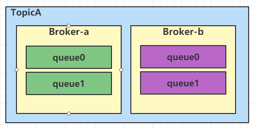

如果我们发送6条消息，给消息依次编号，会选择什么队列发送呢?

```java
for (int i= 0; i<6; i++){
    Message msg = new Message("q-2-1",
                              "TagA",
                              "test",
                              ("RocketMQ" + String.format("%05d",i)).getBytes());
    SendResult sendResult = producer.send(msg);
    System.out.println(String.format("%05d",i)+":"+sendResult)
}
```

**消息接收顺序（看SendResult）∶ a-q0,a-q1,b-q0,b-q1,a-q0,a-q1**

| 输出列表                      |
| ----------------------------- |
| BrokerName=broker-a,queueId=0 |
| BrokerName=broker-a,queueId=1 |
| BrokerName=broker-b,queueId=0 |
| BrokerName=broker-b,queueId=1 |
| BrokerName=broker-a,queueId=0 |
| BrokerName=broker-a,queueId=1 |

因为消费者只有1个读队列，只能消费编号为0的队列，所以读到的消息是 a-q0，b-q0，a-q0的消息，序号是0，2，4。

**则1，3，5序号的消息没有被消费**

| 输出列表                      |
| ----------------------------- |
| BrokerName=broker-a,queueId=0 |
| BrokerName=broker-b,queueId=0 |
| BrokerName=broker-a,queueId=0 |


#### 事例2

> 如果是1个写队列，2个读队列（topic名字∶q-1-2），那么两个 broker 的 consumequeue 目录会出现1个队列。

/usr/local/soft/rocketmq/store/broker-a/consumequeue/q-1-2

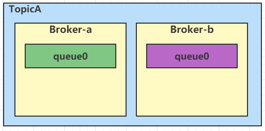

发送6条消息，依次编号∶消息接收顺序 a-q0，b-q0，a-q0，b-q0a-q0，b-q0

| 输出列表                      |
| ----------------------------- |
| BrokerName=broker-a,queueId=0 |
| BrokerName=broker-b,queueId=0 |
| BrokerName=broker-a,queueId=0 |
| BrokerName=broker-b,queueId=0 |
| BrokerName=broker-a,queueId=0 |
| BrokerName=broker-b,queueId=0 |

消费者有 2 个读队列，可以消费编号0 的队列。

**所有消息都可以接收到。**


#### 结论

根据`事例1`和`事例2`的表述，读写队列数量最好一致，否则会出现消费不了的情况。


> 思考∶Queue 的数量到底会产生什么影响? 
>
> Queue的数量要比Broker的数量多（倍数），才能实现尽量平均的负载，或者应对未来的扩容。
>
> 队列数量也要比消费者数量多，否则有部分消费者无法消费消息。


## 5. RocketMQ原理

### 5.1 生产者

前面我们说Message Queue是用来实现横向扩展的，生产者利用队列可以实现消息的负载和平均分布，那什么时候消息会发到哪个队列呢?

#### 5.1.1.消息发送规则

从Producer的send方法开始跟踪，在`DefaultMQProducerlmpl`的`select`方法会选择要发送的Queue(568 行)∶

```java
public MessageQueue selectOneMessageQueue(final TopicPublishInfo tpInfo, final String lastBrokerName){
    return this.mqFaultStrategy.selectOneMessageQueue(tpInfo, lastBrokerName);
}   
```

调用的是`MQFaultStratage`的选择队列的方法，这个类是 MQ负载均衡的核心类 

```java
int index= tpInfo.getSendWhichQueue().getAndIncrement();
for (int i=0;i<tpInfo.getMessageQueueList().size();i++){
    int pos= Math.abs(index++) % tpInfo.getMessageQueueList().size();
    if(pos < 0)
        pos = 0;
    MessageQueue mq= tpInfo.getMessageQueueList().get(pos);
    if (latencyFaultTolerance.isAvailable(mq.getBrokerName))){
        if (null == lastBrokerName || mq.getBrokerName().equals(lastBrokerName))
            return mq;
    }
}

```

之前我们看过默认的结果，是轮询的∶a-q0，a-q1，b-q0，b-q1……

MessageQueueSelector 有三个实现类∶

1. `SelectMessageQueueByHash`(默认) : 它是一种不断自增、轮询的方式。

2. `SelectMessageQueueByRandom`∶ 随机选择一个队列。

3. `SelectMessageQueueByMachineRoom`∶ 返回空，没有实现。

除了上面自带的策略，也可以自定义`MessageQueueSelector`，作为参数传进去：

```java
SendResult sendResult = producer.send(msg, new MessageQueueSelector(){
    public MessageQueue select(List<MessageQueue>mqs, Message msg, Object arg) {
        Integer id = (Integer) arg;
        int index = id % mqs.size();
        return mqs.get(index);
    }
}.i);
```

#### 5.1.2 顺序消息

顺序消息的场景∶ 一个客户先提交了一笔订单，订单号位1688，然后支付，后面又发起了退款，产生了三条消息∶ 

1. 提交订单的消息
2. 支付的消息
3. 退款的消息。

这三笔消息到达消费者的顺序，肯定要跟生产者产生消息的顺序一致。不然，没有订单，不可能付款，没有付款，是不可能退款的。

在RPC调用的场景中我们不用考虑有序性的问题，本来代码中调用就是有序的。而消息中间件经过了Broker的转发，而且可能出现多个消费者并发消费，就会导致乱序的问题。

这里我们先区分一个概念，全局有序和局部有序。

- 全局有序就是不管有几个生产者，在服务端怎么写入，有几个消费者，消费的顺序跟生产的顺序都是一致的，实现比较麻烦，而且即使实现了，也会对MQ的性能产生很大的影响

- 我们这里说的顺序消息其实是局部有序

  比如不同的颜色表示不同的订单相关的消息，只要同一个订单相关的消费的时候是有序的时候就OK了。

**要保证消息有序，要分成几个环节分析∶**

1. 生产者发送消息的时候，到达Broker应该是有序的，所以对于生产者不能使用多线程异步发送，而是顺序发送。
2. 写入Broker的时候，应该是顺序写入的，也就是相同主题的消息应该集中写入选择同一个queue，而不是分散写入。
3. 消费者消费的时候只能有一个线程，否则由于消费的速率不同，有可能出现记录到数据库的时候无序。

**RocketMQ 的顺序消息怎么实现呢?**

1. 首先是生产者发送消息，是单线程的。

   案 例：`example.ordermessage.Producer` ， 跟 踪`send`方 法，在`DefaultMQProducerlmpl`类 `send`方法里面有一个默认的参数（1092行）∶

   ```java
   CommunicationMode.SYNC
   ```

   表示消息是同步发送的，生产者需要等待Broker的响应，最终其实是调用了∶`MQClientAPIlmpl`的`sendMessageSync`方法同步发送消息。

   1126行`sendKernellmpl`，再到849行的 `switch case`。

   ```java
   private SendResult sendMessageSync(
       final String addr, 
       final String brokerName, 
       final Message msg, 
       final long timeoutMillis, 
       final RemotingCommand request
   )throws RemotingException, MQBrokerException, InterruptedException {
       RemotingCommand response=this.remotingClient.invokeSync(addr, request,timeoutMillis); 
       assert response != null;
       return this.processSendResponse(brokerName, msg, response);
   }
   ```

   生产者收到Broker的成功的`Response`才算是消息发送成功。

2. 其次是消息要路由到相同的queue（关键是大家要在相同的通道排队，不能各排各的队，才能实现先进先出）。

   **生产者怎么控制队列的选择?**

   通过`MessageQueueSelector`，默认是用HashKey选择。

   Spring Boot 的源码跟着跟着，orderly不见了，其实是传了一个hashKey进去，只要大家使用相同的hashKey，就会选择同一个队列。

   ```java
   producer.sendOneway(rocketMsg.messageQueueSelector. hashKey));
   ```

3. 最后在消费者，需要保证一个队列只有一个线程消费。
   在Spring Boot 中，`consumeMode` 设置为orderly。Java API中，传入`MessageListenerOrderly`的实现类。
   example.ordermessage.Consumer

   ```java
   consumer.registerMessageListener(new MessageListenerOrderly(){
   ```

   注意看这个接口的注释∶

   ```java
   //A MessageListenerOrderly object is used to receive messages orderly. Onequeue by one thread
   ```

   一个队列只能有一个线程消费。
   消费者在启动`consumer.start`的时候会判断`getMessageListenerlnner` 的实现∶

   ```java
   if (this.getMessageListenerInner() instanceof MessageListenerOrderly) {
       this.consumeOrderly = true; 
       this.consumelMessageService = 
           new ConsumeMessageOrderlyService(this, (MessageListenerOrderly) this.getMessageListenerInner());
   } else if(this.getMessageListenerInner()instanceof MessageListenerConcurrently) {
       this.consumeOrderly = false; 
       this.consumeMessageService = 
           new ConsumeMessageConcurrentlyService(this, (MessageListenerConcurrently)
   this.getMessageListenerInner());
   }
   ```

   根据 Listener 类型使用不同的 Service，紧接着然后会启动这个 Service∶

   ```java
   if(this.getMessageListenerInner()instanceof MessageListenerOrderly){
       this.consumeOrderly = true; 
       this.consumelMessageService = 
           new ConsumeMessageOrderlyService(this,MessageListenerOrderly)this.getMessageListenerlnner();
   } else if (this.getMessageListenerInner() instanceof MessageListenerConcurrently) { 
       this.consumeOrderly = false; 
       this. consumelMessageService = 
           new ConsumeMessageConcurrentlyService(this, (MessageListenerConcurrently) this.getMessageListenerInner());
   }
   this.consumelMessageService.start();
   ```

   在`DefaultMQPushConsumerlmpl#pullMessage ` 的325行，将拉取到的消息放入ProcessQueue:

   ````java
   boolean dispatchToConsume= processQueue.putMessage(pullResult.getMsgFoundList)); DefaultMQPushConsumerlmpl.this.consumeMessageService.submitConsumeRequest(
       pullResult.getMsgFoundList(), 
       processQueue,
       pullRequest.getMessageQueue(), 
       dispatchToConsume);
   ````

   然后进入`ConsumeMessageOrderlyService`的`submitConsumeRequest`方法

   ```java
   public void submitConsumeRequest(
       final List<MessageExt> msgs, 
       final ProcessQueue processQueue, 
       final MessageQueue messageQueue, 
       final boolean dispathToConsume) { 
       if (dispathToConsume){
           ConsumeRequest consumeRequest= new ConsumeRequest(processQueue,messageQueue);
           this.consumeExecutor.submit(consumeRequest);
       }
   }
   ```

   拉取到的消息构造成 ConsumeRequest（实现了Runnable），然后放入线程池等待执行。
   既然是多线程，那它的执行还能保证有序吗?
   回头看一下放消息的`ProcessQueue`，它是用TreeMap来存放消息的∶

   ```java
   private final TreeMap<Long, MessageExt> msgTreeMap=new TreeMap<Long, MessageExt>();
   ```

   TreeMap是红黑树的实现，自平衡的排序二叉树，因为key是当前消息的`offset`，消息是按照`offset`排序的。
   再看`ConsumeRequest`的`run`方法∶

   ```java
   final Object objLock= messageQueueLock.fetchLockObject(this.messageQueue); 
   synchronized (objLock){
   ```

   因为只有一个队列，而消费的时候必须要加锁，RocketMQ顺序消息消费会将队列锁定，当队列获取锁之后才能进行消费，所以能够实现有序消费。

#### 5.1.3 事务消息

http://rocketmg.apache.org/rocketmq/the-design-of-transactional-message

我们先来说一下事务消息的应用场景。

随着应用的拆分，从单体架构变成分布式架构，每个服务或者模块也有了自己的数据库。一个业务流程的完成需要经过多次的接口调用或者多条MQ消息的发送。

举个例子，在一笔贷款流程中，提单系统登记了本地的数据库，资金系统和放款系统必须也要产生相应的记录。

这个时候，作为消息生产者的提单系统，不仅要保证本地数据库记录是成功的，还要关心发出去的消息是否被成功Broker接收，也就是要么都成功要么都失败。

> 问题来了，如果是多个 DML 的操作，数据库的本地事务是可以保证原子性的（通过undo log）。
>
> 但是一个本地数据库的操作，一个发送MQ的操作，怎么把他们两个放在一个逻辑单元里面执行呢?


我们来分析一下情况，如果先发送MQ消息，再操作本地数据库。

- 第一步失败和两个都成功就不说了，这个是一致的。

  关键就是第一步发送消息成功了，第二步操作本地数据库失败了，比如出现了各种数据库异常，主键重复或者字段超长。

  也就是下游的业务系统有最新的数据，而我自己本地数据库反而没有。

  因为这条数据可能是业务异常，所以就是没办法登记到数据库。

  修改以后再登记也没用，这个时候跟其他系统已经登记的数据就不一样了。

  而发出去的消息又不可能撤回，有可能别人都已经消费了，这个叫做覆水难收。所以不能先发MQ消息。

- 改一下，如果先操作本地数据库，再发送 MQ 消息。

  如果操作本地数据库成功，而发送 MQ消息失败，比如网络出了问题。自己的业务系统有最新的数据，但是其他系统没有。
  
  

> 所以，现在我们的问题就是，怎么设计发送消息的流程，才能让这两个操作要么都成功，要么都失败呢?
>
> 如果能有一个协调的方法，那先发MQ消息还是先操作数据库就不是那么重要了。
>
> 我们可不可以参照XA两阶段提交的思想，把发送消息分成两步，然后把操作本地数据库包括在这个流程里面呢?


**例如∶**

  1. 为了防止 MQ 关键时刻掉链子，先去试探一下。生产者先发送一条消息到 Broker，把这个消息状态标记为"未确认"。
  2. Broker通知生产者消息接收成功，现在你可以执行本地事务。
  3. 生产者执行本地事务。

第3步会有两种结果∶

- 如果本地事务执行成功，那么第4步∶ 生产者给Broker发送请求，把消息状态标记为"已确认"，这样的消息就可以让消费者去消费了。那就全部成功了。
- 如果本地事务执行失败，那么第4步∶ 生产者给Broker发送请求，把消息状态标记为"丢弃"。那就全部失败了。

看起来好像很美好，但是还有一种异常情况，第3步之后生产者迟迟没有告诉Broker本地事务是否执行成功，有可能是连接数据库超时，也可能是连接Broker超时。那Broker也不能一直等待下去吧，这个消息是确认还是丢弃，必须有个最终状态。

这个时候Broker就要主动出击了，去生产者检查本地事务是否执行成功。

- 成功：确认; 
- 失败：丢弃;

RocketMQ 里面就是这么实现的。这个里面出现了两个新的概念∶

1. 半消息(half message)∶暂不能投递消费者的消息，发送方已经将消息成功发送到了MQ服务端，但是服务端未收到生产者对该消息的二次确认，此时该亥消息被标记成"暂不能投递"状态，处于该种状态下的消息即半消息。
2. 消息回查（Message Status Check）∶由于网络闪断、生产者应用重启等原因，导致某条事务消息的二次确认丢失，MQ服务端通过扫描发现某条消息长期处于"半消息"时，需要主动向消息生产者询问该消息的最终状态（`Commit`或是`Rollback`），该过程即消息回查。

看一下事务消息的整体流程∶

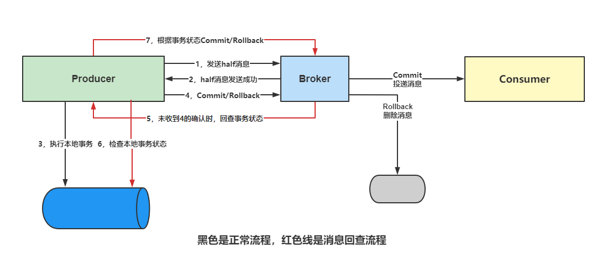

**描述流程：**

1. 生产者向 MQ 服务端发送消息。
2. MQ 服务端将消息持久化成功之后，向发送方 ACK 确认消息已经发送成功，此时消息为半消息。
3. 发送方开始执行本地数据库事务逻辑。
4. 发送方根据本地数据库事务执行结果向 MQ Server 提交二次确认（`Commit`或是`Rollback`），MQ Server 收到 Commit 状态则将半消息标记为可投递，订阅方最终将收到该消息;MQ Server收到`Rollback`状态则删除半消息，订阅方将不会接受该消息。
5. 在断网或者是应用重启的特殊情况下，上述步骤 4 提交的二次确认最终未到达MQ Server，经过固定时间后 MQ Server 将对该消息发起消息回查。
6. 发送方收到消息回查后，需要检查对应消息的本地事务执行的最终结果。
7. 发送方根据检查得到的本地事务的最终状态再次提交二次确认，MQ Server 仍按照步骤 4 对半消息进行操作（`Commit`/`Rollback`）。

**在代码中怎么实现呢?**

ocketMQ提供了一个TransactionListener 接口，这个里面可以实现执行本地事务。

```java
public RocketMQLocalTransactionState executeLocalTransaction(Message msg, Object arg){
    // local transaction process, return bollback, commit or unknown 
    log.info("executeLocalTransaction:"+JSON.toJSONString(msg)); 
    return RocketMQLocalTransactionState.UNKNOWN:
}
```

executeLocalTransaction 方法中执行本地事务逻辑。

这个方法会决定Broker是`commit`消息还是丢弃消息，所以必须return一个状态这个状态可以有三种∶

- `COMMIT`状态，表示事务消息被提交，会被正确分发给消费者。

- `ROLLBACK`状态，该状态表示该事务消息被回滚，因为本地事务逻辑执行失败导致。如果既没有收到`COMMIT`，也没有收到`ROLLBACK`，可能是事务执行时间太长，或者报告 Broker 的时候网络出了问题呢? 那就是第三种状态。

- `UNKNOW`状态∶表示事务消息未确定。
  返回 UNKNOW之后，因为不确定到底事务有没有成功，Broker 会主动发起对事务执行结果的查询∶`checkLocalTransaction`方法执行事务回查逻辑。

  ```java
  @Oeride
  public RocketMQLocalTransactionState checkLocalTransaction(Message msg){
      log.info("checkLocalTransaction:"+JSON.toJSONString(msg)); 
      return RocketMQLocalTransactionState.UNKNOWN;
  }
  ```

  默认回查总次数是 15 次，第一次回查间隔时间是 6s，后续每次间隔 60s。

  生产者消息发送用的是`TransactionMQProducer`，指定`Listener`，Spring Boot 中使用`rocketMQTemplate#sendMessagelnTransaction`。

  ```java
  public String sendTx(@PathVariable String topic, @PathVariable String msg) throws InterruptedException {
      Message message = MessageBuilder.withPayload(msg).build(); 
      System.out.println(Thread.currentThread().getName());
      TransactionSendResult result = rocketMQTemplate.sendMessageInTransaction("groupl", topic, message,"test");
      System.out.println(result.getTransactionId()); 
      return "sendtx";
  }
  ```

#### 5.1.4 延迟消息

延迟消息的场景在 RabbitMQ课程中已经说过，为什么不直接用定时任务也说了。

在 RabbitMQ 里面需要通过死信队列或者插件来实现。

RocketMQ 可以直接支持延迟消息，但是开源版本功能被阉割了，只能支持特定等级的消息。商业L版本可以任意指定时间。

```java
msg setDelayTimeLevel(3)
```

比如 level=3 代表 10 秒。一共支持 18 个等级，延时级别配置代码在MessageStoreConfig#messageDelayLevel 中∶

```java
this.messageDelayLevel="Is 5s 10s 30s lm 2m 3m 4m 5m6m 7m 8m 9m 10m 20m 30m Ih 2h"
```

Spring Boot 中这样使用∶

```java
rocketMQTemplate.syncSend（topic，message，1000，3）;//表示延时 10 秒
```

**实现原理∶**

Broker 端内置延迟消息处理能力，核心实现思路都是一样∶将延迟消息通过一个临时存储进行暂存，到期后才投递到目标Topic中。

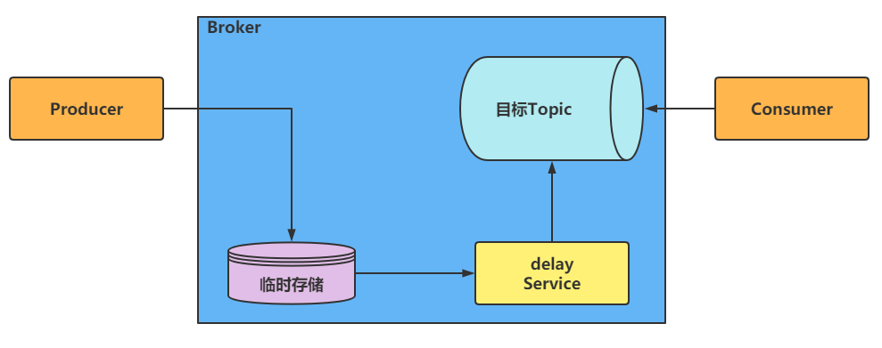

**步骤说明如下∶**

1. producer要将一个延迟消息发送到某个Topic中;

2. Broker判断这是一个延迟消息后，将其通过临时存储进行暂存;

3. Broker内部通过一个延迟服务（delay service）检查消息是否到期，将到期的消息投递到目标Topic中;

4. 消费者消费目标Topic中的延迟投递的消息。

临时存储和延迟服务都是在Broker内部实现，对业务透明。
`org.apache.rocketmq.store.CommitLog#putMessage`

````java
if (msg.getDelayTimeLevel()> 0) {
    //超过2个小时，设置为 2个小时
    if(msg.getDelayTimeLevel(>this.defaultMessageStore.getScheduleMessageService().getMaxDelayLevel)){
        msg.setDelayTimeLevel(this.defaultMessageStore.getScheduleMessageService(0.getMaxDelayLevel));
    }
    // opic 名字设置为∶ SCHEDULE TOPIC XXXX
    topic = TopicValidator.RMQ_SYS_SCHEDULE_TOPIC;
    // 根据 level 选择 Queue
    queueId = ScheduleMessageService.delayLevel2QueueId(msg.getDelayTimeLevel());
    // Backup real topic， queueld 记录原始的 topic和 Queue
    MessageAccessor.putProperty(msg, MessageConst.PROPERTY_REAL_TOPIC,msg.getTopic()); 
    MessageAccessor.putProperty(msg, MessageConst.PROPERTY_REAL_QUEUE_ID, String.valueOf(msg.getQueueld)));
    msg.setPropertiesString(MessageDecoder.messageProperties2String(msg.getProperties()));
    // 更新 topic 和 queue 
    msg.setTopic(topic); 
    msg.setQueueld(queueId);
}
````

当然在这个地方，消息实际是存储在commitlog，异步写入consume queue。
然后有一个∶ `ScheduleMessageService#start`

```java
// 每个延迟级别都创建一个任务
for (Map.Entry<Integer,Long> entry:this.delayLevelTable.entrySet()){
    Integer level = entry.getKey();
    // 获得每个级别的延迟时间 
    Long timeDelay = entry.getValue(); 
    Long offset = this.offsetTable.get(level); 
    if null = offset) { 
        offse = OL;
    }
    
    if (timeDelay != null) {
        // 创建 TimerTask
        this.timer.schedule(new DeliverDelayedMessageTimerTask(level,offset), FIRST DELAY TIME);
    }

```

时间到期后∶ `DeliverDelayedMessageTimerTask#messageTimeup`（内部类）其中有几行关键代码∶

```java
// 获取索引 
ConsumeQueue cq = ScheduleMessageService.this.defaultMessageStore findConsumeQueue(TopicValidator.RMQ SYS SCHEDU LE_TOPIC,
                                                                                   delayLevel2QueueId(delayLevel));
// 读取消息
MessageExt msgExt = ScheduleMessageService.this.defaultMessageStore.lookMessageByOffset offsePy, sizePy);
// 获取原 topic 名称等
MessageExtBrokerInner msgInner= this.messageTimeup(msgExt);
//重新将消息持久化到 commitlog 中 
PutMessageResult putMessageResult = ScheduleMessageService.this.writeMessageStore .putMessage(msgInner);
```

最后一步，由于消息已经重新存储到 commitlog 并且异步写入 consume queue，所以消费者可以正常消费了。

事实上，RocketMQ的消息重试也是基于延迟消息来完成的。在消息消费失败的情况下，将其重新当做延迟消息投递回 Broker。

### 5.2 Broker

#### 5.2.1 消息存储设计理念

RocketMQ的消息存储与Kafka 有所不同。既没有分区的概念，也没有按分区存储消息。

RocketMQ 官方对这种设计进行了解释∶

http://rocketmq.apache.org/rocketmq/how-to-support-more-queues-in-rocketmq/

1. 每个分区存储整个消息数据，尽管每个分区都是有序写入磁盘的，但随着并发写入分区的数量增加，从操作系统的角度来看，写入变成了随机的。

2. 由于数据文件分散，很难使用 Linux IO Group Commit机制（指的是一次把多个数据文件刷入磁盘。例如∶ 批量发送 3 条数据，分散在 3个文件里面，做不到—次刷盘）。


所以 RocketMQ干脆另辟蹊径，设计了一种新的文件存储方式，就是所有的Topic的所有的消息全部写在同一个文件中（这种存储方式叫集中型存储或者混合型存储），这样就能够保证绝对的顺序写。

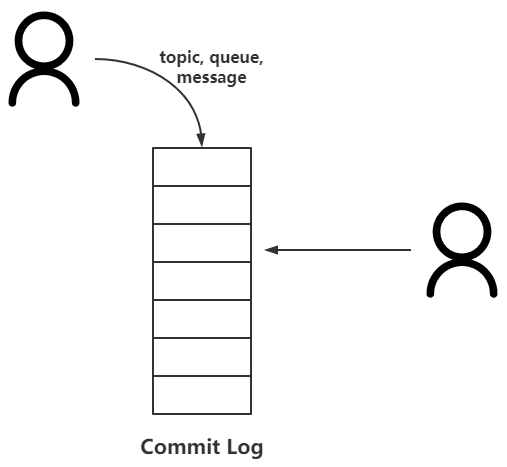

**这样做的优势∶**

- 队列轻量化，单个队列数据量非常少。

- 对磁盘的访问串行化，完全顺序写，避免磁盘竞争，不会因为队列增加导致 IOWAIT增高。

当然消费的时候就有点复杂了。

在kafka中是一个topic下面的partition有独立的文件，只要在一个topic里面找消息就OK了，kafka把这个consumer group跟topic的offset 的关系保存在一个特殊的 topic 中。

现在变成了∶要到一个统一的巨大的commitLog中去找消息，需要遍历全部的消息，效率太低了。

怎么办呢?

如果想要每个 consumer group 只查找自己的topic的offset信息，可以为每一个consumer group把他们消费的topic的最后消费到的offset单独存储在一个地方。

这个存储消息的偏移量的对象就叫做 consume queue。

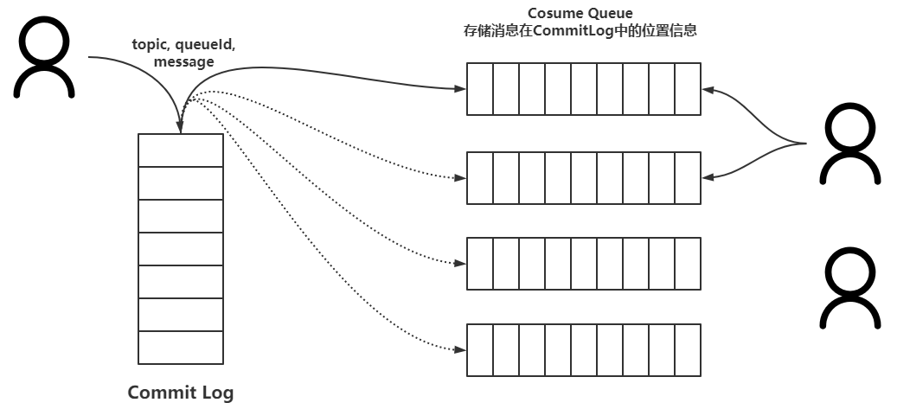

也就是说，消息在 Broker存储的时候，不仅写入commit log，同时也把在commit log中的最新的offset（异步）写入对应的 consume queue。

消费者在消费消息的时候，先从consume queue 读取持久化消息的起始物理位置偏移量offset、大小size和消息Tag的HashCode值，随后再从commit log 中进行读取待拉取消费消息的真正实体内容部分。

consume queue可以理解为消息的索引，它里面没有存消息。

> 总结∶
>
> 1. 写虽然完全是顺序写，但是读却变成了完全的随机读（对于commit log）。
> 2. 读一条消息，会先读 consume queue，再读 commit log，增加了开销

#### 5.2.2 物理存储文件分析

源码方式安装，默认的存储路径在/root/store。存储路径也可以自定义，例如∶

```
/usr/local/soft/rocketmq/store/broker-a

checkpoint 
commitlog 
config 
consumequeue 
index 
lock
```

| 文件名       | 描述                                                         |
| ------------ | ------------------------------------------------------------ |
| checkpoint   | 文件检查点，存储 commitlog 、consumequeue、indexfile 最后一次刷盘时间或时间戳 |
| index        | 消息索引文件存储目录                                         |
| consumequeue | 消息消费队列存储目录                                         |
| commitlog    | 消息存储目录                                                 |
| config       | 运行时的配置信息，包含主题消息过滤信息、集群消费模式消息消费进度、延迟消息队列拉取进度、消息消费组配置信息、 topic 配置属性等 |

1. commit log

   commit log，一个文件集合，每个默认文件1G大小。当第一个文件写满了，第二个文件会以初始偏移量命名。比如起始偏移量 1080802673，第二个文件名为 00000000001080802673，以此类推。

   跟kafka 一样，commit log 的内容是在消费之后是不会删除的。有什么好处? 

   - 可以被多个 consumer group 重复消费。只要修改 consumer group，就可以从头开始消费，每个consumer group维护自己的offset。
   - 支持消息回溯，随时可以搜索。
   
2. consume queue
   
   consume queue∶ 一个Topic可以有多个，每一个文件代表一个逻辑队列，这里存放消息在commit log的偏移值以及大小和Tag属性。
   
   从实际物理存储来说，consume queue 对应每个Topic和Queueld下面的文件，单个文件由 30W条数据组成，大小600万个字节（约 5.72M）。
   
   当一个ConsumeQueue类型的文件写满了，则写入下一个文件。
   
3. index file

   前面我们在使用API方法的时候，看到Message有一个keys参数，它是用来检索消息的。所以，如果出现了keys，服务端就会创建索引文件，以空格分割的每个关键字都会产生一个索引。

   单个IndexFile 可以保存 2000W个索引，文件固定大小约为 400M。

   > 索引的目的是根据关键字快速定位消息。根据关键字定位消息? 那这样的索引用什么样的数据结构合适?
   >
   > HashMap，没错，RocketMQ的索引是一种哈希索引。由于是哈希索引，key尽量设置为唯一不重复。

#### 5.2.3 RocketMQ存储关键技术（持久化 / 刷盘）

> RocketMQ消息存储在磁盘上，但是还是能做到这么低的延迟和这么高的吞吐，到底是怎么实现的呢?

首先要介绍 Page Cache 的概念。

CPU 如果要读取或者操作磁盘上的数据，必须要把磁岛的数据加载至到内存，这个是由硬件结构和访问速度的差异决定的。

这个加载的大小有一个固定的单位，叫做Page。x86 的linux中一个标准页面大小是4KB。

如果要提升磁盘访问速度，或者说尽量减少磁盘 I/O，可以把访问过的Page在内存中缓存起来。这个内存的区域就叫做 Page Cache。

下次处理 I/O请求的时候，先到 Page Cache 查找，找到了就直接操作。没找到就到磁盘查找。

Page Cache本身也会对数据文件进行预读取，对于每个文件的第一个读请求操作，系统在读入所请求页面的同时会读入紧随其后的少数几个页面。

但这里还是有一个问题。我们知道，虚拟内存分为内核空间和用户空间。Page Cache属于内核空间，用户空间访问不了，因此读取数据还需要从内核空间拷贝到用户空间缓冲区。

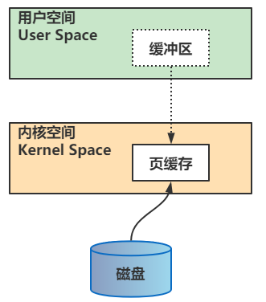

> 可以看到数据需要从Page Cache 再经过一次拷贝程序才能访问得到。这个copy的过程会降低数据访问的速度。有什么办法可以避免从内核空间到用户空间的copy 呢?
>
> 这里用到了一种零拷贝的技术。
>
> 干脆把Page Cache的数据在用户空间中做一个地址映射，这样用户进程就可以通过指针操作直接读写 Page Cache，不再需要系统调用(例如 read())和内存拷贝。

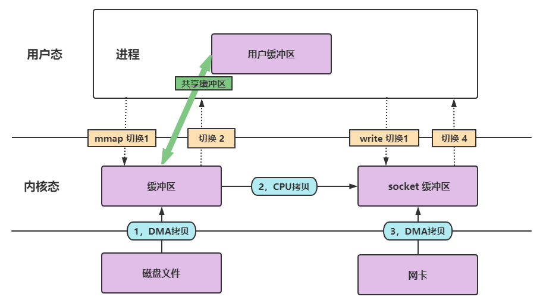

RocketMQ中具体的实现是使用mmap（memory map，内存映射），不论是CommitLog还是CosumerQueue都采用了mmap。Kafka用的是sendfile。

#### 5.2.4 文件清理策略

跟kafka 一样，RocketMQ中被消费过的消息是不会删除的，所以保证了文件的顺序写入。如果不清理文件的话，文件数量不断地增加，最终会导致磁盘可用空间越来越少。

> 哪些文件需要清理?

主要清除CommitLog、ConsumeQueue的过期文件。

```java
private void cleanFilesPeriodically {
    this.cleanCommitLogServicerun(); 
    this.cleanConsumeQueueServicerun();
}
```

其次，什么情况下这些文件变成过期文件?默认是超过72 个小时的文件。

```java
// MessageStoreConfig.java
// The number ofhours to keep alog file before deleting it(in hours)
    private int fileReservedTime = 72;
```

再者，过期的文件什么时候删除呢?有两种情况∶

- 第一种情况∶通过定时任务，每天凌晨4点，删除这些过期的文件。

  ```java
  // MessageStoreConfig.java
  // When to delete,default is at 4 am 
  private String deleteWhen="04"
  ```

- 第二种情况∶磁盘使用空间超过了75%，开始删除过期文件。

  ```java
  private int diskMaxUsedSpaceRatio=75
  ```

  1. 如果磁盘空间使用率超过85%，会开始批量清理文件，不管有没有过期，直到空间充足。

  2. 如果磁盘空间使用率超过90%，会拒绝消息写入。

  在`DefaultMessageStore`类中能找到这两个默认值的定义∶

  ```java
  System.getProperty("rocketmg.broker.diskSpaceWarningLevelRatio","0.90"); 
  System.getProperty("rocketmq.broker.diskSpaceCleanForciblyRatio","0.85");
  ```

### 5.2 消费者

> 思考：
>
> - 在集群消费模式下，如果我们要提高消费者的负载能力，必然要增加消费者的数量。消费者的数量增加了，怎么做到尽量平均的消费消息呢? 
> - 队列怎么分配给相应的消费者?
> - 队列的数量是固定的。比如有 4个队列，假设有3个消费者，或者5个消费者，这个时候队列应该怎么分配?
> - 消费者挂了，消费者增加了，队列又怎么分配?

#### 5.2.1 消费端的负载均衡与rebalance

消费者增加的时候肯定会引起rebalance，所以先从消费者启动的代码入手，这里面有几行关键的代码:

```java
public class DefaultMQPushConsumerlmpl implements MQConsumerInner {
    private MQClientInstance mQClientFactory;
    //启动 Consumer 的入口函数
    public synchronized void start() throws MQClientException {
        this.mQClientFactory = MQClientManager.getInstance().getOrCreateMOClientInstance(
            this.defaultMQPushConsumer, this.rpcHook);
        //调用 MQClientInstance 的 start 方法 
        mQClientFactory.start();
    }
}
```

`start`里面就调用了`rebalanceService`

```java
public class MQClientInstance {
    private final RebalanceService rebalanceService
        public void start() throws MQClientException {
        synchronized (this) {
            // 调用 RebalanceService 的 start 方法 
            this.rebalanceService.start();
        }
    }
}
```

这里实际上是调用了`RebalanceService`的`run`方法∶

```java
while(!this.isStopped()){ 
    this.waitForRunning(waitnterval); 
    this.mqClientFactory.doRebalance();
}
```

也就是说，消费者启动的时候，或者有消费者挂掉的时候，默认最多 20 秒，就会做一次 rebalance，让所有的消费者可以尽量均匀地消费队列的消息。

> 但是 20 秒钟是不是太长了?

在`DefaultMQPushConsumerlmpl`的start方法末尾还有一句∶

```java
this.mQClientFactory.rebalanceImmediately);
```

会唤醒沉睡的线程，也就是立即执行`RebalanceService`的`run`方法

```java
public void rebalanceImmediately({
    this rebalanceServicewakeup();
}
```

> 具体到底怎么rebalance的呢?
>
>  一直往后面跟（case CLUSTERING，277行）

```java
llocateMessageQueueStrategy strategy=this.allocateMessageQueueStrategy;
List<MessageQueue> allocateResult = null;
try {
    allocateResult=strategy.allocate(
        this.consumerGroup,
        this.mQClientFactory.getClientld(), 
        mqAll, 
        cdAll);
}
```

AllocateMessageQueueStrategy有6种实现的策略，可以指定，也可以自定义实现∶

```java
consumer.setAllocateMessageQueueStrategy()
```

- AllocateMessageQueueAveragely∶连续分配（默认）

  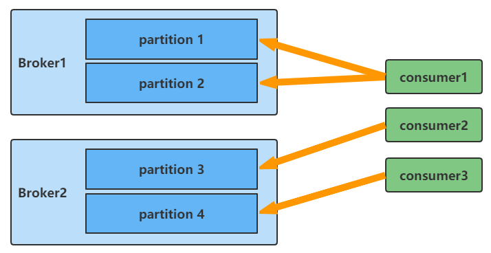

- AllocateMessageQueueAveragelyByCircle∶每人轮流一个

  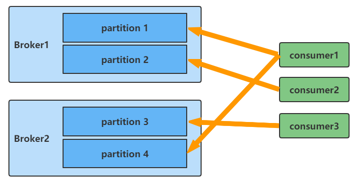

- AllocateMessageQueueByConfig∶通过配置

- AllocateMessageQueueConsistentHash∶一致性哈希

- AllocateMessageQueueByMachineRoom∶指定一个broker的topic中的 queue消费

- AllocateMachineRoomNearby∶ 按Broker的机房就近分配队列的数量尽量要大于消费者的数量。

#### 5.2.2 消费端重试与死信队列

先看一个业务流程中RocketMQ的使用场景。

> 订单系统是消息的生产者，物流系统是消息的消费者。
>
> 物流系统收到消费消息后需要登记数据库，生成物流记录。

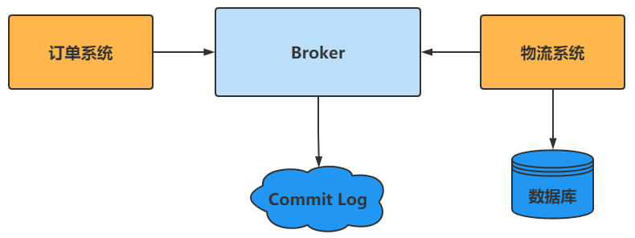

然后反馈给Broker，通知消费成功，更新offset。消费者的代码是这样写的∶

```java
consumer.registerMessageListener(new MessageListenerConcurrently() {
    public ConsumeConcurrentlyStatus consumeMessage(List<MessageExt> msgs,
                                                    ConsumeConcurrentlyContext context) {
        System.out.printf("%s Receive New Messages:%s %n", Thread.currentThread().getName(), msgs); 
        for(MessageExt msg: msgs) {
            String topic = msg.getTopic(); 
            String messageBody = ""; 
            try {
                messageBody = new String(msg.getBody(,"utf-8"));
            } catch (UnsupportedEncodingException e) {
                e.printStackTrace();// 重新消费
                return ConsumeConcurrentlyStatus.RECONSUME LATER;
                String tags = msg.getTags();
                System.out.println("topic:"+topic+",tags:"+tags+",msg:"+messageBody);
            }
            // 消费成功
            return ConsumeConcurrentlyStatus.CONSUME SUCCESS;
        }
    }
});
```

如果物流系统处理消息的过程发生异常，比如数据库不可用，或者网络出现问题，这时候返回给Broker的是`RECONSUME_LATER`，表示稍后重试。

这个时候消息会发回给Broker，进入到RocketMQ的重试队列中。

服务端会为consumer group创建一个名字为`%RETRY%`开头的重试队列，dashboard页面可也查看到。

```tex
%RETRY%qs-consumer-group
```

重试队列的消息过一段时间会再次发送给消费者，如果还是异常，会再次进入重试队列。

重试的时间间隔会不断衰减，从10 秒开始直到 2 个小时∶ 10s 30s 1m 2m 3m 4m5m 6m 7m 8m 9m 10m 20m 30m 1h 2h，最多重试 16次。

这个时间间隔似乎之前见过?没错，这个就是延迟消息的时间等级，从 Level=3 开始。 

也就是说重试队列是用延迟队列的功能实现的 ， 发到对应的`SCHEDULE_TOPIC_XXXX`，到时间后再替换成真实的Topic，实现重试。

> 重试消费 16 次都没有成功怎么处理呢?
>
> 这个时候消息就会丢到死信队列了。
>
> Broker会创建一个死信队列 ，死信队列的名字是`%DLQ%`+`ConsumerGroupName`。

```java
    private boolean handleRetryAndDLQ(SendMessageRequestHeader requestHeader,
                                      RemotingCommand response,
                                      RemotingCommand request,
                                      MessageExt msg,
                                      TopicConfig topicConfig) {
        // 获取 topic 进行判断逻辑
        String newTopic = requestHeader.getTopic();
        //重试队列是以%RETRY%+consumerGroup 作为维度的
        if (null != newTopic && newTopic.startsWith(MixAll.RETRY GROUP_TOPIC_PREFIX)) {
            String groupName = newTopic.substring(MixAll.RETRY_GROUP_TOPIC_PREFIX.length));
            SubscriptionGroupConfig subscriptionGroupConfig =
                    this.brokerController.getSubscriptionGroupManager).findSubscriptionGroupConfig(groupName);
            if (null == subscriptionGroupConfig) {
                response.setCode(ResponseCode.SUBSCRIPTION GROUP NOT EXIST));
                response.setRemark("subscription group not exist, " +
                        groupName +
                        "" +
                        FAQUrlsuggestTodo(FAQUrl.SUBSCRIPTION_GROUP_NOT_EXIST));
                return false;
            }

            // 获取最大重试次数
            int maxReconsumeTimes = subscriptionGroupConfig.getRetryMaxTimes();
            if (request.getVersion() >= MQVersion.Version.V3_4_9.ordinal)){
                maxReconsumeTimes = requestHeader.getMaxReconsumeTimes();
            }
            int reconsumeTimes = requestHeader.getReconsumeTimes() == null ? 0 : requestHeader.getReconsumeTimes();
            //超过最大重试次数之后发送到死信队列 
            if (reconsumeTimes >= maxReconsumeTimes) {
                // 死信队列是以%DLQ%+consumerGroup 作为维度的 
                newTopic = MixAll.getDLQTopic(groupName);
                int queueIdInt = Math.abs(this.random.nextInt() % 99999999) % DLQ_NUMS_PER GROUP;
                topicConfig = this.brokerController.getTopicConfigManager()
                        .createTopicInSendMessageBackMethod(newTopic,
                                DLQ_NUMS_PER_ GROUP,
                                PermName.PERM_WRITE,
                                0
                        );
                msg.setTopic(newTopic);
                msg.setQueueId(queueIdInt);
                if (null == topicConfig) {
                    response.setCode(ResponseCode.SYSTEM_ERROR);
                    response.setRemark("topic[" + newTopic + "] not exist");
                    return false;
                }
            }
        }
        int sysFlag = requestHeader.getSysFlag();
        if (TopicFilterType.MULTI_TAG = topicConfig.getTopicFilterType() {
            sysFlag |= MessageSysFlag.MULTI TAGS FLAG;
        }

        msg.seSysFlag(sysFlag);
        return true;
    }
```

死信队列的消息最后需要人工处理，可以写一个线程，订阅`%DLQ%`  + ConsumerGroupName，消费消息。

## 6 高可用架构

在RocketMQ的高可用架构中，我们主要关注两块∶主从同步和故障转移。


### 6.1 主从同步的意义

1. 数据备份∶ 保证了两/多台机器上的数据冗余，特别是在主从同步复制的情况下，一定程度上保证了 master 出现不可恢复的故障以后，数据不丢失。
2. 高可用性∶ 即使 master 掉线， consumer 会自动重连到对应的 slave 机器，不会出现消费停滞的情况。
3. 提高性能∶主要表现为可分担 master 读的压力，当从 master 拉取消息，拉取消息的最大物理偏移与本地存储的最大物理偏移的差值超过一定值，会转向slave（默认brokerld=1）进行读取，减轻了master 压力。
4. 消费实时∶ master 节点挂掉之后，依然可以从 slave 节点读取消息，而且会选择一个副本作为新的 master，保证正常消费。

### 6.2 数据同步

#### 6.2.1 主从关联

1. 集群的名字相同，brokerClusterName=XXX-cluster。
2. 连接到相同的NameServer。
3. 在配置文件中∶ brokerld=0代表是 master，brokerld =1代表是slave。

#### 6.2.2 主从同步和刷盘类型

在部署节点的时候，配置文件中设置了Broker 角色和刷盘方式∶

|             属性              |      值      |                      | 含义                                                         |
| :---------------------------: | :----------: | :------------------: | :----------------------------------------------------------- |
| brokerRole <br />Broker的角色 | ASYNC_MASTER |     主从异步复制     | master 写成功，返回客户端成功。<br />拥有较低的延迟和较高的吞吐量，但是当 master 出现故障后，有可能造成数据丢失。 |
|                               |  SYNCMASTER  | 主从同步双写（推荐） | master 和slave 均写成功，才返回客户端成功。<br />maste挂了以后可以保证数据不丢失，但是同步复制会增加数据写入延迟，降低吞吐量。 |
| flushDiskType<br />//刷盘方式 | ASYNC_FLUSH  |  异步刷盘（默
认）   | 生产者发送的每一条消息并不是立即保存到磁盘，而是暂时缓存起来，然后就返回生产者成功。<br />随后再异步的将缓存数据保存到磁盘，有两种情况∶<br />1是定期将缓存中更新的数据进行刷盘，<br />2 是当缓存中更新的数据条数达到某一设定值后进行刷盘。这种方式会存在消息丢失 （在还未来得及同步到磁盘的时候宕机）， 但是性能很好。默认是这种模式。 |
|                               |  SYNC_FLUSH  |       同步刷盘       | 生产者发送的每一条消息都在保存到磁盘成功后才返回告诉生产者成功。<br />这种方式不会存在消息丢失的问题，但是有很大的磁盘 IO 开销，性能有一定影响。 |


通常情况下，会把 Master和 Slave 的 Broker均配置成 ASYNC FLUSH 异步刷盘方式，主从之间配置成 SYNC MASTER 同步复制方式，即∶ 异步刷盘+同步复制。

#### 6.2.3 主从同步流程

1. 从服务器主动建立TCP连接主服务器，然后每隔5s向主服务器发送
commitLog 文件最大偏移量拉取还未同步的消息;
2. 主服务器开启监听端口，监听从服务器发送过来的信息，主服务器收到从服务器发过来的偏移量进行解析，并返回查找出未同步的消息给从服务器;
3. 客户端收到主服务器的消息后，将这批消息写入 commitLog 文件中，然后更新 commitLog 拉取偏移量，接着继续向主服务拉取未同步的消息。

### 6.3 HA与故障转移

https://github.com/apache/rocketmq/blob/master/docs/cn/dledger/quick_start.md

在之前的版本中，RocketMQ只有master/slave 一种部署方式，一组Broker中有一个master，有零到多个slave，slave通过同步复制或异步复制方式去同步master的数据。

master/slave部署模式，提供了一定的高可用性，但这样的部署模式有一定缺陷。

比如故障转移方面，如果主节点挂了还需要人为手动的进行重启或者切换，无法自动将一个从节点转换为主节点。

如果要实现自动故障转移，根本上要解决的问题是自动选主的问题。

比如 Kafka 用 Zookeeper选Controller，用类PacificA算法选leader、Redis哨兵用Raft协议选Leader。

用 ZK 的这种方式需要依赖额外的组件，部署和运维的负担都会增加，而且ZK故障的时候会影响 RocketMQ集群。

RocketMQ 2019年3月发布的4.5.0版本中，利用Dledger技术解决了自动选主的问题。

DLedger就是一个基于raft协议的commitlog存储库，也是RocketMQ实现新的高可用多副本架构的关键。

它的优点是不需要引入外部组件，自动选主逻辑集成到各个节点的进程中，节点之间通过通信就可以完成选主。

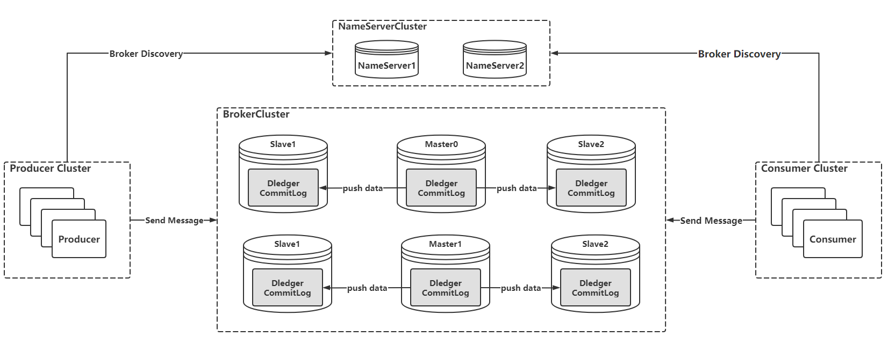

在这种情况下，commitlog是Dledger管理的，具有选主的功能。


> 怎么开启 Dledger 的功能?
>
> enableDLegerCommitLog是否启用Dledger，即是否启用RocketMQ主从切换，默认值为false。
>
> 如果需要开启主从切换，则该值需要设置为true。


需要添加以下配置∶

```properties
#是否启用 DLedger 
enableDLegerCommitLog=true
# DLedger Raft Group的名字 
dLegerGroup=broker-a
#DLedger Group 内各节点的地址和端口，至少需要 3 个节点
dLegerPeers=n0-192.168.44.163:10911;nl-192.168.44.164:1091l;n2-192.168.44.165:1091
#本节点ID 
dLegerSelfid=n0
```

## 7 RocketMQ 特性

现在市面上有这么多流行的消息中间件，RocketMQ 又有什么不同之处?

一般我们会从使用、功能、性能、可用性和可靠性四个方面来衡量。其中有一些是基础特性，这里重点说一下 RocketMQ 比较突出的∶

1. 单机可以支撑上万个队列的管理——可以满足众多项目创建大量队列的需求;
2. 上亿级消息堆积能力——在存储海量消息的情况下，不影响收发性能;
3. 具有多副本容错机制————消息可靠性高，数据安全;
4. 可以快速扩容缩容，有状态管理服务器——那就意味着具备了横向扩展的能力;
5. 可严格保证消息的有序性——满足特定业务场景需求;
6. Consumer 支持 Push和 Pull 两种消费模式——更灵活(主要是 Pull);
7. 支持集群消费和广播消息——适合不同业务场景;
8. 低延迟∶客户端消息延迟控制在毫秒级别(从双十—的复盘情况来看延迟在1ms以内的消息比例99.6%; 延迟在 10ms 以内的消息占据99.996%)——效率高。

## 8 MQ选型分析

參考

## 9 MQ设计思路

參考
