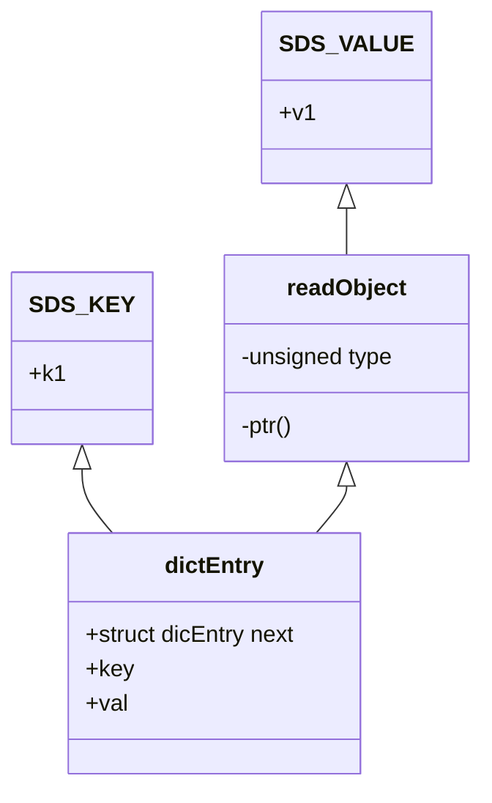
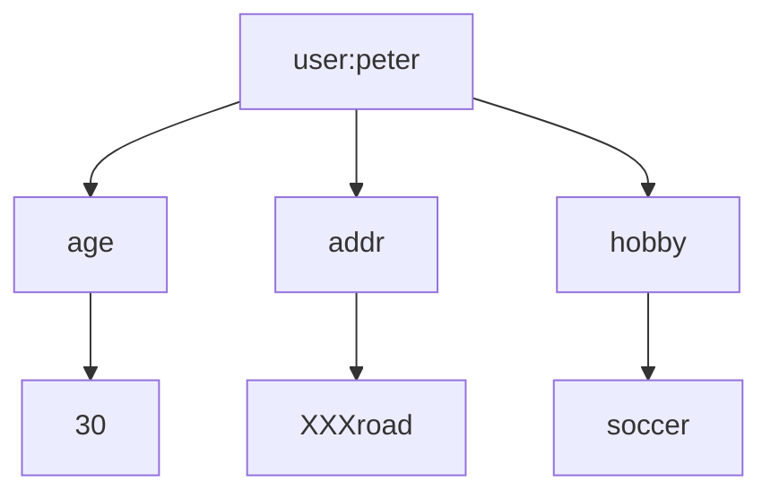

# 1. Redis基本数据类型

## 1.1 String字符串

### 存储类型

可以用来存储INT(整数)、float(单精度浮点数)、String(字符串)。

### 操作命令

```properties
# 获取指定范围的字符 
getrange test 0 l
# 获取值长度 
strlen test
# 字符串追加内容 
append test good
# 设置多个值（批量操作，原子性） 
mset test1 2673 test2 666
# 获取多个值
mget test2 test1
# 设置值，如果 key 存在，则不成功 
setnx lock 1
# 基于此可实现分布式锁。用 del key 释放锁。
# 但如果释放锁的操作失败了，导致其他节点永远获取不到锁，怎么办?
# 加过期时间。单独用 expire 加过期，也失败了，无法保证原子性，怎么办?多参数 
set key value [expiration EX seconds PX milliseconds][NX|XX]
# 使用参数的方式 
set kl v1 EX 10 NX
#（整数）值递增（值不存在会得到 1） 
incr test 
incrby test 100
# （整数）值递减
decr test1
decrby test1 100
# 浮点数增量 
set mf 2.6
incrbyfloat mf7.3
```

### 存储（实现）原理

#### 数据模型

Redis的最外层确实是通过hashtable实现的(外层的哈希)，在Redis里面，这个哈希表怎么实现呢?

我们看一下C语言的源码，每个键值对都是一个dictEntry，通过指针指向key的存储结构和value的存储结构，而且next存储了指向下一个键值对的指针。

```c
typedef struct dictEntry {
    void *key; /*key关键字定义*/ 
    union {
        void *val; /*value定义 */ 
        uint64_t u64; 
        int64_t s64; 
        double d;
    } v;
    struct dictEntry *next; /*指向下一个键值对节点*/
} dictEntry;
```

实际上最外层是redisDb，redisDb里面放的是dict

```c
typedef struct redisDb {
    dict *dict;                   /* 所有的键值对 *//*The keyspace for this DB*/
    dict *expires;                /* 设置了过期时间的键值对 *//*Timeout of keys with a timeout set*/
    dict *blocking_keys;          /* Keys with clients waiting for data (BLPOP)*/
    dict *ready_keys;             /* Blocked keys that received a PUSH */
    dict *watched_keys;           /* WATCHED keys for MULTI/EXEC CAS */
    int id;                       /* Database ID */
    long long avg_ttl;            /* Average TTL,just for stats */
    unsigned long expires_cursor; /* Cursor of the active expire cycle.*/ 
    list *defrag_later;           /* List of key names to attempt to defrag one by one,gradually.*/
} redisDb;
```

以`set k1 v1`为例，因为key是字符串，Redis自己实现了一个字符串类型叫做SDS，所以`v1`指向一个SDS的结构。



当value存储一个字符串的时候，Redis并没有直接使用SDS存储，而是存储在redisObject中。

实际上五种常用的数据类型的任何一种的value，都是通过redisObject来存储的，最终redisObject再通过一个指针指向实际的数据结构。

#### redisObject

```c
typedef struct redisObject {
    unsigned type∶4;       /* 对象的类型，包括∶ OBJ STRING、OBJ LIST、OBJHASH、OBJ SET、OBJ ZSET*/
    unsigned encoding∶4;   /* 具体的数据结构 */
    unsigned Iru∶LRU BITS; /* 24 位，对象最后一次被命令程序访问的时间，与内存回收有关 */
    int refcount;           /* 引用计数。当 refcount 为 0 的时候，表示该对象已经不被任何对象引用，则可以进行垃圾回收了 */
    void *ptr;              /* 指向对象实际的数据结构 */
} robj;
```

- 用`Type`命令就能查看存储的类型

  - OBJ STRING
  - OBJ LIST
  - OBJHASH
  - OBJ SET
  - OBJ ZSET

- `String`命令可以出现三种不同的编码

  1. `int`: 存储8个字节的长整型(long，2^63-1)。
  
  2. `embstr`: 代表embstr格式的SDS，存储小于44个字节的字符串。
  
     > `embstr`只分配一次内存空间(因为RedisObject和SDS是连续的)
  
  3. `raw`: 存储大于44个字节的字符串。
  
     > `raw`需要分配两次内存空间(分别为 RedisObject 和 SDS 分配空间)

> - `embstr`与`raw`相比，`embstr`的好处在于创建时少分配一次空间，删除时少释放一次空间，以及对象的所有数据连在一起，寻找方便。
> - `embstr`的缺点是，字符串的长度增加需要重新分配RedisObject和SDS空间，因此`Redis`中的`embstr`实现为只读(这种编码的内容是不能修改的)。

**Int和embstr什么时候转化为raw?** 

1. `int`数据不再是整数 ---> `raw`
2. `int`大小超过了long的范围(2^63-1) ---> `embstr`
3. `embstr`长度超过了44个字节 ---> `raw`
4. `embstr`内容只要修改 ---> `raw`

> 关于Redis内部编码的转换，都符合以下规律∶ 
>
> - 编码转换在Redis写入数据时完成，
> - 转换过程不可逆，只能从小内存编码向大内存编码转换(但是不包括重新set)。

#### SDS

本质上其实还是字符数组，SDS又有多种结构∶

- `sdshdr5`
- `sdshdr8`
- `sdshdr16`
- `sdshdr32`
- `sdshdr64`

用于存储不同的长度的字符串，分别代表`2^5=32byte`，`2^8=256byte`，`2^16=65536byte=64KB`,`2^32byte=4GB`

**特点**∶

1. 不用担心内存溢出问题，如果需要会对SDS进行扩容。
2. 获取字符串长度时间复杂度为O(1)，因为定义了len属性。
3. 通过"空间预分配"(sdsMakeRoomFor)和"惰性空间释放"，防止多次重分配内存。
4. 判断是否结束的标志是len属性，可以包含"\0'(它同样以\0'结尾是因为这样就可以使用 C 语言中函数库操作字符串的函数了)。

**Redis要用SDS实现字符串而使用C语言的字符串数组char[]：**

1. 使用字符数组必须先给目标变量分配足够的空间，否则可能会溢出。
2. 如果要获取字符长度，必须遍历字符数组，时间复杂度是O(n)。
3. C字符串长度的变更会对字符数组做内存重分配。
4. 通过从字符串开始到结尾碰到的第一个\0'来标记字符串的结束，因此不能保存图片、音频、视频、压缩文件等二进制(bytes)保存的内容，二进制不安全。

| C字符数组                                    | SDS                                          |
| -------------------------------------------- | -------------------------------------------- |
| 获取字符串长度的复杂度为O(Ｎ)                | 获取字符串长度的复杂度为O(1)                 |
| API是不安全的，可能会造成缓冲区溢出          | API是安全的，不会造成缓冲区溢出              |
| 修改字符串长度Ｎ次必然需要执行Ｎ次内存重分配 | 修改字符串长度Ｎ次最多需要执行Ｎ次内存重分配 |
| 只能保存文本数据                             | 可以保存文本或者二进制数据                   |
| 可以使用所有<string.h>库中的函数             | 可以使用一部分<string.h>库中的函数           |

### 应用场景

1. 缓存

   String类型 set方法

   缓存热点数据。例如网站首页、报表数据等等，可以显著提升热点数据的访问速度。

2. 分布式数据共享

   String类型 set方法

   Redis是分布式的独立服务，可以在多个应用之间共享。  例如∶ 分布式 Session (spring-session-data-redis)

3. 分布式锁

   String类型，setnx方法

   只有不存在时才能添加成功，返回true。

4. 全局ID

   Int类型，incrby，利用原子性。

   分库分表的场景，一次性取得一段唯一ID

5. 计数器

   Int类型，incr方法

   例如：文章阅读量，点赞，写入Redis在定期同步到数据库。

6. 限流

   Int类型，incr方法

   以访问者的IP和其他信息作为key，访问一次增加一次计数，超过次数则返回 false。

## 2 Hash 哈希

### 2.1 存储类型

Hash用来存储多个无序的键值对，最大存储数量 2^32-1(40 亿左右)。



> 注意∶ Hash的value只能是字符串，不能嵌套其他类型，比如hash或者list。

#### Hash与String的主要区别

1. 把所有相关的值聚集到一个key中，节省内存空间 

2. 只使用一个key，减少key 冲突

3. 当需要批量获取值的时候，只需要使用一个命令，减少内存/IO/CPU的消耗


#### Hash不适合的场景∶

1. Field不能单独设置过期时间
2. 需要考虑数据量分布的问题(field非常多的时候，无法分布到多个节点)

### 2.2 存储（实现）原理

哈希底层可以使用两种数据结构实现∶

- ziplist∶ OBJENCODING ZIPLIST（压缩列表） 
- hashtable∶ OBJENCODING HT（哈希表）

#### ziplist 压缩列表

ziplist是一个经过特殊编码的，由**连续内存块组成的双向链表**。

它不存储指向上一个链表节点和指向下一个链表节点的指针，而是存储上一个节点长度和当前节点长度。

这样读写可能会慢一些，因为要去算长度，但是可以节省内存是一种时间换空间的思想。

`ziplist`的内部结构

```xml
<zlbytes><zltail><zllen><entry><entry>...<entry><zlend>
```

**zlentry**

```c
typedef struct zlentry {
    unsigned int prevrawlensize;     /* 存储上一个链表节点的长度数值所需要的字节数 */ 
    unsigned int prevrawlen;         /* 上一个链表节点占用的长度 */
    unsigned int lensize;            /* 存储当前链表节点长度数值所需要的字节数 */ 
    unsigned int len;                /* 当前链表节点占用的长度 */
    unsigned int headersize;         /* 当前链表节点的头部大小（prevrawlensize+lensize），即非数据域的大小*/
    unsigned char encoding;          /* 编码方式 */ 
    unsigned char *p;                /* 压缩链表以字符串的形式保存，该指针指向当前节点起始位置 */
} zlentry;
```

**什么时候使用ziplist存储**

当hash对象同时满足以下两个条件的时候，使用ziplist编码∶

1. 哈希对象保存的键值对数量 < 512个。
2. 所有的键值对的健和值的字符串长度都 < 64byte(一个英文字母一个字节)。

src/redis.conf 配置

```properties
hash-max-ziplist-value 64      //ziplist 中最大能存放的值长度
hash-max-ziplist-entries 512   //ziplist 中最多能存放的entry 节点数量
```

> 如果超过这两个阈值的任何一个，存储结构就会转换成 hashtable。
>
> 总结∶字段个数少，字段值小，用ziplist

#### hashtable(dict)

在Redis中，hashtable被称为字典(dictionary)。

Redis的KV结构是通过一个dictEntry来实现的，在hashtable中，又对dictEntry进行了多层的封装。

**dictEntry**

```c
typedef struct dictEntry { 
    void *key;         /*key 关键字定义 */ 
    union {
        void *val;    uint64_t u64;  /* value 定义*/
        int64_t s64;  double d; 
    } V;
    struct dictEntry *next;/* 指向下一个键值对节点 */
} dicEntry;
```


