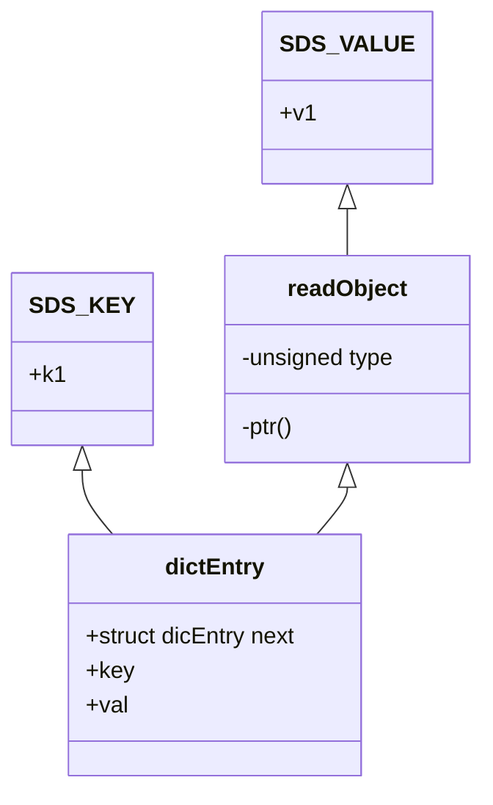

# 1. Redis基本数据类型

最基本也是最常用的数据类型就是 String，set和 get 命令就是 String 的操作命令。 

Redis 的字符串被叫做二进制安全的字符串，为什么是 Binary-safe strings 呢?

下面对于所有的数据类型我们都会从4个维度来分析∶存储类型、操作命令、存储结构、应用场景。

## 1.1 String字符串

### 存储类型

可以用来存储INT（整数）、float（单精度浮点数）、String （字符串）。

### 操作命令

```properties
# 获取指定范围的字符 
getrange test 0 l
# 获取值长度 
strlen test
# 字符串追加内容 
append test good
# 设置多个值（批量操作，原子性） 
mset test1 2673 test2 666
# 获取多个值
mget test2 test1
# 设置值，如果 key 存在，则不成功 
setnx lock 1
# 基于此可实现分布式锁。用 del key 释放锁。
# 但如果释放锁的操作失败了，导致其他节点永远获取不到锁，怎么办?
# 加过期时间。单独用 expire 加过期，也失败了，无法保证原子性，怎么办?多参数 
set key value [expiration EX seconds PX milliseconds][NX|XX]
# 使用参数的方式 
set kl v1 EX 10 NX
#（整数）值递增（值不存在会得到 1） 
incr test 
incrby test 100
# （整数）值递减
decr test1
decrby test1 100
# 浮点数增量 
set mf 2.6
incrbyfloat mf7.3
```

### 存储（实现）原理

#### 数据模型

Redis的最外层确实是通过hashtable实现的(外层的哈希)，在Redis里面，这个哈希表怎么实现呢?

我们看一下C语言的源码，每个键值对都是一个dictEntry，通过指针指向key的存储结构和value的存储结构，而且next存储了指向下一个键值对的指针。

```c
typedef struct dictEntry {
    void *key; /*key关键字定义*/ 
    union {
        void *val; /*value定义 */ 
        uint64_t u64; 
        int64_t s64; 
        double d;
    } v;
    struct dictEntry *next; /*指向下一个键值对节点*/
} dictEntry;
```

实际上最外层是redisDb，redisDb里面放的是dict

```c
typedef struct redisDb {
    dict *dict;                   /* 所有的键值对 *//*The keyspace for this DB*/
    dict *expires;                /* 设置了过期时间的键值对 *//*Timeout of keys with a timeout set*/
    dict *blocking_keys;          /* Keys with clients waiting for data (BLPOP)*/
    dict *ready_keys;             /* Blocked keys that received a PUSH */
    dict *watched_keys;           /* WATCHED keys for MULTI/EXEC CAS */
    int id;                       /* Database ID */
    long long avg_ttl;            /* Average TTL,just for stats */
    unsigned long expires_cursor; /* Cursor of the active expire cycle.*/ 
    list *defrag_later;           /* List of key names to attempt to defrag one by one,gradually.*/
} redisDb;
```

以`set k1 v1`为例，因为key是字符串，Redis自己实现了一个字符串类型叫做SDS，所以`v1`指向一个SDS的结构。



当value存储一个字符串的时候，Redis并没有直接使用SDS存储，而是存储在redisObject中。

实际上五种常用的数据类型的任何一种的value，都是通过redisObject来存储的，最终redisObject再通过一个指针指向实际的数据结构。

#### redisObject

```c
typedef struct redisObject {
    unsigned type∶4;       /* 对象的类型，包括∶ OBJ STRING、OBJ LIST、OBJHASH、OBJ SET、OBJ ZSET*/
    unsigned encoding∶4;   /* 具体的数据结构 */
    unsigned Iru∶LRU BITS; /* 24 位，对象最后一次被命令程序访问的时间，与内存回收有关 */
    int refcount;           /* 引用计数。当 refcount 为 0 的时候，表示该对象已经不被任何对象引用，则可以进行垃圾回收了 */
    void *ptr;              /* 指向对象实际的数据结构 */
} robj;
```

- 用`Type`命令就能查看存储的类型

  - OBJ STRING
  - OBJ LIST
  - OBJHASH
  - OBJ SET
  - OBJ ZSET

- `String`命令可以出现三种不同的编码
  1. `int`: 存储8个字节的长整型(long，2^63-1)。
  2. `embstr`: 代表embstr格式的SDS，存储小于44个字节的字符串。
  3. `raw`: 存储大于44个字节的字符串。

#### SDS

本质上其实还是字符数组，SDS又有多种结构∶

- `sdshdr5`
- `sdshdr8`
- `sdshdr16`
- `sdshdr32`
- `sdshdr64`

用于存储不同的长度的字符串，分别代表`2^5=32byte`，`2^8=256byte`，`2^16=65536byte=64KB`,`2^32byte=4GB`


