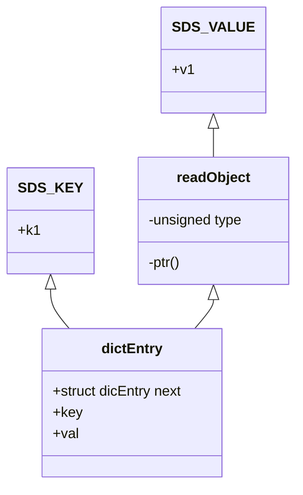
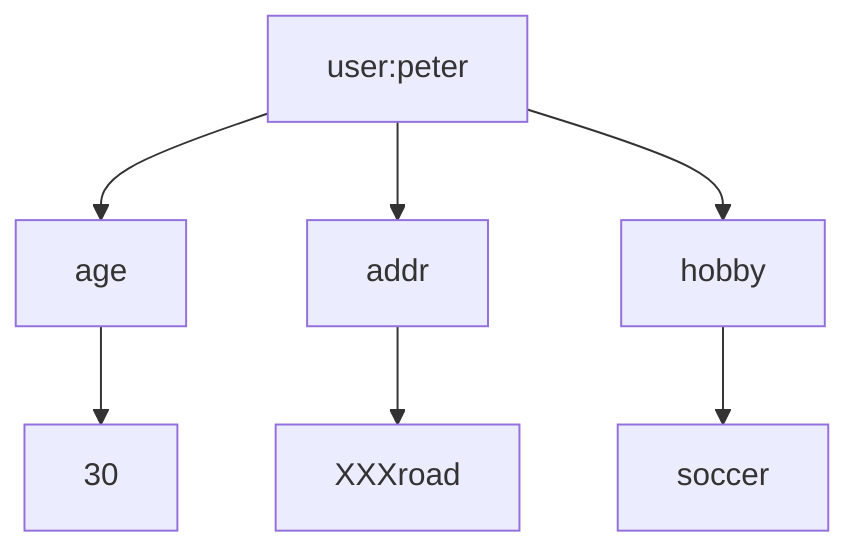

# 1. Redis基本数据类型

## 1.1 String字符串

### 存储类型

可以用来存储INT(整数)、float(单精度浮点数)、String(字符串)。

### 操作命令

```properties
# 获取指定范围的字符 
getrange test 0 l
# 获取值长度 
strlen test
# 字符串追加内容 
append test good
# 设置多个值（批量操作，原子性） 
mset test1 2673 test2 666
# 获取多个值
mget test2 test1
# 设置值，如果 key 存在，则不成功 
setnx lock 1
# 基于此可实现分布式锁。用 del key 释放锁。
# 但如果释放锁的操作失败了，导致其他节点永远获取不到锁，怎么办?
# 加过期时间。单独用 expire 加过期，也失败了，无法保证原子性，怎么办?多参数 
set key value [expiration EX seconds PX milliseconds][NX|XX]
# 使用参数的方式 
set kl v1 EX 10 NX
#（整数）值递增（值不存在会得到 1） 
incr test 
incrby test 100
# （整数）值递减
decr test1
decrby test1 100
# 浮点数增量 
set mf 2.6
incrbyfloat mf7.3
```

### 存储（实现）原理

#### 数据模型

Redis的最外层确实是通过hashtable实现的(外层的哈希)，在Redis里面，这个哈希表怎么实现呢?

我们看一下C语言的源码，每个键值对都是一个dictEntry，通过指针指向key的存储结构和value的存储结构，而且next存储了指向下一个键值对的指针。

```c
typedef struct dictEntry {
    void *key; /*key关键字定义*/ 
    union {
        void *val; /*value定义 */ 
        uint64_t u64; 
        int64_t s64; 
        double d;
    } v;
    struct dictEntry *next; /*指向下一个键值对节点*/
} dictEntry;
```

实际上最外层是redisDb，redisDb里面放的是dict

```c
typedef struct redisDb {
    dict *dict;                   /* 所有的键值对 *//*The keyspace for this DB*/
    dict *expires;                /* 设置了过期时间的键值对 *//*Timeout of keys with a timeout set*/
    dict *blocking_keys;          /* Keys with clients waiting for data (BLPOP)*/
    dict *ready_keys;             /* Blocked keys that received a PUSH */
    dict *watched_keys;           /* WATCHED keys for MULTI/EXEC CAS */
    int id;                       /* Database ID */
    long long avg_ttl;            /* Average TTL,just for stats */
    unsigned long expires_cursor; /* Cursor of the active expire cycle.*/ 
    list *defrag_later;           /* List of key names to attempt to defrag one by one,gradually.*/
} redisDb;
```

以`set k1 v1`为例，因为key是字符串，Redis自己实现了一个字符串类型叫做SDS，所以`v1`指向一个SDS的结构。



当value存储一个字符串的时候，Redis并没有直接使用SDS存储，而是存储在redisObject中。

实际上五种常用的数据类型的任何一种的value，都是通过redisObject来存储的，最终redisObject再通过一个指针指向实际的数据结构。

#### redisObject

```c
typedef struct redisObject {
    unsigned type∶4;       /* 对象的类型，包括∶ OBJ STRING、OBJ LIST、OBJHASH、OBJ SET、OBJ ZSET*/
    unsigned encoding∶4;   /* 具体的数据结构 */
    unsigned Iru∶LRU BITS; /* 24 位，对象最后一次被命令程序访问的时间，与内存回收有关 */
    int refcount;           /* 引用计数。当 refcount 为 0 的时候，表示该对象已经不被任何对象引用，则可以进行垃圾回收了 */
    void *ptr;              /* 指向对象实际的数据结构 */
} robj;
```

- 用`Type`命令就能查看存储的类型

  - OBJ STRING
  - OBJ LIST
  - OBJHASH
  - OBJ SET
  - OBJ ZSET

- `String`命令可以出现三种不同的编码

  1. `int`: 存储8个字节的长整型(long，2^63-1)。
  
  2. `embstr`: 代表embstr格式的SDS，存储小于44个字节的字符串。
  
     > `embstr`只分配一次内存空间(因为RedisObject和SDS是连续的)
  
  3. `raw`: 存储大于44个字节的字符串。
  
     > `raw`需要分配两次内存空间(分别为 RedisObject 和 SDS 分配空间)

> - `embstr`与`raw`相比，`embstr`的好处在于创建时少分配一次空间，删除时少释放一次空间，以及对象的所有数据连在一起，寻找方便。
> - `embstr`的缺点是，字符串的长度增加需要重新分配RedisObject和SDS空间，因此`Redis`中的`embstr`实现为只读(这种编码的内容是不能修改的)。

**Int和embstr什么时候转化为raw?** 

1. `int`数据不再是整数 ---> `raw`
2. `int`大小超过了long的范围(2^63-1) ---> `embstr`
3. `embstr`长度超过了44个字节 ---> `raw`
4. `embstr`内容只要修改 ---> `raw`

> 关于Redis内部编码的转换，都符合以下规律∶ 
>
> - 编码转换在Redis写入数据时完成，
> - 转换过程不可逆，只能从小内存编码向大内存编码转换(但是不包括重新set)。

#### SDS

本质上其实还是字符数组，SDS又有多种结构∶

- `sdshdr5`
- `sdshdr8`
- `sdshdr16`
- `sdshdr32`
- `sdshdr64`

用于存储不同的长度的字符串，分别代表`2^5=32byte`，`2^8=256byte`，`2^16=65536byte=64KB`,`2^32byte=4GB`

**特点**∶

1. 不用担心内存溢出问题，如果需要会对SDS进行扩容。
2. 获取字符串长度时间复杂度为O(1)，因为定义了len属性。
3. 通过"空间预分配"(sdsMakeRoomFor)和"惰性空间释放"，防止多次重分配内存。
4. 判断是否结束的标志是len属性，可以包含"\0'(它同样以\0'结尾是因为这样就可以使用 C 语言中函数库操作字符串的函数了)。

**Redis要用SDS实现字符串而使用C语言的字符串数组char[]：**

1. 使用字符数组必须先给目标变量分配足够的空间，否则可能会溢出。
2. 如果要获取字符长度，必须遍历字符数组，时间复杂度是O(n)。
3. C字符串长度的变更会对字符数组做内存重分配。
4. 通过从字符串开始到结尾碰到的第一个\0'来标记字符串的结束，因此不能保存图片、音频、视频、压缩文件等二进制(bytes)保存的内容，二进制不安全。

| C字符数组                                    | SDS                                          |
| -------------------------------------------- | -------------------------------------------- |
| 获取字符串长度的复杂度为O(Ｎ)                | 获取字符串长度的复杂度为O(1)                 |
| API是不安全的，可能会造成缓冲区溢出          | API是安全的，不会造成缓冲区溢出              |
| 修改字符串长度Ｎ次必然需要执行Ｎ次内存重分配 | 修改字符串长度Ｎ次最多需要执行Ｎ次内存重分配 |
| 只能保存文本数据                             | 可以保存文本或者二进制数据                   |
| 可以使用所有<string.h>库中的函数             | 可以使用一部分<string.h>库中的函数           |

### 应用场景

1. 缓存

   String类型 set方法

   缓存热点数据。例如网站首页、报表数据等等，可以显著提升热点数据的访问速度。

2. 分布式数据共享

   String类型 set方法

   Redis是分布式的独立服务，可以在多个应用之间共享。  例如∶ 分布式 Session (spring-session-data-redis)

3. 分布式锁

   String类型，setnx方法

   只有不存在时才能添加成功，返回true。

4. 全局ID

   Int类型，incrby，利用原子性。

   分库分表的场景，一次性取得一段唯一ID

5. 计数器

   Int类型，incr方法

   例如：文章阅读量，点赞，写入Redis在定期同步到数据库。

6. 限流

   Int类型，incr方法

   以访问者的IP和其他信息作为key，访问一次增加一次计数，超过次数则返回 false。

## 1.2 Hash 哈希

### 1.2.1 存储类型

Hash用来存储多个无序的键值对，最大存储数量 2^32-1(40 亿左右)。



> 注意∶ Hash的value只能是字符串，不能嵌套其他类型，比如hash或者list。

#### Hash与String的主要区别

1. 把所有相关的值聚集到一个key中，节省内存空间 

2. 只使用一个key，减少key 冲突

3. 当需要批量获取值的时候，只需要使用一个命令，减少内存/IO/CPU的消耗


#### Hash不适合的场景∶

1. Field不能单独设置过期时间
2. 需要考虑数据量分布的问题(field非常多的时候，无法分布到多个节点)

### 1.2.2 存储（实现）原理

哈希底层可以使用两种数据结构实现∶

- ziplist∶ OBJENCODING ZIPLIST（压缩列表） 
- hashtable∶ OBJENCODING HT（哈希表）

#### ziplist 压缩列表

ziplist是一个经过特殊编码的，由**连续内存块组成的双向链表**。

它不存储指向上一个链表节点和指向下一个链表节点的指针，而是存储上一个节点长度和当前节点长度。

这样读写可能会慢一些，因为要去算长度，但是可以节省内存是一种时间换空间的思想。

`ziplist`的内部结构

```xml
<zlbytes><zltail><zllen><entry><entry>...<entry><zlend>
```

**zlentry**

```c
typedef struct zlentry {
    unsigned int prevrawlensize;     /* 存储上一个链表节点的长度数值所需要的字节数 */ 
    unsigned int prevrawlen;         /* 上一个链表节点占用的长度 */
    unsigned int lensize;            /* 存储当前链表节点长度数值所需要的字节数 */ 
    unsigned int len;                /* 当前链表节点占用的长度 */
    unsigned int headersize;         /* 当前链表节点的头部大小（prevrawlensize+lensize），即非数据域的大小*/
    unsigned char encoding;          /* 编码方式 */ 
    unsigned char *p;                /* 压缩链表以字符串的形式保存，该指针指向当前节点起始位置 */
} zlentry;
```

**什么时候使用ziplist存储**

当hash对象同时满足以下两个条件的时候，使用ziplist编码∶

1. 哈希对象保存的键值对数量 < 512个。
2. 所有的键值对的健和值的字符串长度都 < 64byte(一个英文字母一个字节)。

src/redis.conf 配置

```properties
hash-max-ziplist-value 64      //ziplist 中最大能存放的值长度
hash-max-ziplist-entries 512   //ziplist 中最多能存放的entry 节点数量
```

> 如果超过这两个阈值的任何一个，存储结构就会转换成 hashtable。
>
> 总结∶字段个数少，字段值小，用ziplist

#### hashtable(dict)

在Redis中，hashtable被称为字典(dictionary)。

Redis的KV结构是通过一个dictEntry来实现的，在hashtable中，又对dictEntry进行了多层的封装。

**dictEntry**

```c
typedef struct dictEntry { 
    void *key;         /*key 关键字定义 */ 
    union {
        void *val;    uint64_t u64;  /* value 定义*/
        int64_t s64;  double d; 
    } V;
    struct dictEntry *next;/* 指向下一个键值对节点 */
} dicEntry;
```

dictEntry放到了dictht(hashtable里面)∶

```c
typedef struct dict {
    dictType*type;  /* 字典类型*/
    void*privdata;  /* 私有数据*/
    dictht ht[2];   /* 一个字典有两个哈希表 */ 
    long rehashidx; /* rehash 索引 */
    unsigned long iterators;/* 当前正在使用的迭代器数量 */
} dict;
```

从最底层到最高层dictEntry --- dictht --- dict。它是一个数组+链表的结构

**为什么要定义两个哈希表**

redis的hash默认使用的是 ht[0]，ht[1]不会初始化和分配空间。

哈希表dictht是用链地址法来解决碰撞问题的，在这种情况下，哈希表的性能取决于它的大小(size 属性)和它所保存的节点的数量(used 属性)之间的比率∶

- 比率在 1∶1 时(一个哈希表ht只存储一个节点entry)，哈希表的性能最好;
- 如果节点数量比哈希表的大小要大很多的话(这个比例用ratio[5]表示平均一个ht存储5个entry)，哈希表就会变成多个链表，本身的性能优势就不再存在。

如果单个哈希表的节点数量过多，哈希表的大小需要扩容。Redis里面的这种操作叫做rehash。

rehash 的步骤∶

1. 为字符ht[1]哈希表分配空间，ht[1]的大小为第一个大于等于ht[0].used*2的2的N次方幂。比如已经使用了10000，那就是16384。
2. 将所有的ht[0]上的节点rehash到ht[1]上，重新计算hash值和索引，然后放入指定的位置。
3. 当ht[0]全部迁移到了ht[1]之后，释放ht[0]的空间，将ht[1]设置为ht[0]表，并创建新的ht[1]，为下次rehash做准备。

**什么时候触发扩容**

负载因子(源码 dict.c)∶

```c
static int dict_can_resize = 1;                  // 是否需要扩容
static unsigned int dict_force_resize ratio =5;  //扩容因子
```

扩容判断和扩容的操作跟HashMap一样，也有缩容。

> 总结一下，Redis的Hash类型，可以用ziplist和hashtable来实现。

### 1.2.3 应用场景

- 跟String一样，String能做的事，Hash都可以做

- 存储对象类型的数据

  - 比如对象或者一张表的数据，比String节省了更多key的空间，也更加便于集中管理。

  - 购物车

    `key`∶ 用户id;  `field`∶商品id; `value`∶ 商品数量

    操作

    - +1: hincr
    - -1: hdecr。
    - 删除∶ hincrby key field -1。
    - 全选∶ hgetall
    - 商品数∶hlen。

> 简单总结一下∶
>
> - String底层编码有INT和emstr、raw。 
> - Hash用ziplist和hashtable实现。

## 1.3 List 列表

### 1.3.1 存储类型

存储有序的字符串（从左到右），元素可以重复。最大存储数量 2^32-1（40 亿左右）。

### 1.3.2 存储（实现原理）

在早期的版本中，数据量较小时用ziplist存储，达到临界值时转换为linkedlist进行存储，分别对应OBJ_ENCODING_ZIPLIST和OBJ_ ENCODING_LINKEDLIST。

3.2 版本之后，统一用quicklist来存储。

quicklist存储了一个双向链表，每个节点都是一个ziplist，所以是ziplist和linkedlist的结合体。

#### quicklist

```c
typedef struct quicklist {
    quicklistNode *head; /* 指向双向列表的表头 */ 
    quicklistNode *tail; /* 指向双向列表的表尾 */
    unsigned long count; /* 所有的 ziplist中一共存了多少个元素 */
    unsigned long len; /* 双向链表的长度，node 的数量 */
    int fill:QL_FILL_BITS; /* ziplist 最大大小，对应 list-max-ziplist-size*/ 
    unsigned int compress:QL_COMP_BITS;/* 压缩深度，对应 list-compress-depth */ 
    unsigned int bookmark count:QL_BM_BITS;/*4 位，bookmarks 数组的大小*/
    quicklistBookmark bookmarks[];/*bookmarks 是一个可选字段，quicklist 重新分配内存空间时使用，不使用时不占用空间*/
} quicklist;
```

redis.conf 相关参数∶

| 含义                           | 参数                                                         |
| ------------------------------ | ------------------------------------------------------------ |
| list-max-zplist-size( fill)    | 正数表示单个ziplist最多所包含的entry个数。<br />负数代表单个ziplist的大小，默认 8k。 <br/>-1: 4KB;  -2: 8KB;   -3: 16KB;   -4: 32KB;   -5: 64KB |
| list-compress-depth (compress) | 压缩深度，默认是0。<br />1:首尾的ziplist不压缩;  <br />2:首尾第一第二个ziplist不压缩，以此类推 |

**quicklistNode**

```c
typedef struct quicklistNode {
    struct quicklistNode *prev;              /* 指向前一个节点 */ 
    struct quicklistNode *next;              /* 指向后一个节点 */ 
    unsigned char *zl;                       /* 指向实际的ziplist */ 
    unsigned int sz;                         /* 当前 ziplist 占用多少字节 */
    unsigned int count:16;                   /* 当前 ziplist 中存储了多少个元素，占 16bit（下同），最大 65536 个 */ 
    unsigned int encoding:2;                 /* 是否采用了LZF 压缩算法压缩节点 *//* RAW==l or LZF==2 */ 
    unsigned int container:2;                /*2;ziplist，未来可能支持其他结构存储*//*NONE==1 or ZIPLIST==2 */ 
    unsigned int recompress:1;               /* 当前 ziplist 是不是已经被解压出来作临时使用 */ 
    unsigned int attempted_ compress:1;      /* 测试用 */ 
    unsigned int extra:10;                   /* 预留给未来使用 */
} quicklistNode;
```

> 总结一下∶ quicklist 是一个数组+链表的结构。

### 1.3.3 应用场景

List主要用在存储有序内容的场景。

- 列表

  例如: 用户的消息列表、 网站的公告列表、活动列表、博客的文章列表、评论列表等等。

  思路∶存储所有字段，LRANGE取出一页，按顺序显示。

- 队列/栈

  List还可以当做分布式环境的队列/栈使用。

  List提供了两个阻塞的弹出操作∶ BLPOP/BRPOP，可以设置超时时间（单位∶秒）。

## 1.4 Set集合

### 1.4.1 存储类型

Set存储String类型的无序集合，最大存储数量2^32-1（40 亿左右）。

### 1.4.2 操作指令

```properties
# 添加一个或者多个元素 
sadd myset abcdefg
# 获取所有元素 
smembers myset
# 统计元素个数 
scard myset
# 随机获取一个元素 
srandmember myset
# 随机弹出一个元素 
spop myset
# 移除一个或者多个元素 
srem myset de f
# 查看元素是否存在 
sismember myset a
```

### 1.4.3 存储（实现）原理

Redis用intset或hashtable存储set。

如果元素都是整数类型，就用inset存储。

**inset**

```c
typedef struct intset {
    uint32_t encoding; //编码类型 int16_t、int32 t、int64t 
    uint32_t length;   //长度 最大长度∶2^32 
    int8_t contents[]; //用来存储成员的动态数组
} intset;
```

如果不是整数类型，就用hashtable(数组+链表的存来储结构)。

如果元素个数超过512个，也会用 hashtable存储。跟一个配置有关∶

```properties
set-max-intset-entries 5 12
```

> 问题∶set的key没有value，怎么用 hashtable 存储? 
>
> value存null就好了

### 1.4.4 应用场景

- 抽奖

  随机获取元素∶spop myset

- 点赞，签到，打卡

  - 这条微博的ID是t1001，用户ID是u3001。

  - 用 like:t1001来维护t1001这条微博的所有点赞用户。

  - 点赞了这条微博

    `sadd like:t1001 u3001`

  - 取消点赞

    `srem like:t1001 u3001`

  - 是否点赞

    `sismember like:t1001 u3001`

  - 点赞的所有用户  

    `smembers like:1001`

  - 点赞数 

    `scard like:t1001`

- 商品标签

  - 用 tags:i5001来维护商品所有的标签。
  - sadd tags∶i5001 画面清晰细腻 
  - sadd tags∶i5001 真彩清晰显示屏 
  - sadd tagsi5001 流畅至极

- 商品筛选

  ```java
  // 获取差集 
  sdiff setl set2
  // 获取交集(intersection)
  sinter setl set2
  // 获取并集 
  sunion setl set2
  ```

  P40 上市了，添加商品
  `sadd brand:huawei p40` 

  `sadd os:android p40` 

  `sadd screensize:6.0-6.24 p40`

  

  筛选商品，华为品牌，android系统，屏幕在6.0-6.24之间的

  ```shell
  sinter brand:huawei os:android screensize:6.0-6.24
  ```

- 用户关注、推荐模型

  1. 相互关注
  2. 我关注的人也关注了他
  3. 可能认识的人

## 1.5 ZSet有序集合

### 1.5.1 存储类型

sorted set存储有序的元素。每个元素有个score，按照score从小到大排名，score相同时，按照key的ASCII码排序。

数据结构对比：

| 数据结构     | 是否允许重复元素 | 是否有序 | 有序实现方式 |
| ------------ | ---------------- | -------- | ------------ |
| 列表list     | 是               | 是       | 索引下标     |
| 集合set      | 否               | 否       | 无           |
| 有序集合zset | 否               | 是       | 分值score    |

### 1.5.2 操作命令

```properties
# 添加元素
zadd myzset 10java20php 30 ruby 40 cpp 50python
# 获取全部元素
zrange myzset 0-l withscores 
zrevrange myzset 0-l withscores
# 根据分值区间获取元素 
zrangebyscore myzset 20 30
# 移除元素 也可以根据 score rank 删除 
zrem myzset php cpp
# 统计元素个数 zcard myzset/ 分值递增
zincrby myzset 5 python
# 根据分值统计个数 
zcount myzset 20 60
# 获取元素 rank 
zrank myzset python
# 获取元素 score 
zscore myzset python
# 也有倒序的 rev 操作（reverse）
```

### 1.5.3 存储（实现）原理

默认使用ziplist 编码(第三次见到了，hash的小编码，quicklist的Node，都是ziplist)，在ziplist的内部，按照score排序递增来存储。

插入的时候要移动之后的数据。

如果元素数量大于等于128个，或者任一member长度大于等于64字节使用iskiplist+dict 存储。

```properties
zset-max-ziplist-entries 128 
zset-max-ziplistvalue 64
```

#### skiplist

有序链表中每相邻两个节点增加一个指针，让指针指向下下个节点(或者理解为有三个元素进入了第二层)。

这样所有新增加的指针连成了一个新的链表，但它包含的节点个数只有原来的一半，查找数据时可以看做二分查找。

**哪些元素进入到第二层?**

```c
int zslRandomLevel(void) { 
    int level = 1;
    while (random()&0xFFFF)<(ZSKIPLIST_P * 0xFFFF)
        level += 1;
    return (level<ZSKIPLIST_MAXLEVEL) ? level:ZSKIPLIST_MAXLEVEL;
}
```

现在当我们想查找数据的时候，可以先沿着这个新链表进行查找。当碰到比待查数据大的节点时，再到下一层进行查找。

在这个查找过程中，由于新增加的指针，我们不再需要与链表中每个节点逐个进行比较了。需要比较的节点数大概只有原来的一半。这就是跳跃表。

因为level是随机的，得到的skiplist可能是这样的，有些在第四层，有些在第三层，有些在第二层，有些在第一层。

**源码**

```c
typedef struct zskiplistNode {
    sds ele; /* zset 的元素 */ 
    double score;/* 分值 */
    struct zskiplistNode *backward; /*后退指针*/
    struct zskiplistLevel {
        struct zskiplistNode*forward; /* 前进指针，对应level 的下一个节点 */ 
        unsigned long span;/* 从当前节点到下一个节点的跨度（跨越的节点数）*/
    }level[]; /*层*/
} zskiplistNode; 

typedef struct zskiplist {
    struct zskiplistNode *header，*tail; /* 指向跳跃表的头结点和尾节点 */ 
    unsigned long length; /* 跳跃表的节点数 */ 
    int level;/* 最大的层数 */
} zskilist; 

typedef struct zset {
    dict *ict; 
    zskplist zsl;
} zset;
```

### 1.5.4 应用场景

顺序会动态变化的列表。

- 排行榜

  例如百度热榜、微博热搜。

  id为6001的新闻点击数加1∶ zincrby hotNews∶20251111 1 n6001

  获取今天点击最多的15 条∶zrevrange hotNews∶20251111 0 15 withscores

## 1.6 其他数据类型

### BitMaps

Bitmaps是在字符串类型上面定义的位操作。一个字节由8个二进制位组成。

统计二进制位中1的个数

```properties
bitcount kl
```

获取第一个 1或者 0的位置

```properties
bitpos kl 1
bitpos kl 0
```

因为 bit 非常节省空间（1 MB=8388608 bit），可以用来做大数据量的统计。

例如∶在线用户统计，留存用户统计

```properties
setbit onlineusers 0 1 
setbit onlineusers 1 1 
setbit onlineusers 2 0
```

支持按位与、按位或等等操作。

```properties
BITOP AND destkey key [key …]，对一个或多个key求逻辑并，并将结果保存到destkey。
BITOP OR destkey key [key…]，对一个或多个key求逻辑或，并将结果保存到destkey。 
BITOP XOR destkey key [key…]， 对一个或多个key求逻辑异或，并将结果保存到destkey。 
BITOP NOT destkey key， 对给定key求逻辑非，并将结果保存到destkey 。
```

计算出7天都在线的用户（假设用户编号有序，依次放在位图）

```properties
BITOP "AND" "7_days_both_online_users" "day_1_online_users" "day_2_online_users"..."day_7_online_users"
```

**应用场景∶**

- 用户访问统计
- 在线用户统计

### Hyperloglogs

Hyperloglogs∶提供了一种不太精确的基数统计方法，用来统计一个集合中不重复的元素个数，比如统计网站的 UV，或者应用的日活、月活，存在一定的误差。
在Redis中实现的HyperLogLog，只需要12K内存就能统计2^64 个数据。

### Geo

我之前的公百是做消费金副融帕的，给客户使用的客户端有么一种需求，要获取半径1公里内的门店， 那么我们就要抑门店的经纬度保存走来。 

那个时候我们是直接抑经纬度保存在数据库的，一个字段存经度一个字段存维度。

计算距离比较复杂。Redis的GEO直接提供了这个方法。

### Streams

5.0 推出的数据类型。支持多播的可持久化的消息队列，用于实现发布订阅功能，借鉴了kafka的设计。

## 1.7 总结

### 数据结构

| 对象         | 对象type属性值 | type命令输出 | 底层可能的存储结构                                           | object encoding                 |
| ------------ | -------------- | ------------ | ------------------------------------------------------------ | ------------------------------- |
| 字符串对象   | OBJ_STRING     | "string"     | OBJ_ENCODING_INT<br />OBJ_ENCODING_EMBSTR<br />OBJ_ENCODING_RAW | int<br />embstr<br />raw        |
| 列表对象     | OBJ_LIST       | "list"       | OBJ_ENCODING_QUICKLIST                                       | quicklist                       |
| 哈希对象     | OBJ_HASH       | "hash"       | OBJ_ENCODING_ZIPLIST<br />OBJ_ENCODING_HT                    | ziplist<br />hashtable          |
| 集合对象     | OBJ_SET        | "set"        | OBJ_ENCODING_INTSET<br />OBJ_ENCODING_HT                     | intset<br />hashtable           |
| 有序集合对象 | OBJ_ZSET       | "zset"       | OBJ_ENCODING_ZIPLIST<br />OBJ_ENCODING_SKIPLIST              | ziplist<br />skiplist+hashtable |

### 编码转换


| 对象         | 原始编码                                                     | 升级编码           |      |
| ------------ | ------------------------------------------------------------ | ------------------ | ---- |
| 字符串对象   | INT                                                          | embstr             | raw  |
|              | 整数并且小于long 2^63-1                                      | 超过44字节，被修改 |      |
| 哈希对象     | ziplist                                                      | hashtable          |      |
|              | 键和值的长度小于64byte，键值对个数不超过512个                |                    |      |
| 列表对象     | quicklist                                                    |                    |      |
|              |                                                              |                    |      |
| 集合对象     | intset                                                       | hashtable          |      |
|              | 元素都是整数类型，元素个数小于512个，同时满足                |                    |      |
| 有序集合对象 | ziplist                                                      | skiplist           |      |
|              | 元素数量不超过128个，任何一个member的长度小于64字节，同时满足。 |                    |      |

### 应用场景

- 缓存——提升热点数据的访问速度
- 共享数据——数据的存储和共享的问题
- 全局 ID —— 分布式全局 ID 的生成方案（分库分表）
- 分布式锁——进程间共享数据的原子操作保证
- 在线用户统计和计数
- 队列、栈——跨进程的队列/栈
- 消息队列——异步解耦的消息机制
- 服务注册与发现 —— RPC通信机制的服务协调中心（Dubbo 支持 Redis）
- 购物车
- 新浪/Twitter 用户消息时间线
- 抽奖逻辑（礼物、转发）
- 点赞、签到、打卡
- 商品标签
- 用户（商品）关注（推荐）模型
- 电商产品筛选
- 排行榜


# 2. 原理

## 2.1 发布订阅模式

除了通过list实现消息队列之外，Redis还提供了发布订阅的功能。

消息的生产者和消费者是不同的客户端，连接到同一个Redis的服务里的channel(频道)模型，订阅者可以订阅一个或者多个channel。

消息的发布者可以给指定的channel发布消息。

只要有消息到达了channel，所有订阅了这个channel的订阅者都会收到这条消。

订阅者订阅频道∶可以一次订阅多个，比如这个客户端订阅了3个频道，频道不用实现创建。

```sh
subscribe channel-1 channel-2 channel-3
```

发布者可以向指定频道发布消息（并不支持一次向多个频道发送消息）∶

```sh
publish channel-1 XXXX
```

取消订阅（不能在订阅状态下使用）

```shell
unsubscribe channel-1
```

### 按规则（Pattern）订阅频道

支持?和\*占位符。? 代表一个字符，\*代表0个或者多个字符。

例如，现在有三个新闻频道，运动新闻（news-sport）、音乐新闻（news-music）天气新闻（news-weather）。

三个消费者，消费端1，关注运动信息∶

```sh
psubscribe *sport
```

消费端 2，关注所有新闻∶

```sh
psubscribe news*
```

消费端 3，关注天气新闻∶

```sh
psubscribe news-weather
```

生产者，向 3个频道发布 3 条信息，对应的订阅者能收到消息∶

```sh
publish news-sport kobe 
publish news-music jaychou 
publish news-weather sunny
```


> 一般来说，考虑到性能和持久化的因素，不建议使用Redis的发布订阅功能来实现MQ。
>
> Redis的一些内部机制用到了发布订阅功能。


## 2.2 事务

Redis 的单个命令是原子性的(比如 get set mget mset)，要么成功要么失败，不存在并发干扰的问题。

如果需要把多个命令作为一个不可分割的处理序列，就必须要依赖Redis事务的功能特性来实现了。

Redis 的事务有 3 个特点∶

- 按进入队列的顺序执行。
- 不会受到其他客户端的请求的影响。 
- 事务不能嵌套，多个multi命令效果一样。

### 用法

Redis 的事务涉及到四个命令∶ 

- multi（开启事务）
- exec（执行事务）
- discard（取消事务）
- watch（监视）

案例场景∶ tom和mic 各有1000 元，tom向mic转账100 元。

```shell
set tom 1000 
set mic 1000 
multi 
decrby tom 100 
incrby mic 100 
exec 
get tom 
get mic
```

可以调用discard可以清空事务队列，放弃执行。

```sh
multi 
decrby tom 100 
discard 
get tom
```

### watch命令

为了防止事务过程中某个key 的值被其他客户端请求修改而带来非预期的结果，在Redis中还提供了一个watch命令。

多个客户端更新变量的时候，会跟原值做比较，只有它没有被其他线程修改的情况下才更新成新值。

它可以为Redis事务提供CAS乐观锁行为（Compare and Swap)。

我们可以用watch监视一个或者多个key，如果开启事务之后，至少有一个被监视key键在exec执行之前被修改了， 那么事务都会被取消(key提前过期除外)。

可以用 unwatch 取消。

| client 1                                                     | client 2           |
| ------------------------------------------------------------ | ------------------ |
| set balance 1000 <br />watch balance <br />multi <br />incrby balance 100 |                    |
|                                                              | decrby balance 100 |
| exec【返回 nil】<br />get balance                            |                    |

##  2.3 问题点

事务执行遇到的问题分成两种，一种是在执行exec之前发生错误，一种是在执行exec之后发生错误。

### exec之前发生错误

比如∶入队的命令存在语法错误，包括参数数量，参数名等等（编译器错误）。

```shell
multi 
set test 111 
set test1 yes 
hset test2 666 
exec
```


比如这里出现了参数个数错误，事务会被拒绝执行，也就是队列中所有的命令都不会得到执行。

### exec之后发生错误

 比如对 String 使用了Hash 的命令，参数个数正确，但数据类型错误，这是一种运行时错误。

```shell
flushall 
multi 
set kl 1 
hset kl a b 
exec 

1)OK
2)(error) WRONGTYPE Operation against a key holding the wrong kind of value 

get kI
```

 最后我们发现`set k1 1`的命令是成功的，也就是在这种发生了运行时异常的情况下，只有错误的命令没有被执行，但是其他命令没有受到影响。

这个显然不符合我们对原子性的定义。也就是我们没办法用Redis的这种事务机制来实现原子性，保证数据的一致。

### 为什么不回滚

官方的解释是这样的∶

- Redis 命令只会因为错误的语法而失败，从实用性的角度来说，失败的命令是由代码错误造成的，应该在开发的过程中被发现(这个是程序员的锅)。
- 因为不需要对回滚进行支持，所以Redis的内部可以保持简单且快速。需要知道的是∶ 回滚不能解决代码的问题（程序员的锅必须程序员来背）。


## 3. Lua脚本

Redis 从2.6版本开始引入了Lua 脚本，也就是说Redis可以用 Lua来执行 Redis命令。

Lua是一种轻量级脚本语言，它是用C语言编写的，跟数据的存储过程有点类似。

https://redis.io/commands/eval

使用 Lua 脚本来执行 Redis 命令的好处∶

1. 一次发送多个命令，减少网络开销。
2. Redis 会将整个脚本作为一个整体执行，不会被其他请求打断，保持**原子性**，
3. 对于复杂的组合命令，我们可以放在文件中，可以实现命令复用。

### 在Redis中调用Lua脚本

使用 eval /1'væl/ 方法，语法格式∶

```shell
redis> eval lua-script key-num [keyl key2 key3...][valuel value2 value3...]
```

- eval 代表执行 Lua语言的命令。
- lua-script 代表 Lua 语言脚本内容。
- key-num表示参数中有多少个key，需要注意的是 Redis 中key是从1开始的，如果没有 key的参数，那么写0。
- [keylkey2 key…]是 key 作为参数传递给 Lua 语言，也可以不填，但是需要和key-num的个数对应起来。
- [value1 value2 value3 ….]这些参数传递给 Lua 语言，它们是可填可不填的。

**示例，返回一个字符串，0个参数∶**

```shell
redis> eval "return 'Hello World" 0
```

实际上，Lua 脚本在Redis里面真正的用途是用来执行Redis命令。

Lua 脚本执行 Redis 命令也是有固定语法的∶

使用 redis.call（command，key [param1，param2...]）进行操作。


### 语法格式

```shell
redis.call(command, key [paraml,param2...])
```

- command 是命令，包括 set、get、del 等。
- key是被操作的键。
- param1，param2....代表给key的参数。

来看一个简单的案例，让 Lua 脚本执行 set test 6666（Redis 客户端执行）

```shell
eval "return redis.call('set',test;,'6666')" 0
```

这种方式是写死值的，当然也可以用传参的方式∶

```shell
eval "return redis.call'set', KEYS[1], ARGV[1])" 1 test 6666
```

如果 KEY和 ARGV有多个，继续往后面加就是了。

在redis-cli中直接写Lua脚本不够方便，也不能实现编辑和复用，通常我们会把Lua脚本放在文件里面，然后执行这个文件。


### Lua脚本文件

Lua脚本内容，先赋值，再取值

```lua
redis.call('set,'test','lua666) 
return redis.call('get,'test')
```

调用脚本文件∶

```shell
cd/usr/local/soft/redis-6.0.9/src redis-cli-eval testlua 0
```


### 案例∶对IP进行限流 

需求∶每个用户在 X秒内只能访问 Y次。设计思路∶

- 首先是数据类型，用String的key记录IP，用value记录访问次数，几秒钟和几次要用参数动态传进去。
- 拿到IP以后，对IP次数+1。
- 如果是第一次访问，对key设置过期时间（参数1）。
- 否则判断次数，超过限定的次数（参数2），返回 0。
- 如果没有超过次数则返回1，超过时间，key 过期之后，可以再次访问。

KEY[1]是IP， ARGV[1]是过期时间X，ARGV[2]是限制访问的次数Y。

```lua
- ip_limit.lua
-IP 限流，对某个IP 频率进行限制 ，6秒钟访问10次 
local num=redis.call('incr',KEYS[1]) 
if tonumber(num) ==1 then
    redis.call('expire', KEYS[1], ARGV[1]) 
    return 1
elseif tonumber(num) > tonumber(ARGV[2]) then 
    return 0 
else
    return l 
end
```

6 秒钟内限制访问 10 次，调用测试（连续调用 10 次）∶

```shell
redis-cli--eval ip_limit.lua appiplimit:192.168.8.1l1,6 10
```

- appip∶limit∶192.168.8.111 是key值，后面是参数值，中间要加上一个空格和一个逗号，再加上一个 空格。

  即∶redis-cli-eval  [lua 脚本] [key...]空格，空格[args…]

- 多个参数之间用空格分割。

### 缓存Lua脚本

在Lua脚本比较长的情况下，如果每次调用脚本都需要把整个脚本传给Redis服务端，会产生比较大的网络开销。

为了解决这个问题，Redis可以缓存Lua 脚本并生成SHA1摘要码，后面可以直接通过摘要码来执行 Lua 脚本。


**如何缓存**

这里面涉及到两个命令，首先是在服务端缓存 lua 脚本生成一个摘要码，用script load命令。

```shell
script load "return "Hello World"
```

第二个命令是通过摘要码执行缓存的脚本∶

```sh
evalsha"470877a599ac74fbfda4lcaa908de682c5fc7d4b" 0
```

**自乘案例**

Redis 有 incrby 这样的自增命令，但是没有自乘，比如乘以3，乘以 5。

```sh
set num 2
```

我们可以写一个自乘的运算，让它乘以后面的参数∶

```lua
local curVal = redis.cll("get", KEYS[1]) 
if curVal = false then 
    curVal =0 
else
    curVal = tonumber(curVal)
end
curVal = curVal * tonumber(ARGV[1])
redis.call("set", KEYS[1], curVal) 
return curVal
```

把这个脚本变成单行，语句之间使用分号隔开∶

script load '命令'（Redis客户端执行）

```lua
script load 'local curVal = redis.call("get",KEYS[1]); if curVal == false then curVal=0 else curVal= tonumber(curVal) end; curVal = curVal * tonumber(ARGV[1]); redis.call("set", KEYS[1], curVal);return curVal'
```

```tex
"be4f93d8a5379e5e5b768a74e77c8a4eb0434441"
```

调用∶

```tex
evalsha be4f93d8a5379e5e5b768a74e77c8a4eb04344411 num6
```


### 脚本超时

Redis的指令执行本身是单线程的，这个线程还要执行客户端的Lua脚本，如果Lua脚本执行超时或者陷入了死循环，是不是没有办法为客户端提供服务了呢?

```lua
eval 'while(true) do end' 0
```

它会导致其他的命令都会进入等待状态，因此脚本执行有一个超时时间，默认为 5 秒钟。

```properties
lua-time-limit 5000
```

超过5秒钟，其他客户端的命令不会等待，而是直接会返回"BUSY"错误。

不能一直拒绝其他客户端的命令执行，可以使用下面的命令中止脚本的执行。

```lua
scrip kll
```


  

  
